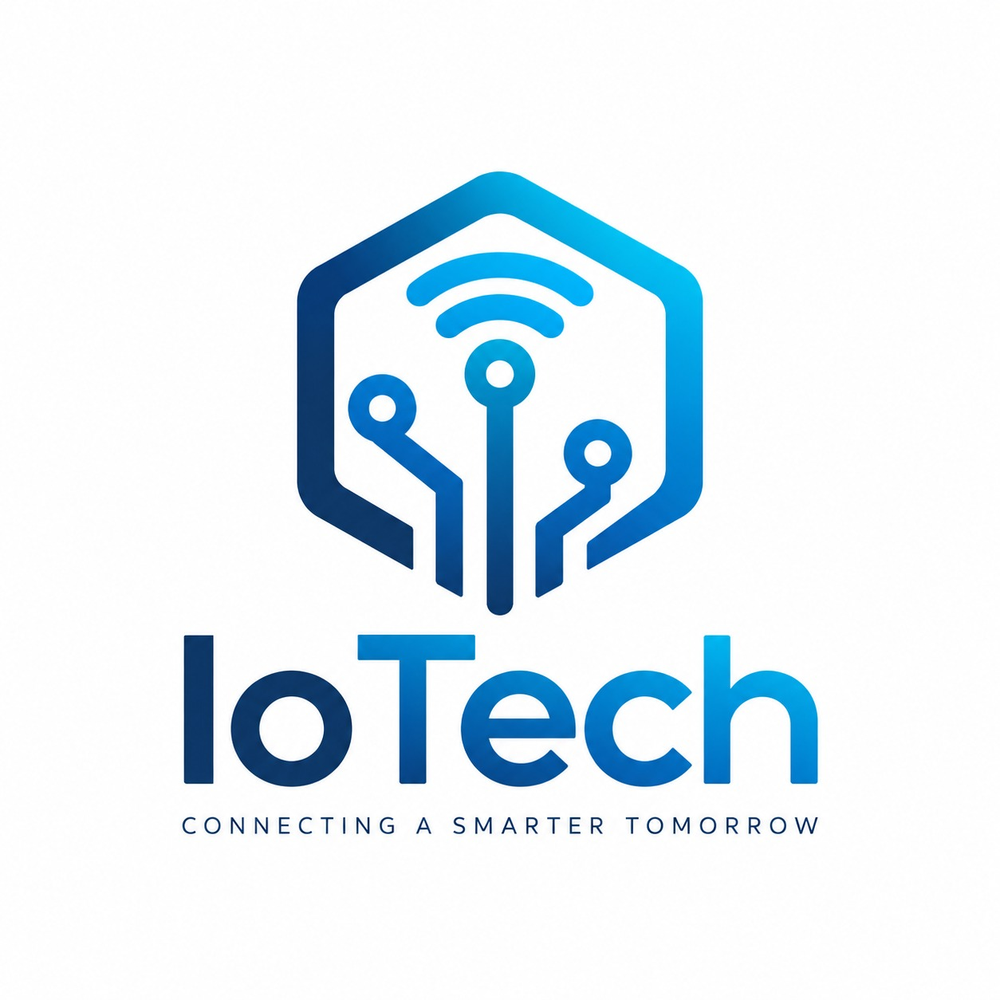

### 1.1. Startup Profile

En esta sección se presenta el perfil de **IoTech**, startup responsable del desarrollo de QualiTrack. Se describen su propósito, enfoque tecnológico, misión y visión, así como los perfiles de los integrantes que participan en el desarrollo del proyecto.

IoTech busca desarrollar soluciones tecnológicas que permitan conectar el mundo físico con plataformas digitales, utilizando dispositivos IoT para obtener información del entorno, procesarla y generar acciones que permitan responder ante diferentes situaciones.

Dentro de este enfoque, la startup desarrolla QualiTrack como una solución dirigida al sector farmacéutico, buscando mejorar la manera en que laboratorios y almacenes supervisan las condiciones de sus instalaciones y mantienen un registro de los eventos que ocurren en ellas.

#### 1.1.1. Descripción de la Startup

**IoTech** es una startup orientada al desarrollo de soluciones que buscan apoyar a las organizaciones en la mejora de sus operaciones. Su enfoque parte de comprender las necesidades y situaciones que pueden afectar el desarrollo de las actividades de una organización, buscando generar alternativas que contribuyan a realizar sus procesos de manera más segura, eficiente y confiable.

La startup busca aportar valor a las organizaciones mediante soluciones adaptadas a sus necesidades y al contexto en el que desarrollan sus actividades. Para ello, considera las dificultades que enfrentan las personas responsables de los procesos y busca contribuir a una mejor gestión de las actividades, facilitando la identificación de situaciones relevantes y la toma de decisiones.

Como parte de su enfoque inicial, IoTech se orienta al sector farmacéutico, principalmente a laboratorios y almacenes, donde resulta importante mantener condiciones adecuadas para el desarrollo de las operaciones y la conservación de los productos. A partir de este sector, la startup busca desarrollar experiencia y generar soluciones que puedan adaptarse posteriormente a organizaciones de otros sectores con necesidades similares.

  

##### Misión

Apoyar a las organizaciones en la mejora de sus operaciones mediante soluciones que respondan a sus necesidades y contribuyan a desarrollar actividades más seguras, eficientes y confiables.

##### Visión

Ser una startup reconocida por comprender las necesidades de las organizaciones y desarrollar soluciones que generen valor y contribuyan a la mejora de sus operaciones en diferentes sectores.

#### 1.1.2. Perfiles de integrantes del equipo

<table border="1" width="100%">

  <tr>
    <td width="140" valign="top" align="center">
      
    </td>
    <td valign="top">
      <strong>Billy Jake Ruiz Madrid - (U202116401)</strong> - Ingeniería de Software  
      Tengo 22 años, soy una persona tranquila, colaborativa y adaptable. Me gusta trabajar en equipo, aportando ideas y soluciones. Cuento con conocimientos en C++, Python y desarrollo de software, y siempre busco formas de hacer las cosas de manera eficiente. Además, me interesa seguir aprendiendo nuevas tecnologías y aplicar mis conocimientos en el desarrollo de soluciones que aporten valor al proyecto.
    </td>
  </tr>

  <tr>
    <td width="140" valign="top" align="center">
      
    </td>
    <td valign="top">
      <strong>Calvo Yalan, Renato Guillermo - (U202217053)</strong> - Ingeniería de Software  
      Soy estudiante de Ingeniería de Software y me interesa especialmente la ciberseguridad y la inteligencia artificial, áreas en las que quiero seguir desarrollándome y aplicar mis conocimientos en proyectos reales. Considero que una de mis principales fortalezas es el liderazgo, ya que me gusta organizar el trabajo, asumir responsabilidades y ayudar a que un equipo avance hacia sus objetivos. También me considero una persona perseverante, con conocimientos en distintos lenguajes de programación y muchas ganas de seguir aprendiendo. Mi objetivo es aprovechar estas habilidades para desarrollar, junto con mi grupo, un proyecto sólido, innovador y exitoso, en el que todos podamos aportar y crecer.
    </td>
  </tr>

  <tr>
    <td width="140" valign="top" align="center">
      
    </td>
    <td valign="top">
      <strong>Dyron Huapaya Galindo - (U202322855)</strong> - Ingeniería de Software  
      Tengo 20 años. Me considero una persona que le gusta apoyar a su equipo y que apoya al equipo en momentos difíciles. Cuento con conocimientos en C++, C#, Java y Python. También sé desarrollar aplicaciones front-end y back-end. Me gusta aprender nuevas tecnologías y temas interesantes, sobre todo acerca del mundo tecnológico. Espero que mis cualidades aporten al equipo.
    </td>
  </tr>

  <tr>
    <td width="140" valign="top" align="center">
      
    </td>
    <td valign="top">
      <strong>Felix Orlando Becerra Ttito - (U20211B387)</strong> - Ingeniería de Software  
Estudiante de Ingeniería de Software de 21 años. Se considera una persona responsable y creativa, interesada en la programación y la tecnología. Cuenta con conocimientos de programación y disposición para colaborar con el equipo en las actividades de análisis, implementación y documentación del proyecto.
 </td>
  </tr>

  <tr>
    <td width="140" valign="top" align="center">
      
    </td>
    <td valign="top">
      <strong>Adrian Quiroz Cáceres -(U202214864)</strong> - Ingeniería de Software  
Soy Adrian Quiroz, tengo 22 años y soy estudiante de Ingeniería de Software. Poseo conocimientos en backend, frontend y bases de datos, áreas que me permiten contribuir al desarrollo de soluciones digitales.
    </td>
  </tr>

</table>