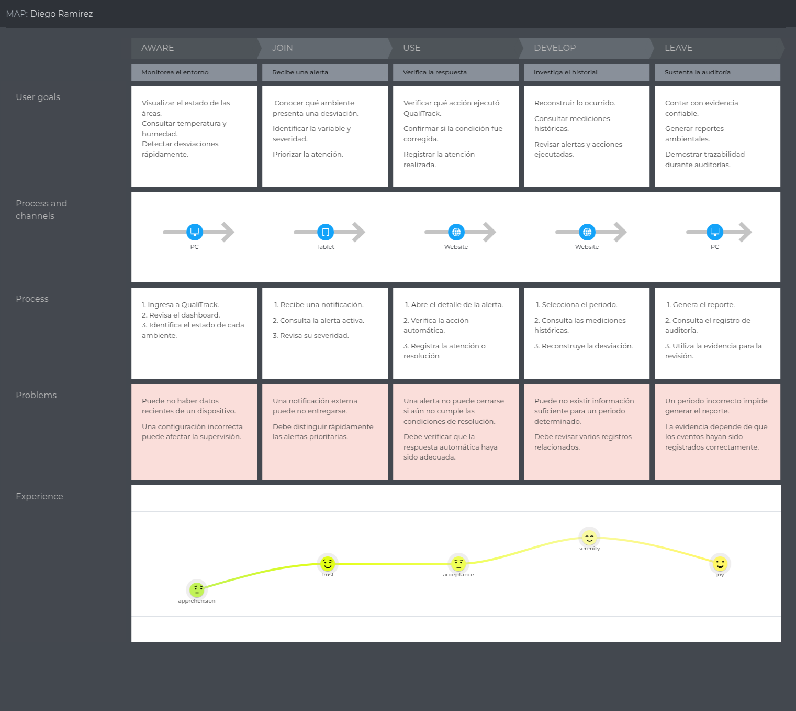
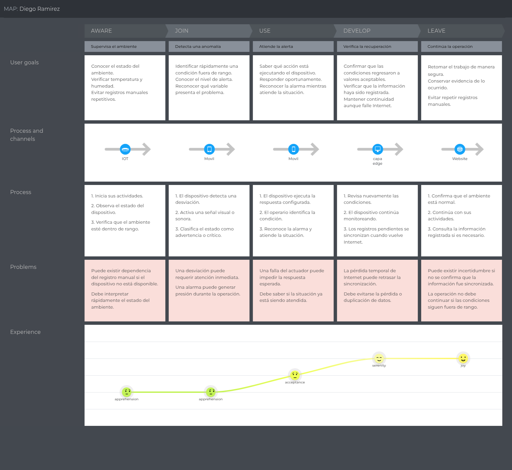

## 3.1. To-Be Scenario Mapping

El To-Be Scenario Mapping representa la experiencia futura con QualiTrack. Valeria consulta el dashboard, recibe una alerta, revisa la respuesta ejecutada, investiga el historial y utiliza la evidencia en una auditoría. Rosa dispone de registro automático, detección de anomalías, respuesta local, sincronización y seguimiento gráfico.

**Segmento 1: Responsables de calidad y supervisión**

**Segmento 2: Personal operativo de laboratorios y almacenes**

