## 4.4. Mobile Applications UX Design

Esta sección detalla el diseño de las interfaces operativas de la plataforma Qualitrack, abarcando la aplicación móvil
de monitoreo. El diseño UX/UI se ha centrado en la eficiencia operativa,
buscando que el flujo de información entre las básculas inteligentes y el usuario final sea directo, minimizando errores
en la interpretación de datos de inventario.

### 4.4.1. Applications Wireframes

Se presentan los esquemas estructurales de las aplicaciones, los cuales definen la lógica de navegación y la
distribución de los componentes funcionales. Estos wireframes de media fidelidad sirven para validar la usabilidad del
sistema, permitiendo organizar los módulos de visualización de peso, alertas de temperatura y gestión de reportes de
manera coherente, antes de proceder con la implementación de estilos visuales.
#### Mobile Application

En esta sección se presentan los esquemas de media fidelidad diseñados específicamente para dispositivos móviles. El
enfoque principal de estos wireframes es la optimización de la experiencia de usuario (UX) en pantallas reducidas,
priorizando la visualización rápida de alertas de stock y el estado de las básculas inteligentes. La arquitectura de
información aquí expuesta busca minimizar la carga cognitiva del personal operativo, permitiendo una gestión de
inventario eficiente y ágil mediante una navegación simplificada.

**Inicio de Sesión**

**Descripción:** Esquema estructural de la pantalla principal de inicio de sesión que define la disposición de campos
para acceso estándar mediante credenciales o inicio de sesión único (SSO) corporativo.

  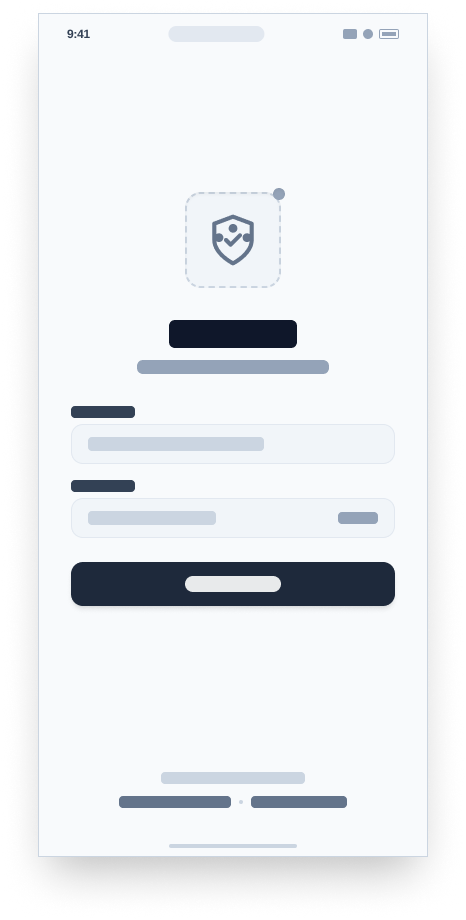

**Registro de Usuario**

**Descripción:** Esquema estructural de la pantalla de registro de nuevos usuarios, definiendo la disposición de campos
para la creación de credenciales mediante correo.

  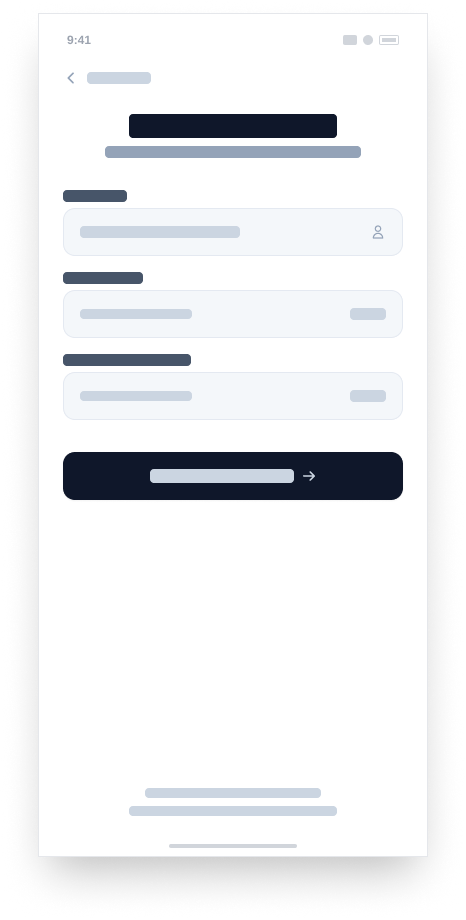

**Dashboard de Monitoreo General**

**Descripción:** Esquema de la pantalla principal que define la disposición estructural de indicadores de estado de los
contenedores, ambientes, alertas y metricas.

  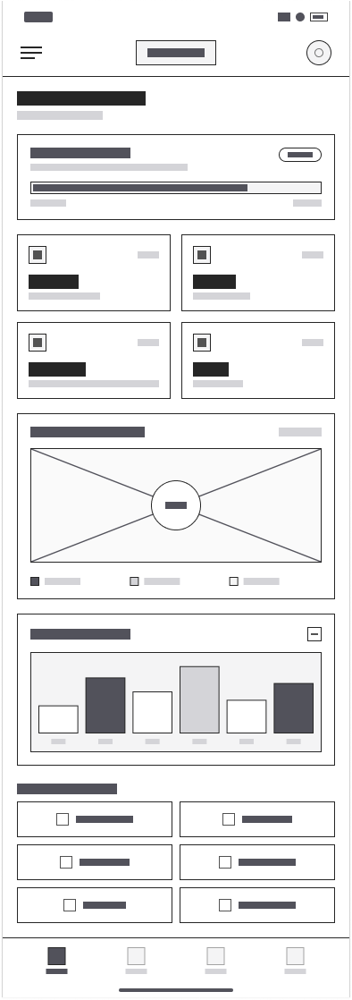

**Dashboard Risk Overview**

**Descripción:** Esquema de la pantalla extendida de la sección Risk Overview, define la disposición de las alertas
registradas por los equipos.

  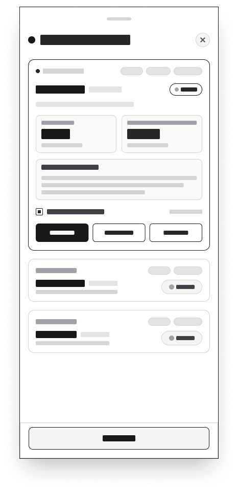

**Dashboard de telemetría**

**Descripción:** Esquema de estructural que define la disposición de las métricas registradas por el equipo
seleccionado: estado de conexión con su latencia, las anomalías detectadas y la gráfica del perfil de temperatura.

  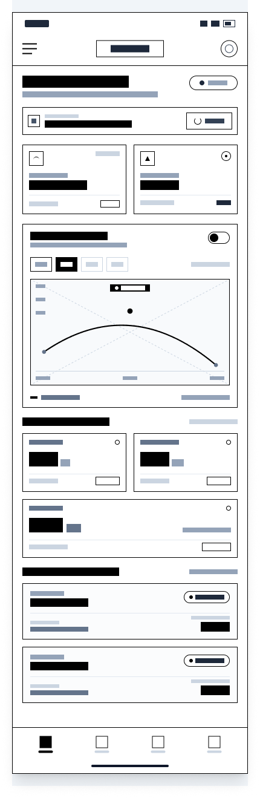

**Data Log de telemetria**

**Descripción:** Esquema de estructural del registro detallado de lecturas de los sensores, filtrable por equipo y rango
de fechas, que identifica en cada entrada el parámetro, la fecha y hora.

  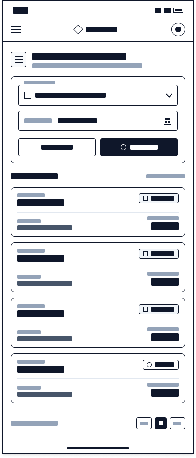

**Alertas de cumplimiento**

**Descripción:** Esquema de estructural del centro de alertas que presenta los indicadores de alertas sin resolver y
desviaciones críticas, el filtrado de incidentes por estado.

  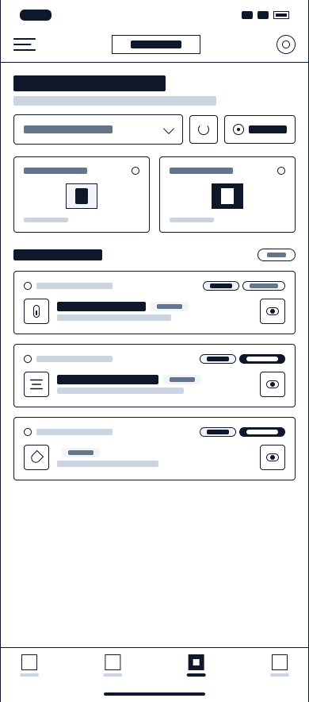

**Alertas críticas y desviaciones**

**Descripción:** Esquema estructural de la ventana emergente de alertas críticas que detalla el sensor, la unidad de
almacenamiento y el lote afectados.

  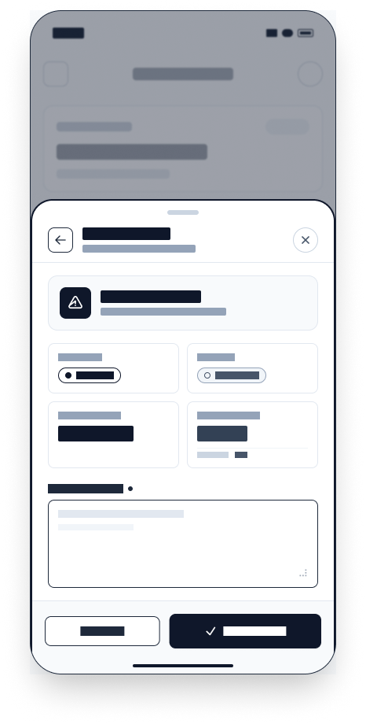

**Manejo de lotes**

**Descripción:** Esquema de estructural de la lista de lotes de producción que presenta los indicadores de lotes
liberados, pendientes y rechazados.

  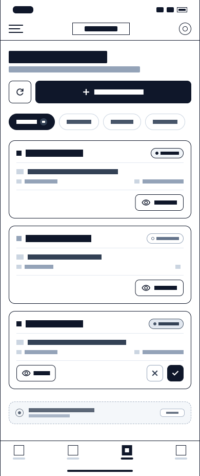

**Información general de Lote**

**Descripción:** Esquema de estructura de la información general de los lotes ya sean pendientes, aceptados o
rechazados.

  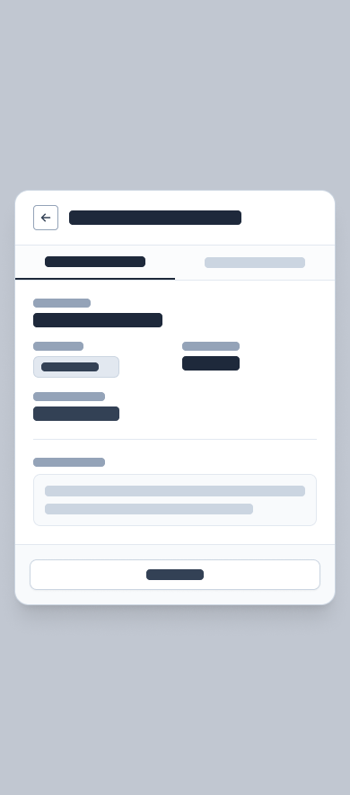

**Materiales del Lote**

**Descripción:** Esquema de estructura de los materiales usados para la creación de los lotes.

  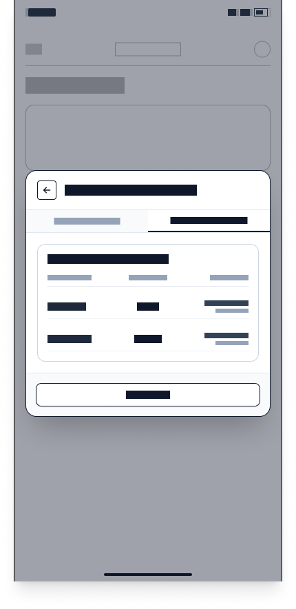

**Confirmación de Lote**

**Descripción:** Esquema de estructura de la pantalla de confirmación o rechazo de los lotes.

  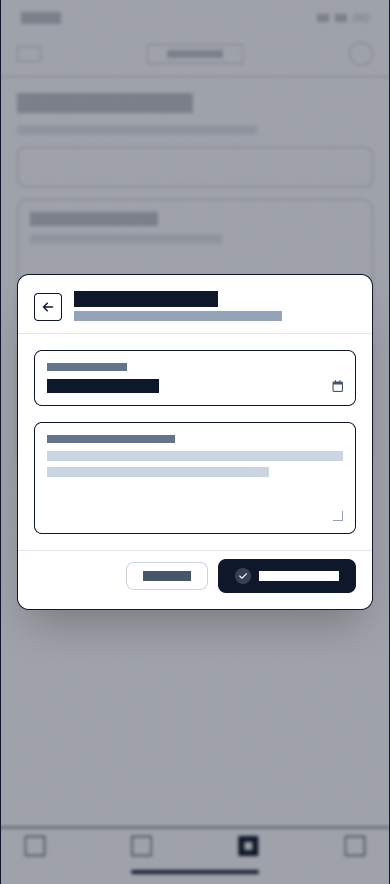

**Manejo de Productos**

**Descripción:** Esquema de estructura del catálogo de productos registrados que organiza en una tabla el código, el
nombre, las especificaciones BPM.

  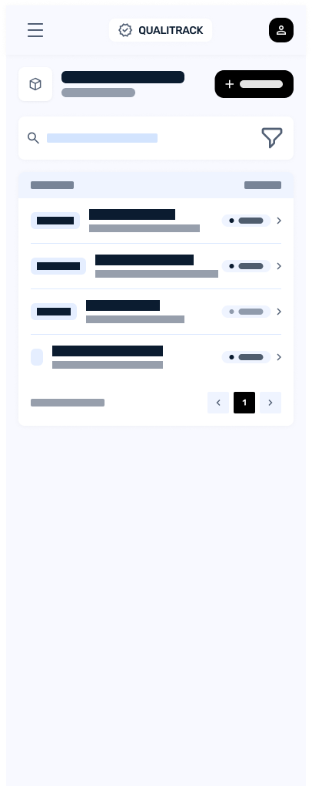

**Registro de Productos**

**Descripción:** Esquema de estructura del formulario de registro de productos farmacéuticos.

  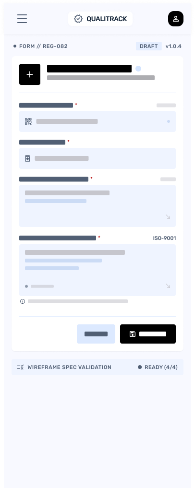

**Inventario de Material Primas**

**Descripción:** Esquema de estructura del inventario de materias primas que advierte los materiales por debajo del
umbral mínimo.

  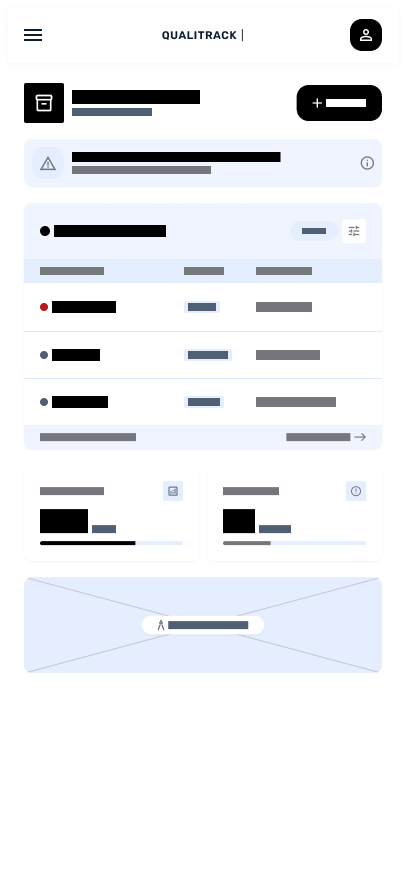

**Registro de Materia Prima**

**Descripción:** Esquema de estructura del formulario de registro de materias primas.

  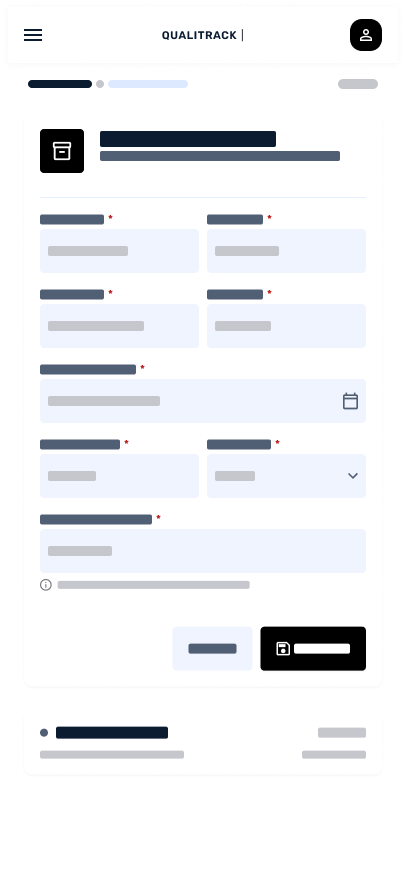

**Facturación de suscripción**

**Descripción:** Esquema de estructura de la pantalla de facturación que presenta la suscripción activa con su plan,
estado y periodo, las opciones para cambiar de plan o cancelarla.

  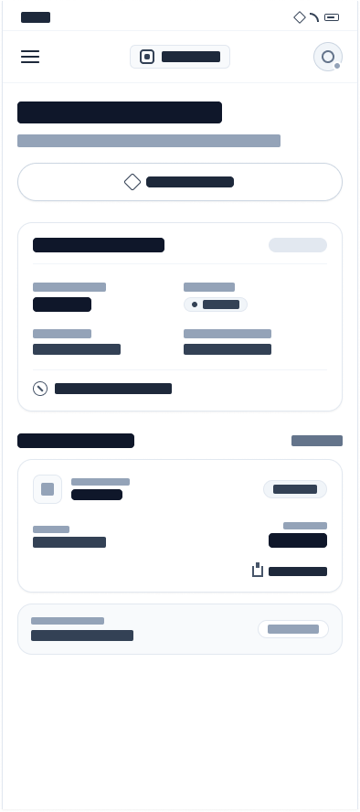

**Planes de suscripción**

**Descripción:** Esquema de estructura de la pantalla de planes con facturación mensual que compara los planes
Enterprise y Standard Lab según su precio.

  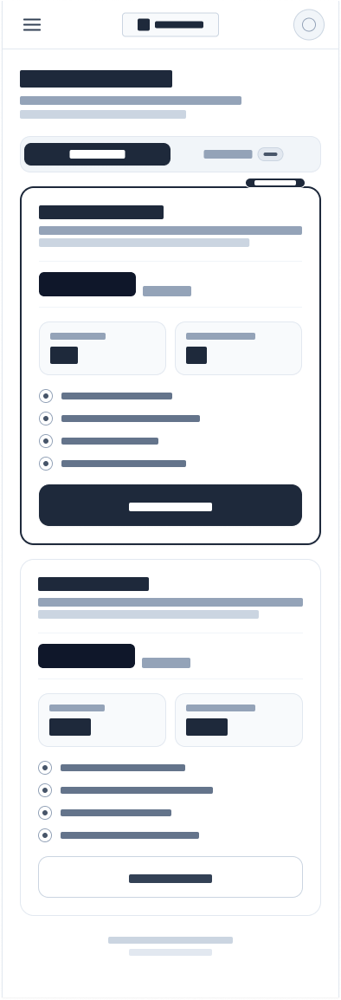

### 4.4.2. Applications Wireflow Diagrams

Un wireflow o flujo de pantalla es un diagrama donde se reúnen distintos wireframes realizados cuya finalidad es contar
las metas del usuario (User Goal) con la aplicación y cómo las consiguen.

**- Task Flow 6:** Supervisión de la telemetría desde la aplicación móvil

  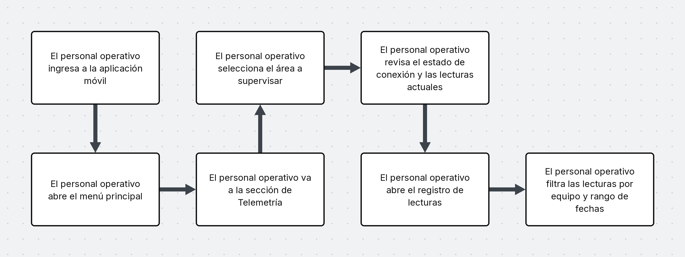

#### Pasos del Task Flow 6:

1. El personal operativo ingresa a la aplicación móvil
2. El personal operativo abre el menú principal
3. El personal operativo va a la sección de Telemetría
4. El personal operativo selecciona el área a supervisar
5. El personal operativo revisa el estado de conexión y las lecturas actuales
6. El personal operativo abre el registro de lecturas
7. El personal operativo filtra las lecturas por equipo y rango de fechas

**- User Goal 6:** Como personal operativo, quiero revisar desde el móvil las lecturas actuales y el historial de
mediciones de un área, para verificar si las condiciones son adecuadas.

  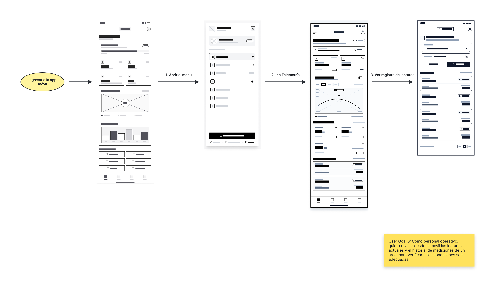

El personal operativo accede a la sección de Telemetría desde el menú de la aplicación móvil, selecciona el área que
desea supervisar y revisa el estado de conexión, las anomalías detectadas y las lecturas actuales de los sensores. Luego
consulta el registro de lecturas, donde puede filtrar por equipo y rango de fechas para identificar mediciones fuera de
los parámetros BPM.

**- Task Flow 7:** Revisión y resolución de una alerta de desviación

  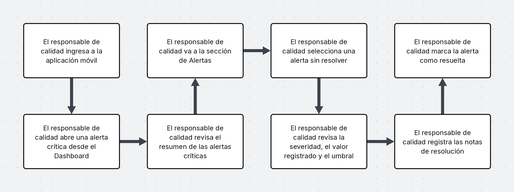

#### Pasos del Task Flow 7:

1. El responsable de calidad ingresa a la aplicación móvil
2. El responsable de calidad abre una alerta crítica desde el Dashboard
3. El responsable de calidad revisa el resumen de las alertas críticas
4. El responsable de calidad va a la sección de Alertas
5. El responsable de calidad selecciona una alerta sin resolver
6. El responsable de calidad revisa la severidad, el valor registrado y el umbral
7. El responsable de calidad registra las notas de resolución
8. El responsable de calidad marca la alerta como resuelta

**- User Goal 7:** Como responsable de calidad y supervisión, quiero revisar una alerta de desviación y registrar su
resolución desde el móvil, para conservar evidencia de cómo fue atendida.

  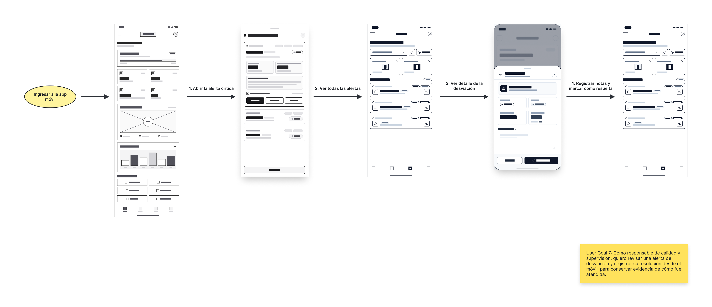

El responsable de calidad identifica una alerta crítica desde el Dashboard de la aplicación móvil y revisa su resumen.
Luego accede a la lista de alertas de cumplimiento, abre el detalle de una desviación sin resolver para revisar su
severidad, el valor registrado y el umbral permitido, y registra las notas de resolución antes de marcarla como
resuelta. La alerta pasa al estado resuelta y conserva la evidencia de su atención.

**- Task Flow 8:** Revisión y liberación de un lote de producto

  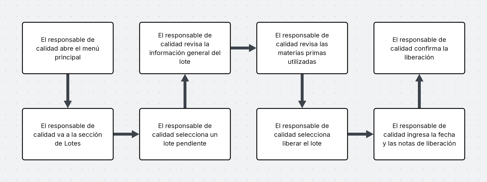

#### Pasos del Task Flow 8:

1. El responsable de calidad abre el menú principal
2. El responsable de calidad va a la sección de Lotes
3. El responsable de calidad selecciona un lote pendiente
4. El responsable de calidad revisa la información general del lote
5. El responsable de calidad revisa las materias primas utilizadas
6. El responsable de calidad selecciona liberar el lote
7. El responsable de calidad ingresa la fecha y las notas de liberación
8. El responsable de calidad confirma la liberación

**- User Goal 8:** Como responsable de calidad y supervisión, quiero revisar la información y las materias primas de un
lote antes de liberarlo, para que la decisión quede sustentada y registrada.

  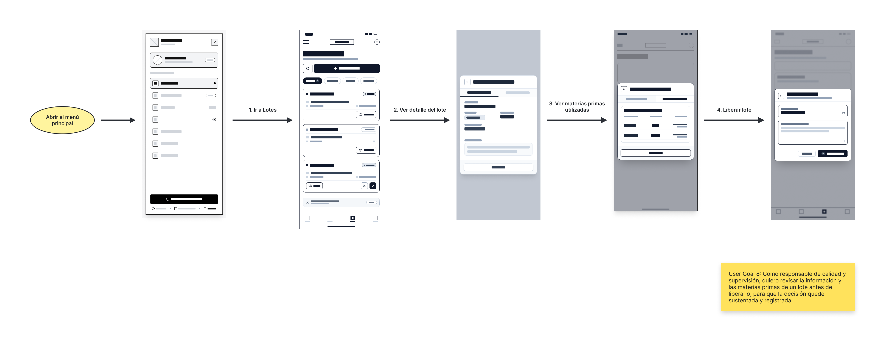

El responsable de calidad accede a los lotes de producción y selecciona un lote pendiente de liberación. Revisa su
información general y el historial de materias primas utilizadas con sus cantidades y fechas de uso. Con esa información
abre el proceso de liberación, registra la fecha y las notas de verificación de calidad, y confirma la decisión para que
quede registrada en el lote.

**- Task Flow 9:** Registro de una materia prima en el inventario

  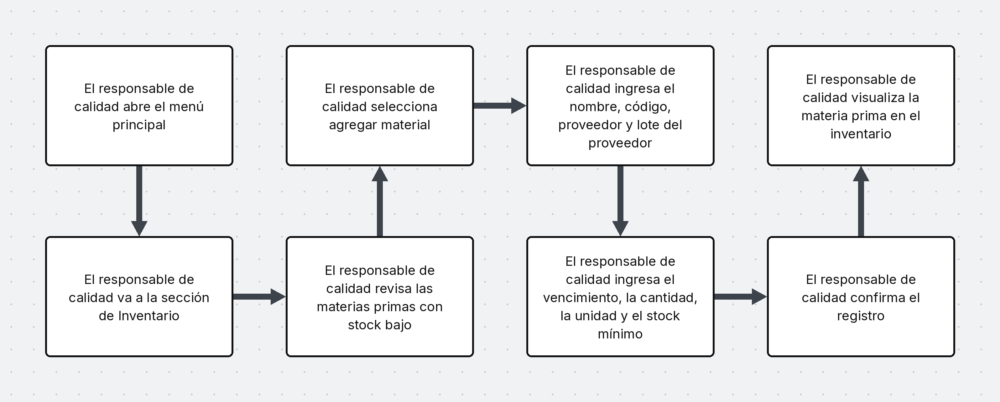

#### Pasos del Task Flow 9:

1. El responsable de calidad abre el menú principal
2. El responsable de calidad va a la sección de Inventario
3. El responsable de calidad revisa las materias primas con stock bajo
4. El responsable de calidad selecciona agregar material
5. El responsable de calidad ingresa el nombre, código, proveedor y lote del proveedor
6. El responsable de calidad ingresa el vencimiento, la cantidad, la unidad y el stock mínimo
7. El responsable de calidad confirma el registro
8. El responsable de calidad visualiza la materia prima en el inventario

**- User Goal 9:** Como responsable de calidad y supervisión, quiero registrar una materia prima con su lote y su stock
mínimo, para controlar su disponibilidad y saber cuándo reponerla.

  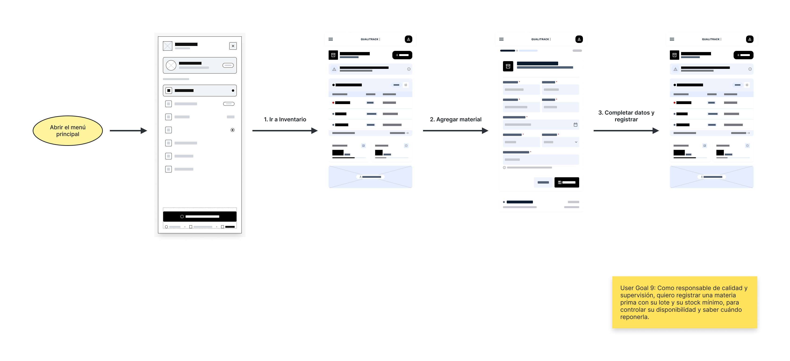

El responsable de calidad accede al inventario de materias primas, donde el sistema advierte cuántos materiales se
encuentran por debajo del umbral mínimo. Desde allí registra una nueva materia prima con su código interno, proveedor,
lote del proveedor, fecha de vencimiento, cantidad inicial, unidad de medida y stock mínimo. Al confirmar, el material
aparece en el inventario con su estado de stock.

**- Task Flow 10:** Registro de cuenta e inicio de sesión desde la aplicación móvil

  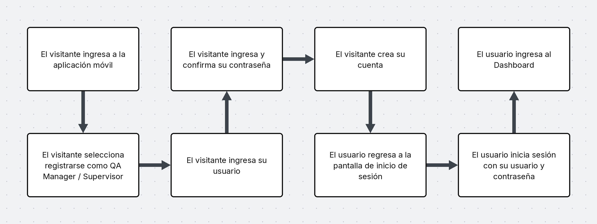

#### Pasos del Task Flow 10:

1. El visitante ingresa a la aplicación móvil
2. El visitante selecciona registrarse como QA Manager / Supervisor
3. El visitante ingresa su usuario
4. El visitante ingresa y confirma su contraseña
5. El visitante crea su cuenta
6. El usuario regresa a la pantalla de inicio de sesión
7. El usuario inicia sesión con su usuario y contraseña
8. El usuario ingresa al Dashboard

**- User Goal 10:** Como visitante, quiero crear mi cuenta e iniciar sesión desde la aplicación móvil, para supervisar
la operación del laboratorio desde cualquier lugar de la planta.

  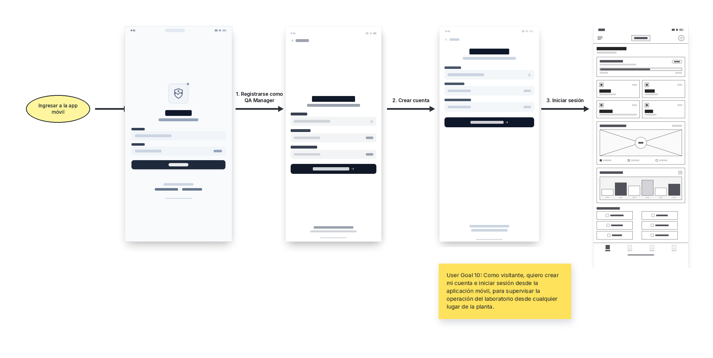

El visitante accede a la aplicación móvil y, desde la pantalla de inicio de sesión, elige registrarse como QA Manager /
Supervisor. Ingresa su usuario, define y confirma su contraseña, y crea la cuenta. Luego inicia sesión con sus
credenciales y accede al Dashboard, donde visualiza el estado operativo del laboratorio. Si el usuario ya está
registrado o las contraseñas no coinciden, el sistema impide crear la cuenta.

**- Task Flow 11:** Reconocimiento de alertas críticas desde el Dashboard

  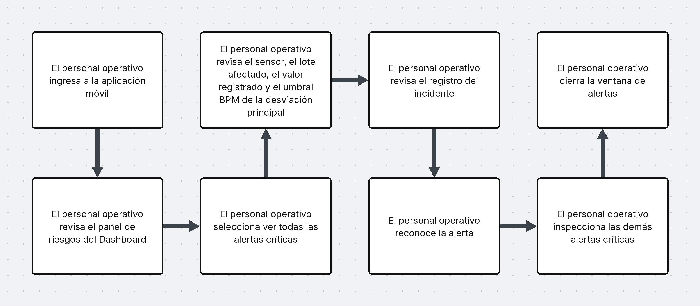

#### Pasos del Task Flow 11:

1. El personal operativo ingresa a la aplicación móvil
2. El personal operativo revisa el panel de riesgos del Dashboard
3. El personal operativo selecciona ver todas las alertas críticas
4. El personal operativo revisa el sensor, el lote afectado, el valor registrado y el umbral BPM de la desviación
   principal
5. El personal operativo revisa el registro del incidente
6. El personal operativo reconoce la alerta
7. El personal operativo inspecciona las demás alertas críticas
8. El personal operativo cierra la ventana de alertas

**- User Goal 11:** Como personal operativo, quiero revisar y reconocer las alertas críticas desde el Dashboard, para
dejar constancia de que estoy atendiendo las desviaciones detectadas.

  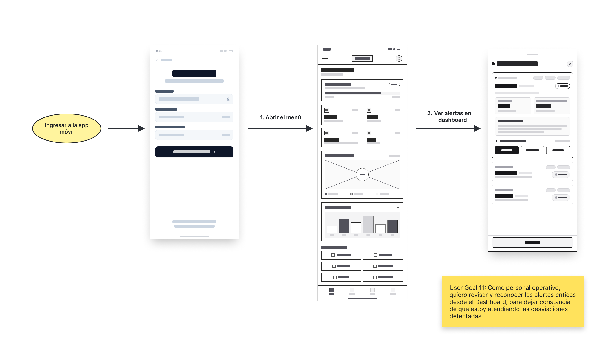

El personal operativo identifica en el panel de riesgos del Dashboard que existen alertas críticas y abre la ventana que
las reúne. En la desviación principal revisa el sensor, la unidad de almacenamiento y el lote afectados, compara el
valor registrado con el umbral BPM y lee el registro del incidente. Después reconoce la alerta para dejar constancia de
su atención e inspecciona las demás alertas críticas. Desde esta ventana también puede abrir la investigación o
consultar el audit log.

**- Task Flow 12:** Rechazo de un lote no conforme

  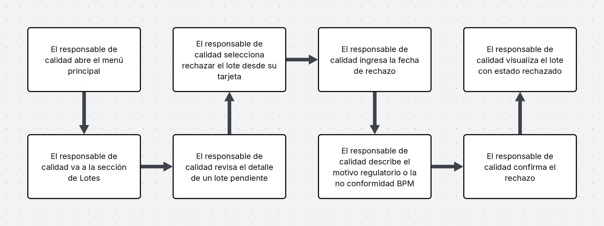

#### Pasos del Task Flow 12:

1. El responsable de calidad abre el menú principal
2. El responsable de calidad va a la sección de Lotes
3. El responsable de calidad revisa el detalle de un lote pendiente
4. El responsable de calidad selecciona rechazar el lote desde su tarjeta
5. El responsable de calidad ingresa la fecha de rechazo
6. El responsable de calidad describe el motivo regulatorio o la no conformidad BPM
7. El responsable de calidad confirma el rechazo
8. El responsable de calidad visualiza el lote con estado rechazado

**- User Goal 12:** Como responsable de calidad y supervisión, quiero rechazar un lote no conforme registrando la fecha
y el motivo, para que la decisión quede sustentada según las Buenas Prácticas de Manufactura.

  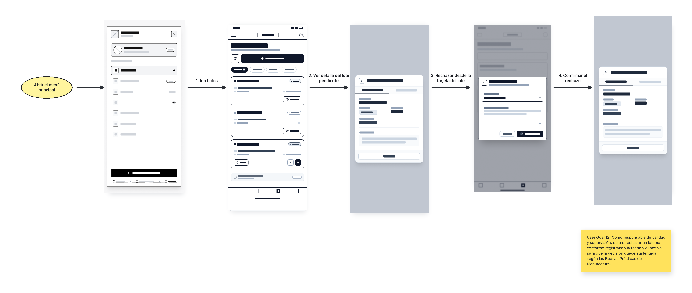

El responsable de calidad accede a los lotes de producción y revisa el detalle de un lote pendiente de aprobación. Al
identificar que no cumple los criterios de calidad, selecciona rechazarlo desde su tarjeta y completa el formulario de
rechazo con la fecha y el motivo regulatorio, que es obligatorio según las BPM. Al confirmar, el lote pasa a estado
rechazado y conserva las notas que sustentan la decisión.

**- Task Flow 13:** Registro de un producto farmacéutico

  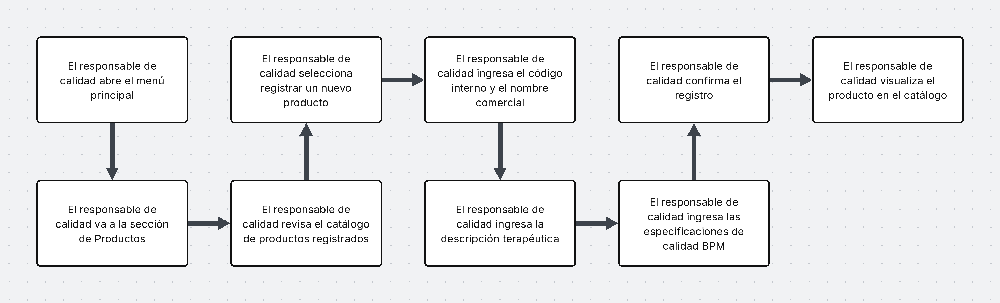

#### Pasos del Task Flow 13:

1. El responsable de calidad abre el menú principal
2. El responsable de calidad va a la sección de Productos
3. El responsable de calidad revisa el catálogo de productos registrados
4. El responsable de calidad selecciona registrar un nuevo producto
5. El responsable de calidad ingresa el código interno y el nombre comercial
6. El responsable de calidad ingresa la descripción terapéutica
7. El responsable de calidad ingresa las especificaciones de calidad BPM
8. El responsable de calidad confirma el registro
9. El responsable de calidad visualiza el producto en el catálogo

**- User Goal 13:** Como responsable de calidad y supervisión, quiero registrar los productos farmacéuticos con sus
especificaciones BPM, para asociarlos a los lotes que se fabrican y evaluar su calidad.

  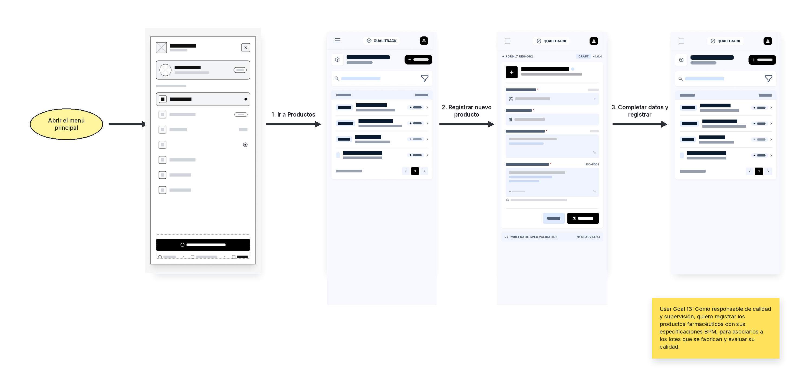

El responsable de calidad accede al catálogo de productos farmacéuticos y selecciona registrar uno nuevo. Ingresa su
código interno, nombre comercial y descripción terapéutica, y define las especificaciones de calidad BPM con los
criterios de aceptación, los límites y los controles requeridos. Al confirmar, el producto aparece en el catálogo y
queda disponible para asociarlo a los lotes de producción.

**- Task Flow 14:** Gestión de la suscripción y cambio de plan

  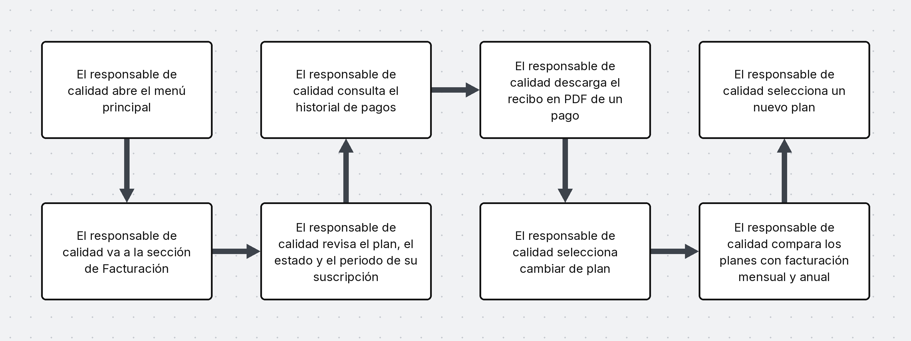

#### Pasos del Task Flow 14:

1. El responsable de calidad abre el menú principal
2. El responsable de calidad va a la sección de Facturación
3. El responsable de calidad revisa el plan, el estado y el periodo de su suscripción
4. El responsable de calidad consulta el historial de pagos
5. El responsable de calidad descarga el recibo en PDF de un pago
6. El responsable de calidad selecciona cambiar de plan
7. El responsable de calidad compara los planes con facturación mensual y anual
8. El responsable de calidad selecciona un nuevo plan

**- User Goal 14:** Como responsable de calidad y supervisión, quiero revisar mi suscripción y su historial de pagos y
cambiar de plan cuando lo necesite, para ajustar QualiTrack al tamaño de mi laboratorio.

  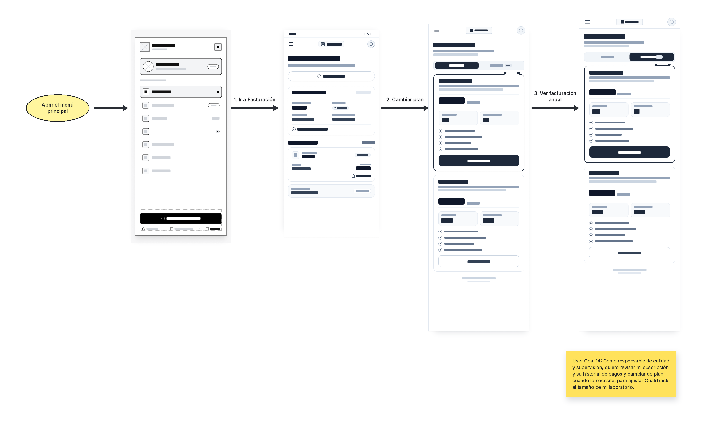

El responsable de calidad accede al resumen de facturación, donde revisa el plan contratado, su estado y el periodo
vigente, consulta el historial de pagos procesados por Stripe y descarga los recibos en PDF. Si necesita más usuarios o
registros de equipos, selecciona cambiar de plan, compara las opciones con facturación mensual y anual y elige el plan
que mejor se ajusta a su laboratorio. Desde el mismo resumen también puede cancelar la suscripción.

### 4.4.3. Applications Mock-ups

#### Mobile Application

**Inicio de sesión**

**Descripción:** Pantalla de acceso a la aplicación móvil mediante usuario y contraseña, con enlaces para registrarse
como QA Manager / Supervisor o como Lab Operator.

  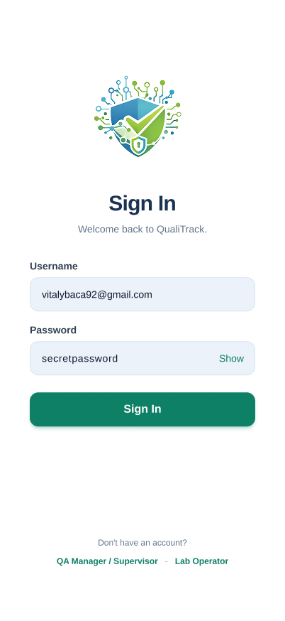

**Registro de QA Manager**

**Descripción:** Formulario de creación de cuenta para el responsable de la supervisión y liberación de lotes
farmacéuticos, con usuario, contraseña y confirmación de contraseña.

  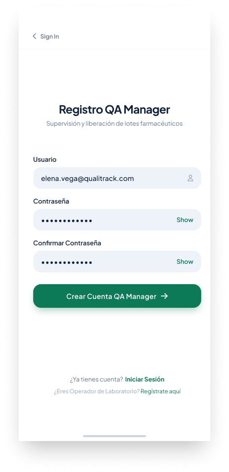

**Registro de Lab Operator**

**Descripción:** Formulario de creación de cuenta para el personal de análisis y ensayos de control en planta, con
acceso directo al inicio de sesión.

  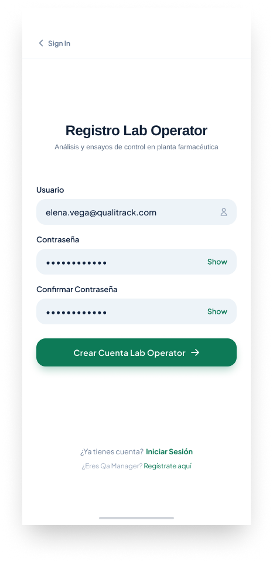

**Menú de navegación lateral**

**Descripción:** Panel de navegación con el perfil del usuario y su planta asignada, los módulos principales de la
aplicación y el acceso para sincronizar la telemetría.

  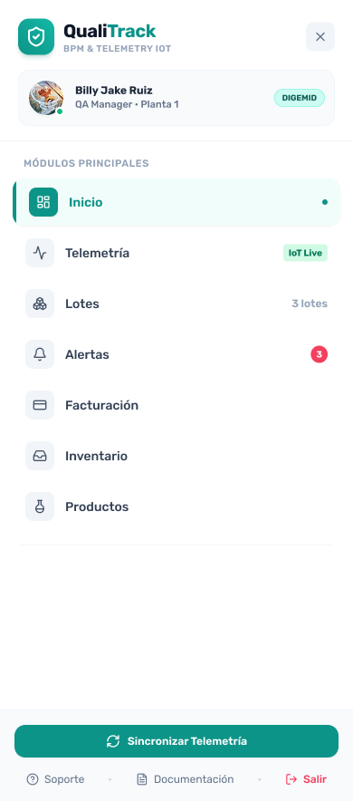

**Dashboard general**

**Descripción:** Centro de mando que resume el índice de salud operativa, las métricas de lotes, alertas y materias
primas, el estado de la telemetría en vivo, la distribución de recursos y los riesgos pendientes.

  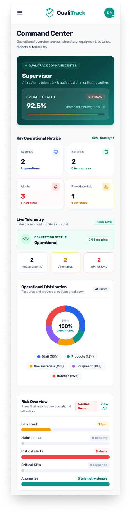

**Alertas críticas del dashboard**

**Descripción:** Ventana emergente que lista las alertas críticas recientes y detalla la desviación principal con su
sensor, lote afectado, valor registrado y umbral BPM, con acciones para investigar, reconocer o consultar el audit log.

  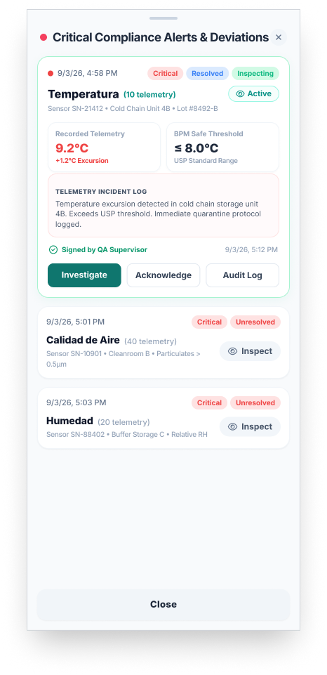

**Dashboard de telemetría**

**Descripción:** Panel de supervisión en tiempo real del área seleccionada, con el estado de conexión, las anomalías
detectadas, el perfil de temperatura y las lecturas actuales de temperatura, calidad de aire y humedad.

  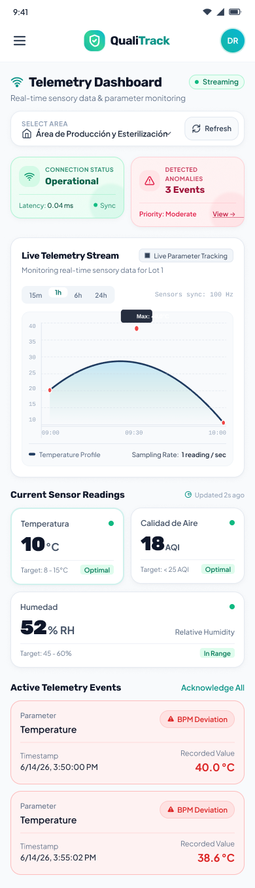

**Data log de telemetría**

**Descripción:** Historial de lecturas de los sensores filtrable por equipo y rango de fechas, que distingue las
mediciones normales de las desviaciones BPM.

  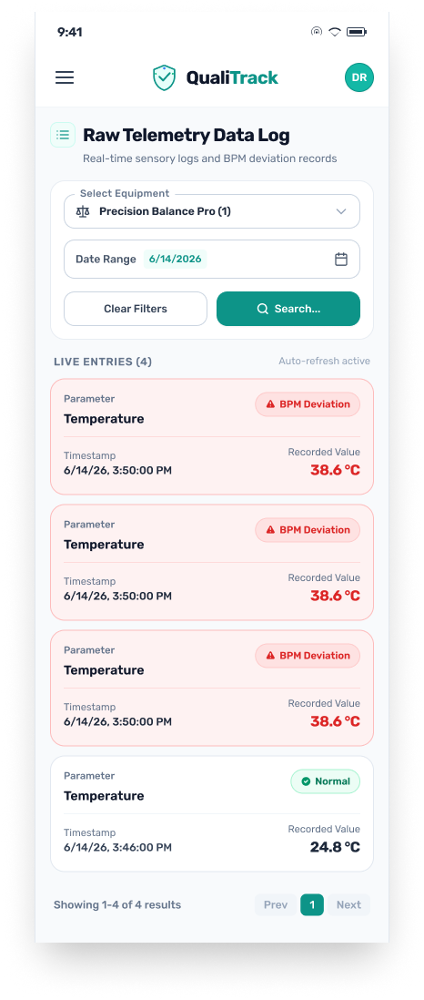

**Alertas de cumplimiento**

**Descripción:** Centro de alertas que presenta los incidentes BPM activos por equipo, con indicadores de alertas sin
resolver y desviaciones críticas, filtros por estado y la opción de reconocer todas las alertas.

  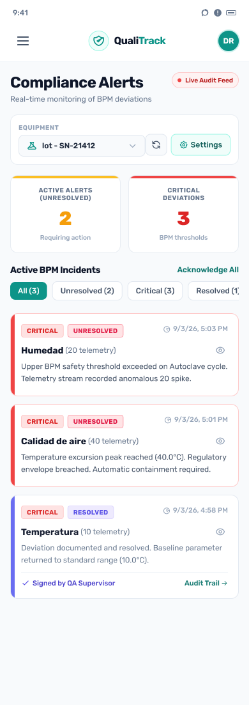

**Detalle de desviación sin resolver**

**Descripción:** Ventana de inspección técnica de una alerta pendiente que muestra su severidad, valor registrado,
umbral y equipo, y solicita notas de resolución para marcarla como resuelta.

  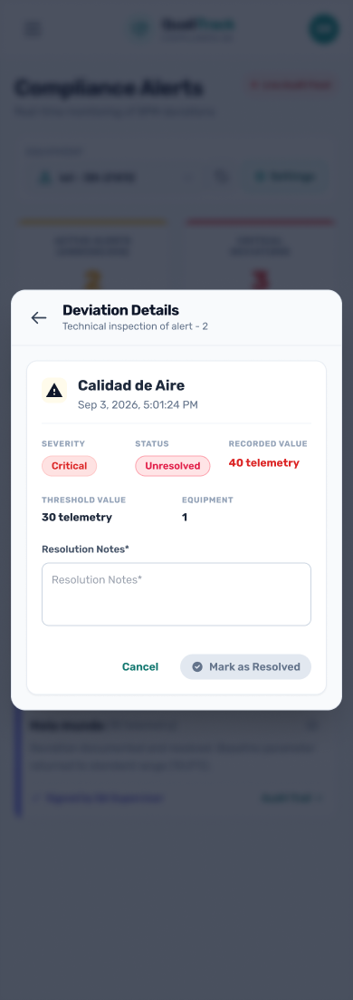

**Detalle de desviación resuelta**

**Descripción:** Ventana de inspección de una alerta ya atendida que conserva las notas de resolución como evidencia de
la acción correctiva aplicada.

  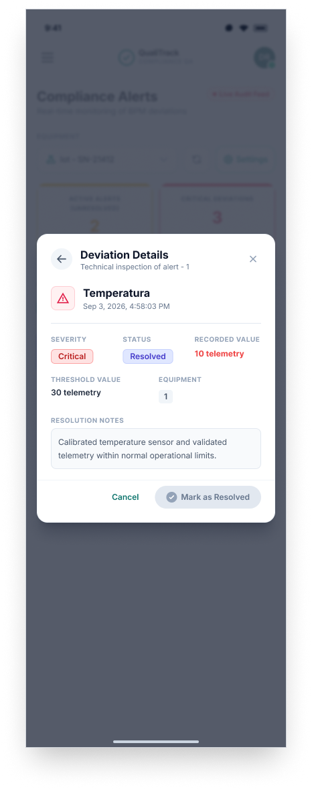

**Lotes de producción**

**Descripción:** Listado de lotes con indicadores por estado, búsqueda y filtros, en el que los lotes pendientes pueden
aprobarse o rechazarse directamente desde su tarjeta.

  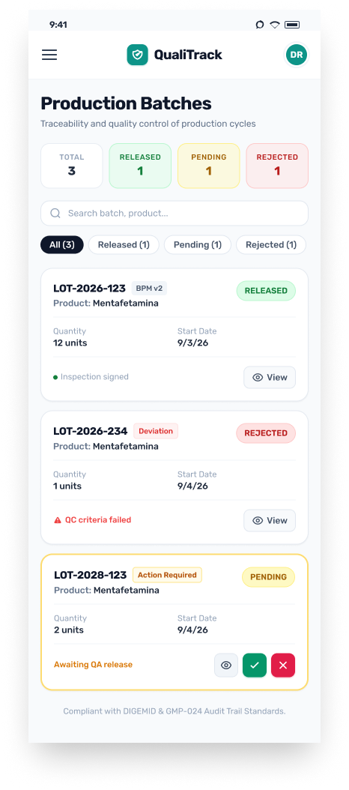

**Detalle de lote pendiente**

**Descripción:** Ventana con la información general de un lote en espera de aprobación de QA, incluidas sus notas BPM de
revisión.

  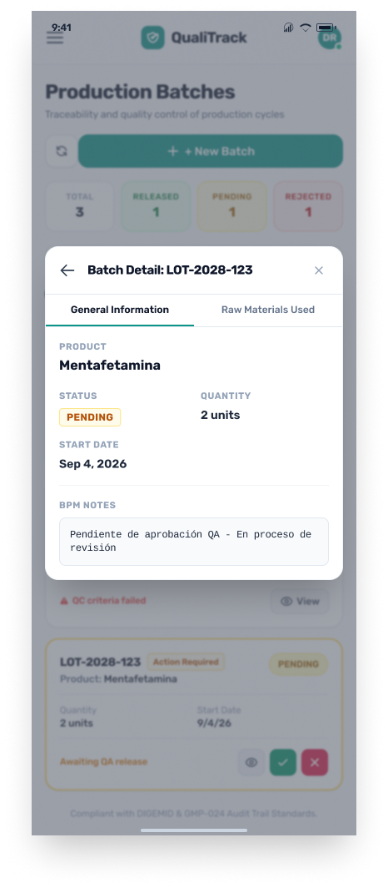

**Detalle de lote liberado**

**Descripción:** Ventana con la información general de un lote liberado, que muestra el producto, la cantidad, la fecha
de inicio y las notas BPM.

  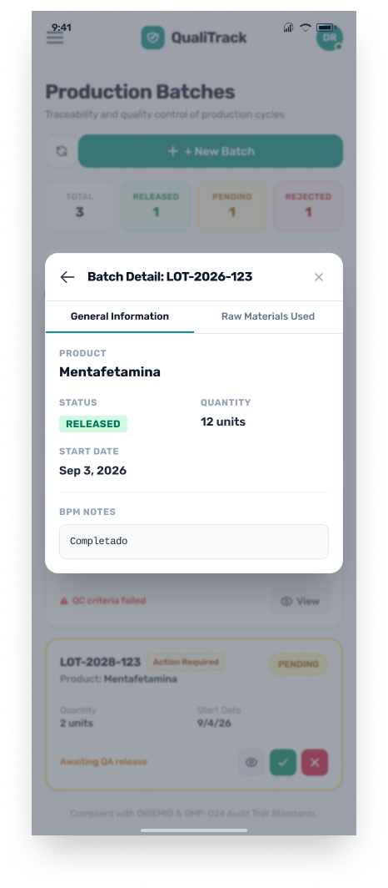

**Detalle de lote rechazado**

**Descripción:** Ventana con la información general de un lote rechazado y las notas BPM que sustentan la decisión.

  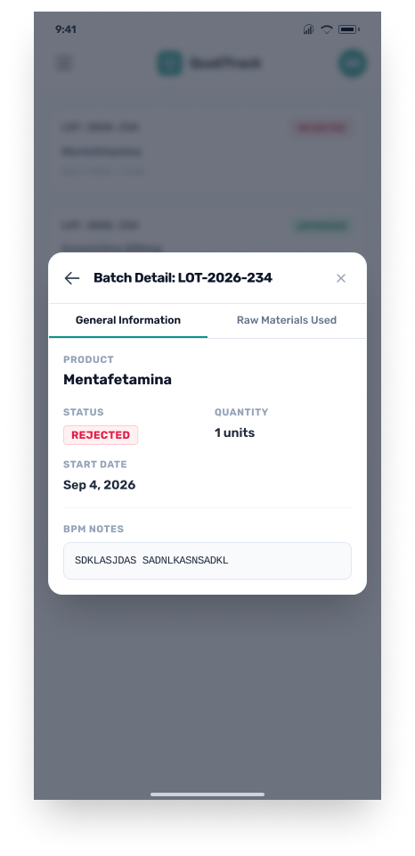

**Materias primas utilizadas**

**Descripción:** Pestaña del detalle del lote que muestra el historial de materias primas utilizadas con su cantidad y
fecha de uso, como soporte de la trazabilidad.

  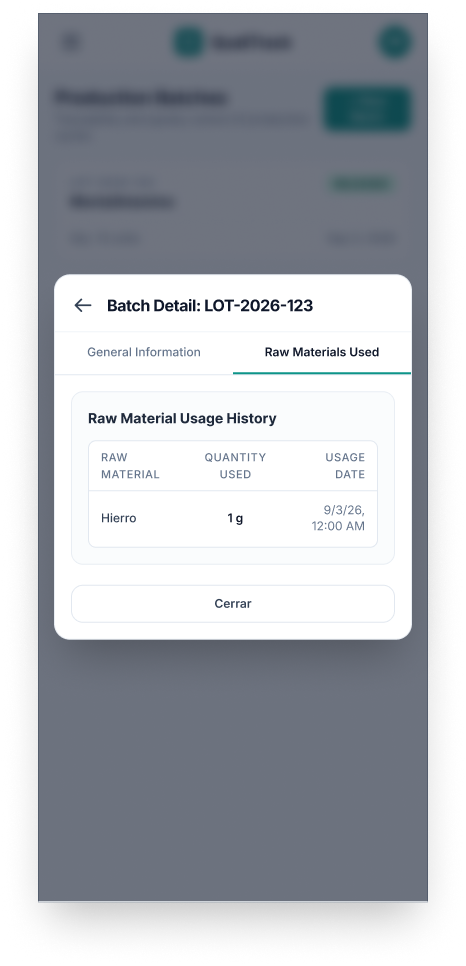

**Confirmación de liberación de lote**

**Descripción:** Formulario del proceso de liberación conforme a BPM que registra la fecha de liberación y las notas de
verificación de calidad antes de confirmar la decisión.

  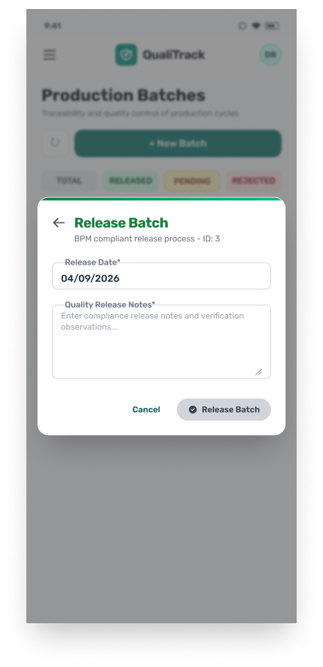

**Confirmación de rechazo de lote**

**Descripción:** Formulario de rechazo de un lote no conforme que exige registrar la fecha y el motivo regulatorio del
rechazo, obligatorio según las Buenas Prácticas de Manufactura.

  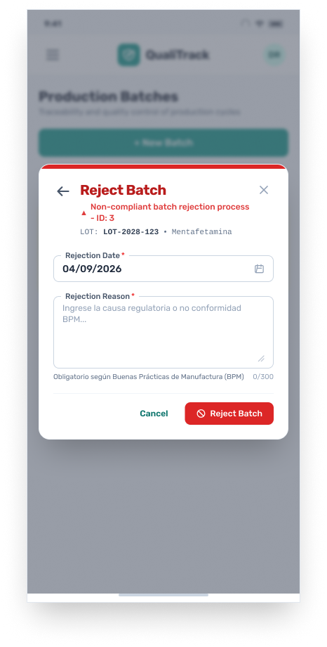

**Catálogo de productos farmacéuticos**

**Descripción:** Listado de productos registrados con búsqueda, código, nombre y especificaciones BPM, con acceso para
registrar un nuevo producto.

  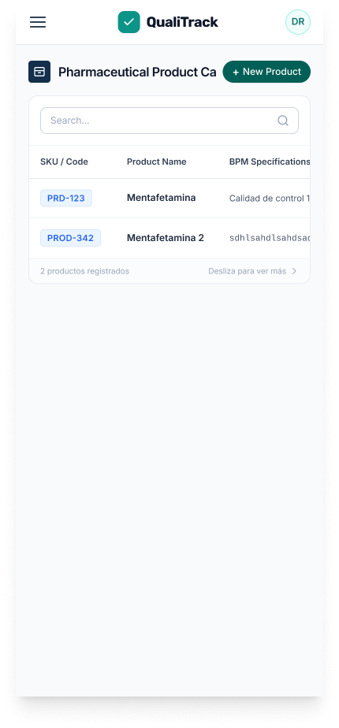

**Registro de producto farmacéutico**

**Descripción:** Formulario para definir un producto con su código interno, nombre comercial, descripción terapéutica y
especificaciones de calidad BPM.

  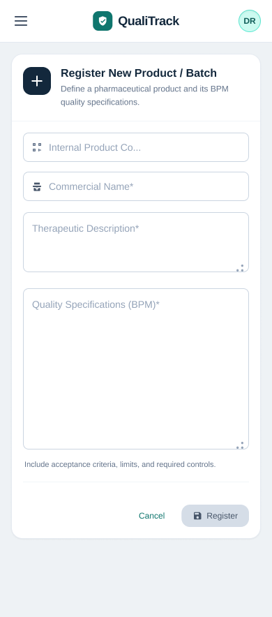

**Inventario de materias primas**

**Descripción:** Tabla de materias primas con código interno, proveedor autorizado y stock actual, encabezada por una
alerta de materiales por debajo del umbral mínimo.

  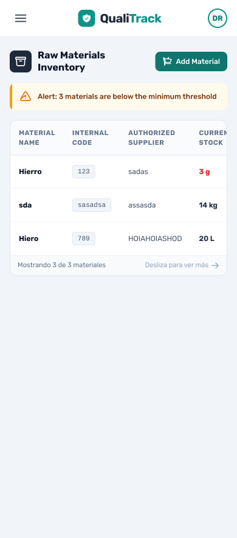

**Registro de materia prima**

**Descripción:** Formulario para ingresar una materia prima con su proveedor, lote del proveedor, vencimiento, cantidad
inicial, unidad de medida y umbral mínimo de stock.

  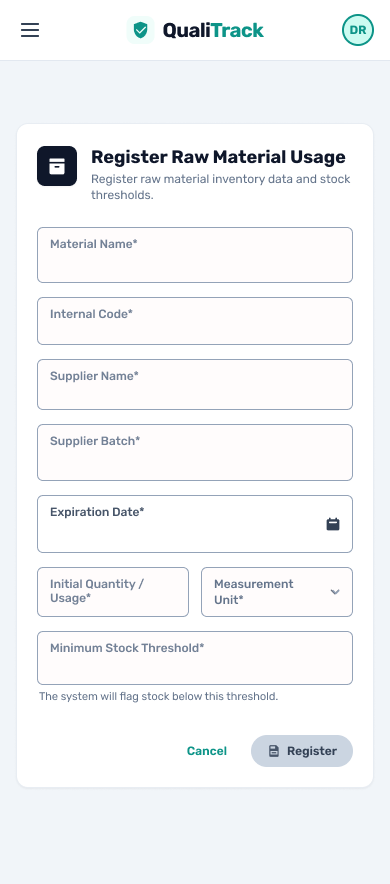

**Planes de suscripción mensual**

**Descripción:** Vista comparativa de los planes Enterprise y Standard Lab con facturación mensual, detallando el
precio, los usuarios, los registros de equipos y los beneficios incluidos.

  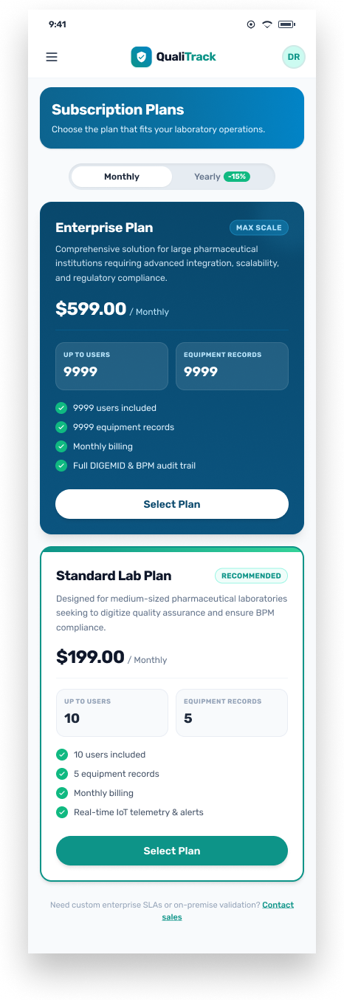

**Planes de suscripción anual**

**Descripción:** Vista de los planes con la facturación anual seleccionada, que aplica el descuento por pago anual y
actualiza el precio de cada plan.

  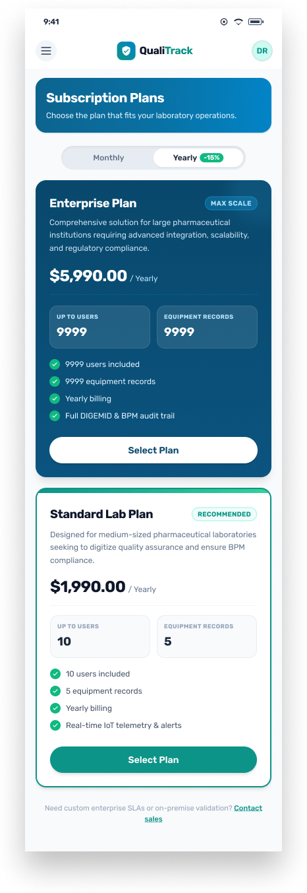

**Resumen de facturación**

**Descripción:** Pantalla de gestión de la suscripción activa que muestra el plan, su estado y el periodo vigente, junto
con el historial de pagos procesados por Stripe y la descarga de recibos en PDF.

  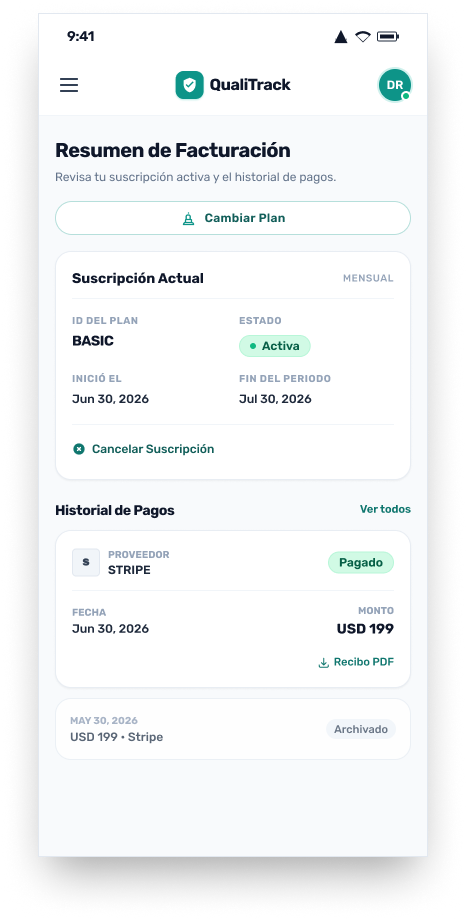

