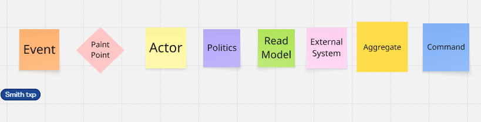
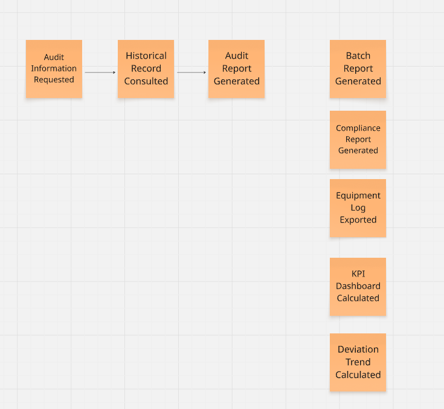
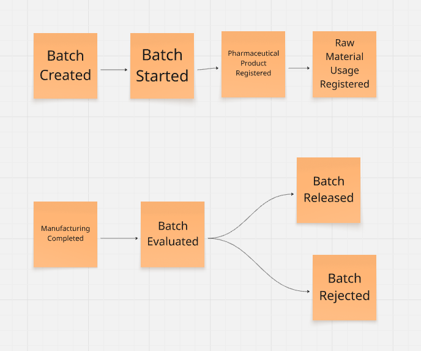
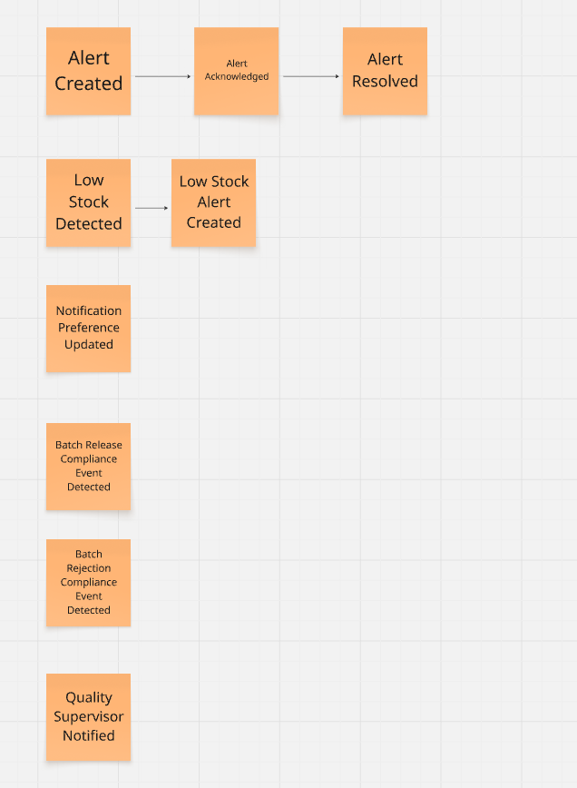
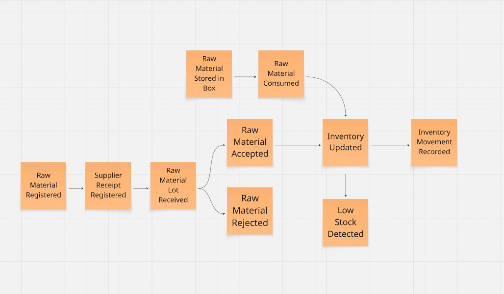
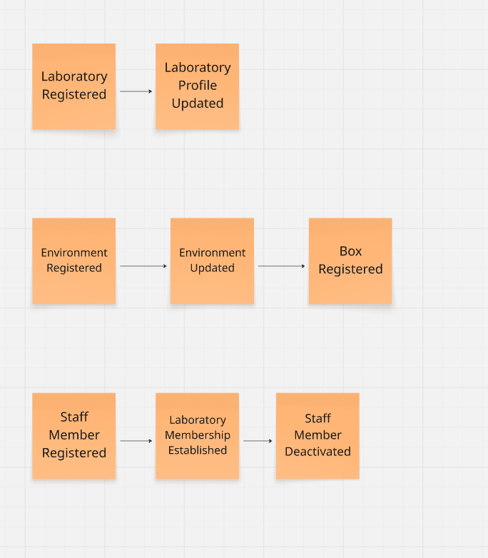

## 4.8. Domain-Driven Software Architecture

La arquitectura de QualiTrack se fundamenta en Domain-Driven Design (DDD) para modelar con precisión las reglas de negocio del sector farmacéutico, incluyendo el cumplimiento BPM, la integración IoT y la trazabilidad inmutable exigida por DIGEMID. Mediante la delimitación de bounded contexts, se separan claramente las responsabilidades de cada subsistema. En esta sección se presentan los resultados del Event Storming, así como los diagramas de contexto, contenedores y componentes que estructuran la solución.

## 4.8.1. Design-Level Event Storming

El desarrollo del proceso del Domain-Driven Design se realizó en la aplicación Miro:
[https://shorturl.at/xSRoo]

En esta sección se presenta el Design-Level EventStorming, técnica utilizada para profundizar en el comportamiento del sistema a partir de los procesos identificados previamente en el Big Picture EventStorming. En esta etapa se detallan los eventos, comandos, actores, políticas, modelos de lectura, sistemas externos y agregados que permiten representar con mayor precisión las reglas e interacciones del dominio.

A partir del análisis de los flujos identificados en el Big Picture EventStorming, el equipo identificó diversos pain points relacionados principalmente con el monitoreo de condiciones ambientales, la gestión de desviaciones, el control de materias primas, la trazabilidad de lotes y la consulta de información histórica. Estos puntos de fricción representan situaciones en las que el proceso actual presenta ambigüedades o requiere una definición más precisa para su posterior digitalización.

**Flujo de monitoreo y control ambiental:**

- *How do you confirm that an out-of-range condition really corresponds to an environmental deviation?:* No se encontraba completamente definido el mecanismo utilizado para confirmar que una medición fuera de rango corresponde realmente a una desviación ambiental. Este punto orientó el diseño de un flujo de monitoreo basado en registros de telemetría, detección de anomalías y generación de alertas.

**Flujo de gestión de desviaciones ambientales:**

- *"Who determines that the environmental condition has been corrected and that the activity can resume?":* El flujo no precisaba completamente cómo se valida la recuperación de una condición ambiental ni quién determina que la actividad puede continuar. Este punto permitió definir eventos relacionados con la detección, atención y resolución de desviaciones y alertas.

**Flujo de desarrollo y producción de productos:**

- *What criteria are considered to determine if a batch is approved or rejected?* No estaban completamente especificados los criterios y pasos posteriores a la evaluación de un lote. Este punto orientó el diseño del flujo de Product Batch Management, diferenciando la evaluación del lote de sus posibles resultados: liberación o rechazo.

**Flujo de gestión de materias primas:**

- *What criteria are used to accept or reject an incoming batch, and where is that decision registered?":* El proceso no detallaba suficientemente cómo se determina la aceptación o rechazo de una materia prima recibida ni cómo queda registrada dicha decisión. Este punto permitió estructurar el flujo de recepción, revisión, aceptación o rechazo y actualización del inventario.

 

  

 

Con el fin de mantener la consistencia y facilitar la interpretación del modelo, el equipo definió una convención de colores para los post-its utilizados durante la tercera fase del Design-Level Event Storming. Esta convención permitió identificar de manera visual los distintos elementos del dominio, tales como eventos, comandos, actores, políticas, modelos de lectura y sistemas externos, facilitando la comprensión de las relaciones y flujos dentro del sistema.

**Paso 1: Event**

El primer paso consistió en la identificación de los eventos de dominio del sistema. Un evento representa un hecho relevante que ya ocurrió dentro del dominio y se expresa en tiempo pasado. En el Design-Level EventStorming, estos eventos se representaron mediante tarjetas de color naranja.

 

  

 

Entre los eventos identificados se encuentran:

-  User Registered, User Authenticated, User Role Assigned, Password Changed, Password Reset Requested, Verification Code Sent y Recovery Code Verified.

- Plan Selected, Checkout Created, Payment Received, Subscription Activated, Subscription Updated y Subscription Canceled.

- Laboratory Registered, Laboratory Profile Updated, Environment Registered, Environment Updated, Staff Member Registered, Laboratory Membership Established, Staff Member Deactivated y Box Registered.

- Equipment Registered, Sensor Linked, BPM Parameter Configured, Maintenance Registered, Equipment Status Updated, Measurement Instrument Calibrated, Calibration Expired, Equipment Failure Detected y Equipment Failure Recorded.

- Telemetry Measurement Recorded, Telemetry History Point Recorded, Telemetry Anomaly Detected, Telemetry Snapshot Updated, Telemetry Status Updated y Measurement Reviewed.

- Raw Material Registered, Supplier Receipt Registered, Raw Material Lot Received, Raw Material Accepted, Raw Material Rejected, Inventory Updated, Inventory Movement Recorded, Raw Material Consumed, Low Stock Detected, Raw Material Stored in Box y Raw Material Removed from Box.

- Batch Created, Batch Started, Pharmaceutical Product Registered, Raw Material Usage Registered, Manufacturing Completed, Batch Evaluated, Batch Released, Batch Rejected y Batch Traceability Updated.

-  Compliance Event Detected, Deviation Alert Created, Alert Acknowledged, Alert Resolved, Notification Preference Updated, Low Stock Alert Created, Calibration Expiration Alert Created, Batch Release Compliance Event Detected, Batch Rejection Compliance Event Detected y Quality Supervisor Notified.

-  Audit Log Entry Recorded, Audit Information Requested, Historical Record Consulted, Audit Report Generated, Batch Report Generated, Compliance Report Generated, Equipment Log Exported, KPI Dashboard Calculated y Deviation Trend Calculated.

Durante esta etapa se priorizó que los eventos representaran hechos ocurridos dentro del dominio, evitando confundirlos con acciones realizadas por un usuario. Por ello, las acciones como registrar, actualizar, consultar, crear o detectar se expresaron como el resultado que se produce después de ejecutar una determinada operación. Por ejemplo, Create Batch corresponde al comando, mientras que Batch Created representa el evento producido.

Asimismo, se conservaron algunos eventos provenientes del Big Picture EventStorming cuando estos continuaban siendo relevantes para representar el comportamiento del sistema en el Design-Level. Entre ellos se encuentran Manufacturing Completed, Batch Evaluated, Raw Material Accepted, Raw Material Rejected, Measurement Reviewed y Measurement Instrument Calibrated. Esto permitió mantener la trazabilidad entre el proceso actual identificado durante el análisis del negocio y el comportamiento propuesto para la solución.

**Paso 2: Timelines**

El segundo paso consistió en organizar los eventos de dominio identificados en el paso anterior mediante líneas de tiempo. El objetivo fue establecer el orden cronológico natural en el que ocurren los hechos dentro de cada flujo.

Los eventos fueron organizados en secuencias horizontales, conectando aquellos que forman parte de un mismo proceso y manteniendo separados los flujos que ocurren de manera independiente.

 

  

se organizaron los eventos del IAM y Payments & Subscriptions en secuencias temporales, mostrando el orden en que ocurren dentro de cada flujo. Se identificaron procesos independientes, como el registro y autenticación de usuarios, la recuperación de contraseña y la gestión de suscripciones y pagos.

 

  

se organizaron los eventos del Reporting & Audit según su secuencia. El flujo principal parte de la solicitud de información de auditoría, continúa con la consulta del registro histórico y finaliza con la generación del reporte de auditoría. También se ubicaron como procesos independientes la generación de reportes de lote y cumplimiento, la exportación del registro de equipos, el cálculo del dashboard de KPIs y el cálculo de tendencias de desviaciones.

 

  

se organizaron los eventos del Product Batch Management. El flujo inicia con la creación y comienzo del lote, seguido del registro del producto farmacéutico y del uso de materias primas. Luego, tras completar la fabricación, el lote es evaluado y puede continuar por dos caminos: Batch Released o Batch Rejected.

 

  

El flujo principal muestra la creación, reconocimiento y resolución de una alerta. También se presentan procesos independientes relacionados con la detección de bajo stock y la creación de su alerta, la actualización de preferencias de notificación y los eventos de cumplimiento asociados a la liberación o rechazo de lotes. Finalmente, se incluye la notificación al supervisor de calidad.

 

  

El flujo inicia con el registro de la materia prima, la recepción del lote y su evaluación, que puede resultar en su aceptación o rechazo. Cuando la materia prima es aceptada y almacenada, puede ser consumida, actualizando el inventario y registrando el movimiento correspondiente. A partir de la actualización del inventario también se puede detectar un nivel bajo de stock.

 

  

El flujo parte del registro de una medición de telemetría, a partir del cual se generan diferentes acciones: registrar el punto histórico, revisar la medición, detectar anomalías y actualizar el estado de la telemetría. La actualización del estado se mantiene como un proceso independiente.

 

  

En esta imagen se organizaron los eventos en tres flujos principales. El primero corresponde al registro y actualización del laboratorio. El segundo muestra el registro y actualización de un ambiente, seguido del registro de un Box, que funciona como contenedor de productos farmacéuticos y permite organizar su seguimiento mediante mediciones de temperatura, calidad del aire, humedad y luminosidad. Finalmente, el tercer flujo representa el registro del personal, el establecimiento de su membresía en el laboratorio y su posterior desactivación.

 

  

El flujo inicia con el registro del equipo, seguido de la vinculación del sensor y la configuración de sus parámetros BPM. También se consideran el mantenimiento y la calibración del instrumento. Finalmente, se contempla la expiración de la calibración, la detección y registro de fallas del equipo, además de la actualización de su estado.

---

**Resumen**

En el **flujo de gestión de usuarios,** se organizó la secuencia de registro, asignación de rol y autenticación, además del flujo independiente de recuperación de contraseña mediante la solicitud, envío y verificación del código de recuperación.

En el **flujo de suscripciones y pagos**, se estableció la secuencia desde la selección del plan y creación del checkout hasta la recepción del pago y activación de la suscripción, considerando posteriormente su actualización o cancelación.

En el **flujo de gestión de laboratorios**, se organizaron los eventos relacionados con el registro y actualización del laboratorio, el registro y actualización de ambientes, el registro de los Box como contenedores para los productos farmacéuticos y la gestión del personal mediante su registro, membresía y desactivación.

En el **flujo de monitoreo de telemetría**, se estableció el registro de las mediciones y sus posibles derivaciones hacia el registro histórico, detección de anomalías, actualización del estado y revisión de las mediciones.

En el **flujo de gestión de equipos**, se organizaron las actividades relacionadas con el registro del equipo, vinculación del sensor, configuración de parámetros BPM, mantenimiento, calibración, detección y registro de fallas, así como la actualización del estado del equipo.

En el **flujo de gestión de materias primas e inventario**, se estableció la secuencia de registro de la materia prima, recepción del lote y su posterior aceptación o rechazo. Para los lotes aceptados se organizó el almacenamiento, consumo, actualización del inventario, registro de movimientos y detección de bajo stock.

En el **flujo de fabricación y gestión de lotes**, se organizó la secuencia de creación e inicio del lote, registro del producto farmacéutico y uso de materias primas, finalización de la fabricación y evaluación del lote, que posteriormente puede resultar en su liberación o rechazo.

En el **flujo de gestión de alertas y cumplimiento**, se organizaron los eventos relacionados con la creación, reconocimiento y resolución de alertas, la detección de bajo stock y los eventos de cumplimiento asociados a la liberación o rechazo de lotes, además de la actualización de preferencias de notificación y la notificación al supervisor de calidad.

Finalmente, en el **flujo de auditoría y generación de información**, se estableció la secuencia de solicitud de información, consulta de registros históricos y generación del reporte de auditoría, además de los procesos independientes de generación de reportes, cálculo de indicadores y tendencias y exportación de información.

La organización de estos flujos permitió establecer una visión cronológica del comportamiento del sistema y sirvió como base para continuar con las siguientes etapas del Design-Level EventStorming.

## 4.8.2. Software Architecture Context Diagram

En este nivel se presenta una vista de alto nivel de la arquitectura, donde el foco está
en el sistema de software QualiTrack como una "caja negra" y en las interacciones que
mantiene con sus usuarios y con otros sistemas externos.

El context diagram muestra al **QualiTrack Software System** como un recuadro en el
centro, rodeado por los principales actores y sistemas con los que se comunica:

- **QA Manager / Supervisor:** usuario interno responsable de gestionar el laboratorio,
  registrar y liberar lotes de producción, configurar parámetros BPM de los equipos,
  supervisar el dashboard de telemetría en tiempo real y generar reportes de auditoría
  para DIGEMID.

- **Lab Operator:** usuario operativo que monitorea el estado de los equipos industriales
  durante los turnos de producción, recibe alertas de desviación de parámetros BPM y
  registra observaciones sobre el proceso de fabricación.

- **IoT Sensors / Industrial Equipment:** sistema externo compuesto por los sensores
  conectados a los equipos industriales del laboratorio (autoclaves, medidores de pH,
  termómetros, sensores de presión). No representan un actor humano, sino un sistema
  automatizado que envía telemetría de variables críticas de forma continua hacia
  QualiTrack mediante endpoints REST, sin intervención manual.

- **Email Notification Service:** servicio externo de correo electrónico utilizado para
  enviar notificaciones transaccionales a los usuarios (alertas de desviación crítica,
  confirmación de registro, alertas de calibración próxima a vencer, reportes de auditoría
  generados).

- **PDF Generation Service:** servicio externo utilizado para generar los reportes de
  trazabilidad inmutables en formato PDF no editable, garantizando la integridad documental
  requerida para las inspecciones de DIGEMID.

En el diagrama se representan las relaciones entre estos elementos. El QA Manager y el
Lab Operator interactúan con QualiTrack a través de la interfaz web. Los sensores IoT
envían telemetría entrante hacia QualiTrack de forma automática. QualiTrack se encarga
de orquestar las integraciones salientes con los servicios externos (notificaciones por
correo y generación de reportes PDF). Esta vista permite entender el alcance del sistema,
los límites de responsabilidad y el ecosistema en el que se inserta QualiTrack antes de
entrar a detalles de implementación.

---

## 4.8.3. Software Architecture Container Diagrams

En el nivel de contenedores, la atención se desplaza desde "quién usa el sistema" hacia
"cómo se organiza internamente el sistema en aplicaciones y fuentes de datos". El
container diagram muestra los elementos de alto nivel de la arquitectura de QualiTrack,
sus responsabilidades principales y la forma en que se comunican entre sí y con los
sistemas externos.

La arquitectura lógica de QualiTrack se estructura en los siguientes contenedores:

- **Landing Page:** aplicación web estática que presenta la propuesta de valor de
  QualiTrack, informa sobre las funcionalidades de la plataforma y los planes de
  suscripción disponibles para laboratorios farmacéuticos. Está desarrollada con
  tecnologías web estándar (HTML, CSS y JavaScript). Cuando el usuario desea acceder a
  la aplicación, delega la entrega del bundle al servidor web.

- **Web Application:** servidor web implementado con **Nginx** que actúa como servidor
  de archivos estáticos. Recibe la delegación de la Landing Page y entrega el bundle
  compilado de la SPA Angular al navegador del usuario. Este contenedor separa la
  responsabilidad de servir el contenido estático de la lógica de negocio del backend.

- **QualiTrack Web Client Application (SPA):** aplicación web principal implementada en
  **Angular** que corre directamente en el navegador del usuario. Una vez entregado el
  bundle por el Web Application, el QA Manager y el Lab Operator interactúan con esta
  SPA para gestionar el laboratorio, monitorear la telemetría IoT, administrar lotes y
  generar reportes de auditoría. Concentra la lógica de presentación para los contextos
  de IAM, Laboratory Management, Equipment Management, Tracking, Compliance & Alerting,
  Batch Management, Reporting & Audit y Shared.

- **API Application:** backend implementado con **Spring Boot**, que expone una API REST
  y encapsula la lógica de negocio, reglas de validación de parámetros BPM y orquestación
  de procesos de compliance farmacéutico. Este contenedor agrupa los módulos backend por
  contexto (IAM Backend, Laboratory Management Backend, Equipment Management Backend,
  Tracking Backend, Compliance & Alerting Backend, Batch Management Backend,
  Reporting & Audit Backend y Shared Backend).

- **Database:** base de datos relacional **MySQL**, donde se persiste la información
  estructurada del sistema: laboratorios, equipos, configuraciones BPM, mediciones de
  telemetría, lotes de producción, eventos de compliance, alertas, materias primas,
  reportes de auditoría y usuarios.

En el diagrama se observa que:

- Los usuarios acceden primero a la **Landing Page**, que delega la entrega del bundle
  al **Web Application (Nginx)**, el cual sirve el bundle compilado al navegador del
  usuario como la **SPA Angular**.
- La **SPA** se comunica exclusivamente con la **API Application** mediante peticiones
  **HTTP/HTTPS** con mensajes **JSON**, siguiendo un estilo REST.
- La **API Application** persiste y consulta datos en la **Database** mediante JDBC y
  mapeo objeto–relacional.
- Los **sensores IoT** envían telemetría entrante directamente a la **API Application**
  mediante peticiones POST al endpoint de ingesta, sin intervención de la SPA.
- La **API Application** interactúa con los sistemas externos salientes: el **Email
  Notification Service** para el envío de alertas críticas y notificaciones, y el **PDF
  Generation Service** para la generación de reportes de trazabilidad inmutables.

Esta vista permite apreciar cómo se distribuyen las responsabilidades entre la capa de
presentación (Landing Page, Web Application y SPA), la capa de lógica de negocio
(API Application) y la capa de persistencia (Database), así como las principales
decisiones tecnológicas adoptadas para cada contenedor.

---

## 4.8.4. Software Architecture Components Diagrams

En el nivel de componentes se detalla la descomposición interna de los contenedores,
mostrando los bloques estructurales que conforman cada uno y las relaciones entre ellos.
Dado que la **SPA** y la **Database** ya fueron descritas en otros apartados mediante
diagramas de clases frontend y de base de datos, en esta sección se pone especial énfasis
en el contenedor **API Application**, donde reside la mayor parte de la lógica de negocio
y las reglas de compliance farmacéutico.

El component diagram de la **API Application** agrupa la arquitectura interna siguiendo
los bounded contexts definidos en el dominio de QualiTrack. Cada módulo backend representa
un componente principal dentro del contenedor:

- **IAM Backend:** se encarga de la autenticación, gestión de usuarios, roles, permisos
  y validaciones de acceso a la plataforma. Garantiza que cada usuario acceda únicamente
  a las funcionalidades habilitadas según su rol (QA Manager, Lab Operator, Auditor).
  Se integra con el Email Notification Service para el envío de correos de activación de
  cuenta y recuperación de contraseña.

- **Laboratory Management Backend:** gestiona la información institucional del laboratorio,
  el catálogo de productos farmacéuticos, el inventario de materias primas y el personal
  técnico. Sirve como base de datos maestra para los demás contextos del sistema.

- **Equipment Management Backend:** administra el ciclo de vida de los equipos
  industriales, la vinculación con sensores IoT, la configuración de parámetros BPM por
  variable y el historial de mantenimientos y calibraciones.

- **Tracking Backend:** implementa el endpoint de ingesta de telemetría que recibe los
  datos enviados automáticamente por los sensores IoT (sistemas externos, no actores
  humanos). Almacena las mediciones de temperatura, presión y pH asociadas al equipo y
  lote correspondiente, y las pone a disposición del contexto de Compliance & Alerting
  para su evaluación inmediata mediante eventos de dominio.

- **Compliance & Alerting Backend:** constituye el núcleo de inteligencia de QualiTrack.
  Evalúa cada medición recibida desde Tracking comparándola con los parámetros BPM
  configurados, clasifica las desviaciones por severidad, genera alertas inmediatas y
  bloquea automáticamente los lotes no conformes. Se integra con el Email Notification
  Service para el envío de alertas críticas al QA Manager y al operario asignado.

- **Batch Management Backend:** gestiona el ciclo de vida completo de los lotes de
  producción, desde su creación hasta su liberación digital o rechazo documentado.
  Registra la trazabilidad de materias primas utilizadas y mantiene el historial inmutable
  de cada lote. Recibe eventos de bloqueo automático desde el Compliance & Alerting
  Backend cuando se detecta una desviación crítica.

- **Reporting & Audit Backend:** genera reportes de trazabilidad en PDF para lotes
  individuales y periodos de tiempo, exporta logs de eventos de equipos y calcula KPIs
  de calidad. Se integra con el PDF Generation Service para producir documentos inmutables
  listos para inspecciones de DIGEMID.

- **Shared Backend:** provee componentes compartidos, value objects comunes (LabId,
  UserId, DateRange, Quantity), clases base auditables, eventos de dominio y mecanismos
  de infraestructura transversales utilizados por todos los módulos backend.

En el diagrama se refleja cómo:

- La **SPA** consume los servicios expuestos por cada módulo backend a través de la
  **API Application**, utilizando endpoints REST específicos por contexto.
- Los **sensores IoT** envían telemetría entrante directamente al **Tracking Backend**
  mediante HTTP POST, sin pasar por la SPA.
- El **Tracking Backend** y el **Compliance & Alerting Backend** trabajan en conjunto
  como el core domain del sistema: el primero ingesta las mediciones y publica el evento
  `MeasurementRecorded`; el segundo lo evalúa y, si detecta una desviación crítica,
  publica el evento `BatchBlocked` hacia el Batch Management Backend.
- El **Reporting & Audit Backend** se integra con el **PDF Generation Service** externo
  para garantizar la inmutabilidad de los reportes de auditoría.
- El **IAM Backend** se integra con el **Email Notification Service** para el envío de
  notificaciones de activación de cuenta y recuperación de contraseña.
- Todos los módulos backend reutilizan capacidades comunes provistas por el
  **Shared Backend**, favoreciendo la consistencia, la reutilización y la reducción de
  duplicación de código entre contextos.

De esta forma, los component diagrams complementan los diagramas de clases del frontend,
backend y base de datos, mostrando cómo los contenedores se descomponen en componentes
coherentes con los bounded contexts del dominio farmacéutico y cómo estos colaboran entre
sí para implementar la funcionalidad completa de QualiTrack.

