## 5.2. Product Implementation & Deployment

### 5.2.1. Sprint Backlogs.

El objetivo del Sprint 1 es desplegar la primera versión de la Landing Page y de la Web Application de QualiTrack. Para
ello se seleccionaron 101 User Stories (190 Story Points): 11 de la Landing Page (17 Story Points) y 90 de la Web
Application (173 Story Points). Cada User Story se descompuso en tareas de implementación de la vista y de integración
con el RESTful API, asignadas según la matriz de liderazgo y colaboración. El seguimiento del sprint se realizó en Jira.

<div align="center">
  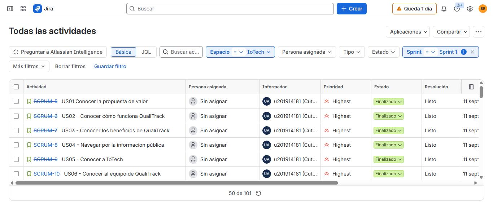
  <p><em>Figura: User Stories del Sprint 1 en Jira. Esta vista evidencia las 101 User Stories del sprint, filtradas por Sprint 1, con su prioridad y su estado Finalizado, con las que el equipo siguió el avance hacia el Sprint Goal.</em></p>
</div>

**Enlace público al tablero:** [Sprint 1 - Jira](https://iotech-2620-8741.atlassian.net/jira/software/projects/SCRUM/boards/1)

En total el sprint comprende 182 tareas y 561 horas estimadas. Al cierre del sprint, las 182 tareas se encuentran en
estado Done.

**Sprint Goal.** *Our focus is on* giving visitors, quality managers of pharmaceutical laboratories and warehouses, clear information about the problem QualiTrack solves, how it works, its benefits, the team behind it and the subscription plans through the Landing Page; and on giving quality managers, operators and auditors the first deployed version of the Web Application to register their laboratory, environments and staff, control the raw material inventory, equipment and IoT devices, supervise environmental conditions, manage batch traceability and release, attend deviation alerts and generate reports.

*We believe it delivers* greater confidence to visitors when deciding to subscribe to QualiTrack, and centralized, traceable supervision of conditions, materials and batches to quality managers and operators, reducing manual records and late responses to deviations.

*This will be confirmed when* visitors navigate the Landing Page sections and reach the Web Application from its calls to action, and when users create their account, complete the initial setup (subscription and laboratory) and perform their main tasks in the deployed application (registering environments, raw materials and batches, checking telemetry, attending an alert and generating a report) without help from the development team.

| Sprint 1 Velocity | Sum of Story Points |
|-------------------|---------------------|
| 190               | 190                 |

**Matriz de liderazgo y colaboración (LACX).** Durante el Sprint 1 los aspectos de trabajo corresponden a la Landing Page y a los Bounded Contexts del core business de QualiTrack implementados en la Web Application: Laboratory Management, Inventory Management, Equipment Management, Tracking & Telemetry, Product Batch Management y Compliance & Alerting. Los contextos de soporte (Identity & Access Management, Payments & Subscriptions, Reporting & Audit y Profile) se desarrollan de forma transversal por el equipo.

| Team Member (Last Name, First Name) / GitHub Username | Landing Page | Laboratory Management | Inventory Management | Equipment Management | Tracking & Telemetry | Product Batch Management | Compliance & Alerting |
|-------------------------------------------------------|--------------|-----------------------|----------------------|----------------------|----------------------|--------------------------|-----------------------|
| Baca Camargo, Vitaly Arturo (Mr-Code-star)            | C | C | C | C | C | C | C |
| Cutiri Agüero, Fabrizio Alexander (FabrizioCutiri)    | C | C | L | C | C | L | C |
| Guzmán Cabrejos, Yaku Mateo (yakumateo)               | C | C | C | L | C | C | C |
| Huapaya Galindo, Dyron (MaineMa)                      | L | C | C | C | C | C | C |
| Lopez Roman, Franco Mauricio (FrancoLopez00)          | C | C | C | C | C | C | L |
| Montes Ramos, Henry Jaredt (jahen17)                  | C | C | C | C | C | C | C |
| Ruiz Madrid, Billy Jake (BJRM03)                      | C | L | C | C | C | C | C |
| Torres Apolinario, Giovany Smith (giovanydevv)        | C | C | C | C | L | C | C |
| Quiroz Caceres, Adrian Alonso (Aqc1019)               | C | C | C | C | C | C | C |

Donde **L (Leader)** es el responsable principal del aspecto y **C (Collaborator)** es el miembro de apoyo en la implementación.

**Sprint Backlog 1 (User Stories y tareas)**

| US | User Story | Task | Título de la tarea | Descripción | Horas | Asignado a | Estado |
|----|------------|------|--------------------|-------------|-------|------------|--------|
| | **Landing Page** | | | | | | |
| US01 | Conocer la propuesta de valor | T001 | Maquetar la sección Home | Hero con el titular, la propuesta de valor, la imagen principal y el botón de llamada a la acción. | 3 | Huapaya Galindo, Dyron | Done |
| US01 | | T002 | Enlazar los CTA con la aplicación web desplegada | Apuntar los botones "Get started" del sitio al frontend publicado en Firebase Hosting. | 1 | Quiroz Caceres, Adrian Alonso | Done |
| US02 | Conocer cómo funciona QualiTrack | T003 | Implementar la sección Features en acordeón | Funcionalidades de monitoreo, alertas, trazabilidad y reportes en un acordeón con su descripción. | 3 | Huapaya Galindo, Dyron | Done |
| US02 | | T004 | Incrustar el video de funcionalidades | Video de YouTube junto al acordeón para explicar cómo funciona QualiTrack. | 1 | Huapaya Galindo, Dyron | Done |
| US03 | Conocer los beneficios de QualiTrack | T005 | Maquetar la sección Benefits | Tarjetas con los beneficios de supervisión, trazabilidad y cumplimiento BPM. | 3 | Huapaya Galindo, Dyron | Done |
| US03 | | T006 | Adaptar el sitio a pantallas móviles | Media queries para que las secciones se reorganicen en móvil, tablet y escritorio. | 2 | Huapaya Galindo, Dyron | Done |
| US04 | Navegar por la información pública | T007 | Implementar la barra de navegación | Navbar fija con anclas a Home, Features, Benefits, About Us y Plans. | 2 | Huapaya Galindo, Dyron | Done |
| US04 | | T008 | Agregar atributos ARIA | Roles, aria-label y aria-expanded en la navegación, el acordeón, el selector de idioma y los botones. | 2 | Baca Camargo, Vitaly Arturo | Done |
| US05 | Conocer a IoTech | T009 | Maquetar la sección About Us | Presentación de IoTech, su misión y el video del equipo. | 3 | Huapaya Galindo, Dyron | Done |
| US06 | Conocer al equipo de QualiTrack | T010 | Publicar los perfiles del equipo | Foto, nombre y descripción de los nueve integrantes, traducidos al inglés y al español. | 3 | Huapaya Galindo, Dyron | Done |
| US07 | Consultar testimonios | T011 | Implementar la sección de testimonios | Sección que muestra solo testimonios reales aprobados, sin publicar testimonios ficticios. | 3 | Baca Camargo, Vitaly Arturo | Done |
| US08 | Comparar planes de suscripción | T012 | Maquetar la sección Plans | Plan Standard Lab y Enterprise con precio, periodicidad, características y cambio mensual/anual. | 3 | Huapaya Galindo, Dyron | Done |
| US08 | | T013 | Enlazar los planes con el registro de la aplicación web | El botón de cada plan lleva al registro del frontend desplegado. | 1 | Baca Camargo, Vitaly Arturo | Done |
| US09 | Solicitar información sobre QualiTrack | T014 | Implementar el formulario de contacto | Formulario con validación de campos obligatorios y confirmación de envío. | 4 | Quiroz Caceres, Adrian Alonso | Done |
| US10 | Consultar el contenido en el idioma preferido | T015 | Implementar el cambio de idioma | Selector EN/ES que reemplaza los textos marcados con data-i18n y recuerda la elección. | 3 | Huapaya Galindo, Dyron | Done |
| US10 | | T016 | Traducir el contenido del sitio | Archivos de traducción en.js y es.js para todas las secciones. | 2 | Huapaya Galindo, Dyron | Done |
| US11 | Consultar documentos legales | T017 | Crear las páginas legales | Páginas de Términos de Servicio y Política de Privacidad enlazadas desde el footer. | 3 | Huapaya Galindo, Dyron | Done |
| | **Identity & Access Management** | | | | | | |
| US12 | Crear una cuenta | T018 | Implementar el formulario de registro | Vista sign-up-form con validación de correo y de la política de contraseñas. | 3 | Guzmán Cabrejos, Yaku Mateo | Done |
| US12 | | T019 | Integrar el registro con la API | IamStore y POST /authentication/sign-up; manejo de correo o usuario ya registrados. | 3 | Ruiz Madrid, Billy Jake | Done |
| US13 | Iniciar sesión | T020 | Implementar el formulario de inicio de sesión | Vista sign-in-form con mensajes de credenciales inválidas. | 3 | Guzmán Cabrejos, Yaku Mateo | Done |
| US13 | | T021 | Gestionar la sesión con JWT | Interceptor que envía el token y redirección según el siguiente paso de la configuración inicial. | 3 | Ruiz Madrid, Billy Jake | Done |
| US14 | Solicitar recuperación de contraseña | T022 | Implementar la solicitud de recuperación | Paso de password-recovery que pide el usuario o el correo. | 3 | Guzmán Cabrejos, Yaku Mateo | Done |
| US14 | | T023 | Integrar la solicitud con la API | POST /authentication/password-recovery-requests y aviso de envío del código. | 3 | Ruiz Madrid, Billy Jake | Done |
| US15 | Restablecer la contraseña | T024 | Implementar el restablecimiento con código | Paso de password-recovery con el código de 6 dígitos y la nueva contraseña. | 3 | Guzmán Cabrejos, Yaku Mateo | Done |
| US15 | | T025 | Integrar el restablecimiento con la API | POST /authentication/password-resets y retorno al inicio de sesión. | 3 | Ruiz Madrid, Billy Jake | Done |
| US16 | Cerrar sesión | T026 | Implementar el cierre de sesión | Acción en user-session-section que limpia la sesión y vuelve al inicio. | 3 | Guzmán Cabrejos, Yaku Mateo | Done |
| US17 | Cambiar mi contraseña | T027 | Implementar el cambio de contraseña | Vista change-password-form, obligatoria con la contraseña temporal del personal. | 3 | Guzmán Cabrejos, Yaku Mateo | Done |
| US17 | | T028 | Integrar el cambio con la API | POST /users/me/password-changes y actualización del estado de la sesión. | 3 | Ruiz Madrid, Billy Jake | Done |
| US18 | Actualizar el usuario y el correo de mi cuenta | T029 | Implementar la edición de la cuenta | Formulario de usuario y correo que pide la contraseña actual. | 3 | Guzmán Cabrejos, Yaku Mateo | Done |
| US18 | | T030 | Integrar la cuenta con la API | PUT /users/me con manejo de usuario o correo ya usados. | 3 | Ruiz Madrid, Billy Jake | Done |
| US24 | Continuar hacia la contratación cuando no existe una suscripción activa | T031 | Implementar el paso de contratación del onboarding | Vista onboarding que guía al responsable de calidad sin suscripción activa hacia los planes. | 3 | Guzmán Cabrejos, Yaku Mateo | Done |
| US24 | | T032 | Proteger las rutas operativas | Guard que consulta GET /users/me/onboarding y redirige según nextStep. | 3 | Ruiz Madrid, Billy Jake | Done |
| US25 | Continuar hacia el registro de la instalación | T033 | Implementar el paso de registro de la instalación | Paso del onboarding que lleva al registro del laboratorio o almacén. | 3 | Guzmán Cabrejos, Yaku Mateo | Done |
| US25 | | T034 | Integrar el paso con la API | Lectura de nextStep LABORATORY y continuación tras el registro. | 3 | Ruiz Madrid, Billy Jake | Done |
| US26 | Acceder a las funciones operativas con la configuración inicial completa | T035 | Habilitar el acceso operativo | Acceso al panel y a los módulos solo con la configuración inicial completa (nextStep READY). | 3 | Guzmán Cabrejos, Yaku Mateo | Done |
| US26 | | T036 | Manejar el error ONBOARDING_REQUIRED | Redirección al paso pendiente cuando la API responde 403 ONBOARDING_REQUIRED. | 3 | Ruiz Madrid, Billy Jake | Done |
| | **Payments & Subscriptions** | | | | | | |
| US19 | Seleccionar un plan | T037 | Implementar el catálogo de planes | Vista plan-list con planes mensuales y anuales, precio y límites de usuarios y equipos. | 3 | Montes Ramos, Henry Jaredt | Done |
| US20 | Completar el pago de la suscripción | T038 | Implementar el pago con Stripe Checkout | Vista checkout que crea la sesión de pago y redirige a Stripe. | 3 | Montes Ramos, Henry Jaredt | Done |
| US20 | | T039 | Implementar el retorno del pago | Vistas payment-success y payment-cancel con la confirmación de la suscripción. | 3 | Ruiz Madrid, Billy Jake | Done |
| US21 | Consultar el estado de la suscripción | T040 | Implementar el resumen de la suscripción | Vista billing-summary con plan, estado, ciclo y fin del periodo. | 3 | Montes Ramos, Henry Jaredt | Done |
| US22 | Consultar el historial de pagos | T041 | Implementar el historial de pagos | Tabla de pagos de la suscripción en billing-summary. | 3 | Montes Ramos, Henry Jaredt | Done |
| US23 | Cancelar la renovación de la suscripción | T042 | Implementar la cancelación de la renovación | Diálogo de confirmación en billing-summary; el acceso se mantiene hasta el fin del periodo. | 3 | Montes Ramos, Henry Jaredt | Done |
| US23 | | T043 | Integrar la cancelación con la API | POST /subscriptions/{id}/cancellation-requests y actualización del estado. | 3 | Ruiz Madrid, Billy Jake | Done |
| | **Laboratory Management** | | | | | | |
| US27 | Registrar el laboratorio o almacén | T044 | Implementar el registro del laboratorio | Vista lab-form con nombre, RUC, dirección, teléfono y regulaciones aplicables. | 3 | Ruiz Madrid, Billy Jake | Done |
| US27 | | T045 | Integrar el registro con la API | POST /laboratories y continuación del onboarding. | 3 | Guzmán Cabrejos, Yaku Mateo | Done |
| US28 | Consultar la información del laboratorio o almacén | T046 | Implementar el perfil del laboratorio | Vista lab-profile con los datos y regulaciones del laboratorio. | 3 | Ruiz Madrid, Billy Jake | Done |
| US29 | Actualizar la información del laboratorio o almacén | T047 | Implementar la edición del laboratorio | Modo de edición de lab-form con validaciones. | 3 | Ruiz Madrid, Billy Jake | Done |
| US29 | | T048 | Integrar la edición con la API | PUT /laboratories/{id}. | 3 | Guzmán Cabrejos, Yaku Mateo | Done |
| US30 | Registrar un ambiente | T049 | Implementar el registro de ambientes | Vista environment-form con código, nombre y descripción. | 3 | Ruiz Madrid, Billy Jake | Done |
| US30 | | T050 | Integrar el registro con la API | POST /laboratories/{id}/environments. | 3 | Guzmán Cabrejos, Yaku Mateo | Done |
| US31 | Definir el uso de un ambiente | T051 | Implementar la definición de uso | Selección de uso del ambiente: laboratorio, producción, almacén de materias primas o de producto. | 3 | Ruiz Madrid, Billy Jake | Done |
| US31 | | T052 | Integrar el uso con la API | POST .../environments/{id}/usage-assignments. | 3 | Guzmán Cabrejos, Yaku Mateo | Done |
| US32 | Consultar los ambientes registrados | T053 | Implementar la lista de ambientes | Vistas environment-list y environment-selector para filtrar los módulos por ambiente. | 3 | Ruiz Madrid, Billy Jake | Done |
| US33 | Actualizar un ambiente | T054 | Implementar la edición de ambientes | Modo de edición de environment-form. | 3 | Ruiz Madrid, Billy Jake | Done |
| US33 | | T055 | Integrar la edición con la API | PUT .../environments/{id}. | 3 | Guzmán Cabrejos, Yaku Mateo | Done |
| US34 | Registrar personal | T056 | Implementar el registro de personal | Vista staff-form para operarios y auditores con su cargo. | 3 | Ruiz Madrid, Billy Jake | Done |
| US34 | | T057 | Integrar el registro con la API | POST .../staff; credenciales enviadas por correo o mostradas una sola vez. | 3 | Guzmán Cabrejos, Yaku Mateo | Done |
| US35 | Consultar la actividad de un miembro del personal | T058 | Implementar el detalle del personal | Vista staff-detail con datos del miembro. | 3 | Ruiz Madrid, Billy Jake | Done |
| US35 | | T059 | Mostrar la actividad del miembro | GET .../staff/{id}/audit-logs con las acciones registradas. | 3 | Guzmán Cabrejos, Yaku Mateo | Done |
| US36 | Desactivar a un miembro del personal | T060 | Implementar la desactivación | Acción con confirmación en staff-list y staff-detail. | 3 | Ruiz Madrid, Billy Jake | Done |
| US36 | | T061 | Integrar la desactivación con la API | POST .../staff/{id}/deactivations. | 3 | Guzmán Cabrejos, Yaku Mateo | Done |
| | **Inventory Management** | | | | | | |
| US37 | Registrar una materia prima | T062 | Implementar el registro de materias primas | Vista register-material con código, unidad y stock mínimo por ambiente. | 3 | Cutiri Agüero, Fabrizio Alexander | Done |
| US37 | | T063 | Integrar el registro con la API | InventoryStore y POST .../environments/{id}/raw-materials. | 3 | Ruiz Madrid, Billy Jake | Done |
| US38 | Consultar materias primas | T064 | Implementar el catálogo de materias primas | Vista inventory-catalogue con búsqueda y filtros. | 3 | Cutiri Agüero, Fabrizio Alexander | Done |
| US39 | Registrar un lote recibido de materia prima | T065 | Implementar el registro de lotes recibidos | Formulario de recepción con proveedor, cantidad y vencimiento en inventory-detail. | 3 | Cutiri Agüero, Fabrizio Alexander | Done |
| US39 | | T066 | Integrar la recepción con la API | POST .../raw-material-batches y actualización del stock. | 3 | Ruiz Madrid, Billy Jake | Done |
| US40 | Consultar lotes de materia prima | T067 | Implementar la lista de lotes | Tabla de lotes con cantidades, estados y vencimientos en inventory-detail. | 3 | Cutiri Agüero, Fabrizio Alexander | Done |
| US41 | Revisar el estado de un lote de materia prima | T068 | Implementar la revisión del lote | Acciones liberar, observar o rechazar con motivo. | 3 | Cutiri Agüero, Fabrizio Alexander | Done |
| US41 | | T069 | Integrar la revisión con la API | Registro de la revisión y del movimiento REVIEW. | 3 | Ruiz Madrid, Billy Jake | Done |
| US42 | Consultar el stock utilizable | T070 | Mostrar el stock utilizable | Resumen de stock utilizable y físico en inventory-detail. | 3 | Cutiri Agüero, Fabrizio Alexander | Done |
| US42 | | T071 | Calcular el stock por lote | Suma de lotes liberados no vencidos menos consumos. | 3 | Ruiz Madrid, Billy Jake | Done |
| US43 | Identificar materias primas con stock bajo | T072 | Implementar el filtro de stock bajo | Filtro y marcador de materias primas bajo el mínimo en inventory-home. | 3 | Cutiri Agüero, Fabrizio Alexander | Done |
| US43 | | T073 | Mostrar el stock bajo en el panel | Tarjeta de materiales con stock bajo en el dashboard. | 3 | Ruiz Madrid, Billy Jake | Done |
| US44 | Identificar lotes próximos a vencer | T074 | Implementar el aviso de lotes por vencer | Indicador de lotes próximos a vencer en inventory-home e inventory-detail. | 3 | Cutiri Agüero, Fabrizio Alexander | Done |
| US44 | | T075 | Ordenar los lotes por vencimiento | Orden y resaltado de los lotes más cercanos a vencer. | 3 | Ruiz Madrid, Billy Jake | Done |
| US45 | Asignar un lote de materia prima a un contenedor monitoreado | T076 | Implementar la asignación a contenedor | Selección del monitor de contenedor del mismo ambiente de almacén de materias primas. | 3 | Cutiri Agüero, Fabrizio Alexander | Done |
| US45 | | T077 | Integrar la asignación con la API | Registro del almacenamiento y del movimiento STORAGE. | 3 | Ruiz Madrid, Billy Jake | Done |
| US46 | Consultar el contenedor de una materia prima | T078 | Mostrar el contenedor del lote | Columna del contenedor asignado en la lista de lotes. | 3 | Cutiri Agüero, Fabrizio Alexander | Done |
| US47 | Consultar los movimientos de una materia prima | T079 | Implementar el historial de movimientos | Tabla de movimientos RECEIPT, REVIEW, STORAGE y CONSUMPTION. | 3 | Cutiri Agüero, Fabrizio Alexander | Done |
| US47 | | T080 | Integrar los movimientos con la API | GET .../raw-materials/{id}/movements. | 3 | Ruiz Madrid, Billy Jake | Done |
| | **Equipment Management** | | | | | | |
| US48 | Registrar un equipo | T081 | Implementar el registro de equipos | Vista equipment-form con tipo, modelo y número de serie. | 3 | Guzmán Cabrejos, Yaku Mateo | Done |
| US48 | | T082 | Integrar el registro con la API | EquipmentStore y POST /laboratories/{id}/equipments. | 3 | Torres Apolinario, Giovany Smith | Done |
| US49 | Consultar equipos | T083 | Implementar la lista de equipos | Vista equipment-list con búsqueda, estado y ambiente. | 3 | Guzmán Cabrejos, Yaku Mateo | Done |
| US50 | Asociar un equipo con un ambiente | T084 | Asociar el equipo con un ambiente | Selección del ambiente en equipment-form. | 3 | Guzmán Cabrejos, Yaku Mateo | Done |
| US50 | | T085 | Integrar la ubicación con la API | Actualización del ambiente del equipo. | 3 | Torres Apolinario, Giovany Smith | Done |
| US51 | Actualizar el estado operativo de un equipo | T086 | Implementar el cambio de estado operativo | Acción en equipment-detail con motivo del cambio. | 3 | Guzmán Cabrejos, Yaku Mateo | Done |
| US51 | | T087 | Integrar el cambio con la API | POST .../equipments/{id}/status-changes. | 3 | Torres Apolinario, Giovany Smith | Done |
| US52 | Registrar un mantenimiento | T088 | Implementar el registro de mantenimiento | Vista maintenance-form con tipo, fecha y técnico. | 3 | Guzmán Cabrejos, Yaku Mateo | Done |
| US52 | | T089 | Integrar el mantenimiento con la API | POST .../maintenance-records. | 3 | Torres Apolinario, Giovany Smith | Done |
| US53 | Consultar el historial de mantenimiento | T090 | Implementar el historial de mantenimiento | Pestaña de mantenimientos en equipment-detail. | 3 | Guzmán Cabrejos, Yaku Mateo | Done |
| US54 | Registrar un dispositivo ambiental | T091 | Implementar el registro del dispositivo ambiental | Vista device-form para un ENVIRONMENTAL_DEVICE con su identificador externo. | 3 | Guzmán Cabrejos, Yaku Mateo | Done |
| US54 | | T092 | Integrar el registro con la API | Alta del dispositivo como equipo IoT. | 3 | Torres Apolinario, Giovany Smith | Done |
| US55 | Asociar un dispositivo ambiental con un ambiente | T093 | Asociar el dispositivo ambiental | Un dispositivo ambiental por ambiente. | 3 | Guzmán Cabrejos, Yaku Mateo | Done |
| US55 | | T094 | Validar la asociación | Mensaje cuando el ambiente ya tiene dispositivo. | 3 | Torres Apolinario, Giovany Smith | Done |
| US56 | Registrar un monitor de contenedor | T095 | Implementar el registro del monitor de contenedor | Vista device-form para un CONTAINER_MONITOR. | 3 | Guzmán Cabrejos, Yaku Mateo | Done |
| US56 | | T096 | Integrar el registro con la API | Alta del monitor como equipo IoT. | 3 | Torres Apolinario, Giovany Smith | Done |
| US57 | Asociar un monitor de contenedor con un ambiente | T097 | Asociar el monitor con un ambiente | Selección del ambiente del contenedor. | 3 | Guzmán Cabrejos, Yaku Mateo | Done |
| US57 | | T098 | Integrar la asociación con la API | Actualización del ambiente del monitor. | 3 | Torres Apolinario, Giovany Smith | Done |
| US59 | Configurar los parámetros BPM de un equipo | T099 | Implementar los parámetros BPM | Vista bpm-config-form con rangos por parámetro. | 3 | Guzmán Cabrejos, Yaku Mateo | Done |
| US59 | | T100 | Integrar los parámetros con la API | PUT por parámetro de .../bpm-configs. | 3 | Torres Apolinario, Giovany Smith | Done |
| | **Tracking & Telemetry** | | | | | | |
| US58 | Consultar el estado de conexión de un dispositivo IoT | T101 | Mostrar el estado de conexión | Insignia Conectado / Requiere revisión en equipos y telemetría. | 3 | Torres Apolinario, Giovany Smith | Done |
| US58 | | T102 | Integrar el estado con la API | GET .../devices/{id}/telemetry-status. | 3 | Ruiz Madrid, Billy Jake | Done |
| US60 | Configurar el rango de calidad de aire de un ambiente | T103 | Implementar el editor del perfil del ambiente | Vistas environmental-profiles y threshold-editor para calidad de aire. | 3 | Torres Apolinario, Giovany Smith | Done |
| US60 | | T104 | Integrar el perfil con la API | PUT .../environmental-profile/thresholds con versión del perfil. | 3 | Ruiz Madrid, Billy Jake | Done |
| US61 | Configurar rangos de temperatura y humedad de un contenedor | T105 | Configurar temperatura y humedad del contenedor | Rangos normal y crítico en threshold-editor. | 3 | Torres Apolinario, Giovany Smith | Done |
| US61 | | T106 | Integrar los rangos con la API | PUT .../container-monitors/{id}/environmental-profile/thresholds. | 3 | Ruiz Madrid, Billy Jake | Done |
| US62 | Configurar el rango de luminosidad de un contenedor | T107 | Configurar la luminosidad del contenedor | Rango normal y crítico de luminosidad. | 3 | Torres Apolinario, Giovany Smith | Done |
| US62 | | T108 | Validar los rangos | El rango crítico debe contener al normal. | 3 | Ruiz Madrid, Billy Jake | Done |
| US63 | Configurar una respuesta automática del contenedor | T109 | Implementar el editor de reglas | Vista actuation-rules-editor: métrica, estado y acción (ventilación, enfriamiento, servo). | 5 | Torres Apolinario, Giovany Smith | Done |
| US63 | | T110 | Integrar las reglas con la API | PUT .../environmental-profile/actuation-rules. | 4 | Ruiz Madrid, Billy Jake | Done |
| US64 | Consultar la calidad de aire de un ambiente | T111 | Mostrar la calidad de aire | Lectura actual y estado en environmental-monitoring. | 3 | Torres Apolinario, Giovany Smith | Done |
| US64 | | T112 | Integrar las mediciones con la API | GET .../environments/{id}/telemetry-measurements. | 3 | Ruiz Madrid, Billy Jake | Done |
| US65 | Consultar la detección de movimiento de un ambiente | T113 | Mostrar la detección de movimiento | Eventos de movimiento del ambiente. | 3 | Torres Apolinario, Giovany Smith | Done |
| US65 | | T114 | Filtrar por métrica MOTION | Consulta de mediciones por métrica. | 3 | Ruiz Madrid, Billy Jake | Done |
| US67 | Consultar temperatura y humedad de un contenedor | T115 | Mostrar temperatura y humedad del contenedor | Lecturas y estados con sus rangos. | 3 | Torres Apolinario, Giovany Smith | Done |
| US67 | | T116 | Integrar el contenedor con la API | GET .../container-monitors/{id}/telemetry-measurements. | 3 | Ruiz Madrid, Billy Jake | Done |
| US68 | Consultar la luminosidad de un contenedor | T117 | Mostrar la luminosidad del contenedor | Lectura y estado de luminosidad. | 3 | Torres Apolinario, Giovany Smith | Done |
| US68 | | T118 | Graficar la luminosidad | Serie de lecturas en el gráfico. | 3 | Ruiz Madrid, Billy Jake | Done |
| US69 | Consultar la acción automática de un contenedor | T119 | Mostrar las acciones automáticas | Lista de acciones ejecutadas por el contenedor. | 3 | Torres Apolinario, Giovany Smith | Done |
| US69 | | T120 | Integrar las acciones con la API | GET .../container-monitors/{id}/actuation-events. | 3 | Ruiz Madrid, Billy Jake | Done |
| US70 | Consultar la identificación RFID de un contenedor | T121 | Mostrar la identificación RFID | Última etiqueta RFID leída por el contenedor. | 3 | Torres Apolinario, Giovany Smith | Done |
| US70 | | T122 | Integrar las lecturas RFID | Mediciones RFID_TAG del monitor. | 3 | Ruiz Madrid, Billy Jake | Done |
| US72 | Consultar el historial del dispositivo ambiental | T123 | Implementar el historial del dispositivo ambiental | Vista telemetry-history con periodo de hasta 31 días. | 3 | Torres Apolinario, Giovany Smith | Done |
| US72 | | T124 | Graficar el historial | Serie temporal con los rangos del perfil. | 3 | Ruiz Madrid, Billy Jake | Done |
| US73 | Consultar el historial de un contenedor monitoreado | T125 | Implementar el historial del contenedor | Historial por métrica del monitor de contenedor. | 3 | Torres Apolinario, Giovany Smith | Done |
| US73 | | T126 | Graficar el historial | Serie temporal con desviaciones resaltadas. | 3 | Ruiz Madrid, Billy Jake | Done |
| | **Product Batch Management** | | | | | | |
| US75 | Registrar un producto | T127 | Implementar el registro de productos | Vista product-form por ambiente. | 3 | Cutiri Agüero, Fabrizio Alexander | Done |
| US75 | | T128 | Integrar el registro con la API | BatchStore y POST .../environments/{id}/products. | 3 | Ruiz Madrid, Billy Jake | Done |
| US76 | Consultar productos | T129 | Implementar el catálogo de productos | Vistas product-catalog y product-detail. | 3 | Cutiri Agüero, Fabrizio Alexander | Done |
| US77 | Registrar un lote de producto | T130 | Implementar el registro de lotes de producto | Vista batch-form con cantidad y fecha de inicio. | 3 | Cutiri Agüero, Fabrizio Alexander | Done |
| US77 | | T131 | Integrar el registro con la API | POST .../products/{id}/batches. | 3 | Ruiz Madrid, Billy Jake | Done |
| US78 | Consultar un lote de producto | T132 | Implementar el detalle del lote | Vistas batch-list y batch-detail. | 3 | Cutiri Agüero, Fabrizio Alexander | Done |
| US79 | Registrar el consumo de materia prima | T133 | Implementar el registro de consumo | Vista raw-material-usage con selección de lotes utilizables. | 5 | Cutiri Agüero, Fabrizio Alexander | Done |
| US79 | | T134 | Integrar el consumo con la API | Descuento de stock e inicio del lote con el primer consumo. | 4 | Ruiz Madrid, Billy Jake | Done |
| US80 | Asociar un equipo con un lote de producto | T135 | Asociar equipos con el lote | Sección de equipos en batch-participants. | 3 | Cutiri Agüero, Fabrizio Alexander | Done |
| US80 | | T136 | Integrar la asociación con la API | Registro de la participación del equipo. | 3 | Ruiz Madrid, Billy Jake | Done |
| US81 | Asociar personal con un lote de producto | T137 | Asociar personal con el lote | Sección de personal en batch-participants. | 3 | Cutiri Agüero, Fabrizio Alexander | Done |
| US81 | | T138 | Integrar la asociación con la API | Registro de la participación del personal. | 3 | Ruiz Madrid, Billy Jake | Done |
| US82 | Asignar un lote de producto a un contenedor monitoreado | T139 | Implementar la asignación a contenedor | Vista batch-storage con contenedores de almacenes de producto. | 3 | Cutiri Agüero, Fabrizio Alexander | Done |
| US82 | | T140 | Integrar la asignación con la API | Registro del contenedor del lote. | 3 | Ruiz Madrid, Billy Jake | Done |
| US83 | Consultar el contenedor de un lote de producto | T141 | Mostrar el contenedor del lote | Sección de almacenamiento en batch-detail. | 3 | Cutiri Agüero, Fabrizio Alexander | Done |
| US84 | Consultar la trazabilidad de un lote | T142 | Implementar la trazabilidad | Vista batch-traceability con materias primas, equipos, personal y contenedor. | 5 | Cutiri Agüero, Fabrizio Alexander | Done |
| US84 | | T143 | Integrar la trazabilidad con la API | GET .../batches/{id}/traceability. | 4 | Ruiz Madrid, Billy Jake | Done |
| US85 | Liberar un lote de producto | T144 | Implementar la liberación | Vista batch-release-form con firma digital. | 3 | Cutiri Agüero, Fabrizio Alexander | Done |
| US85 | | T145 | Integrar la liberación con la API | POST .../batches/{id}/releases y firma SHA-256. | 3 | Ruiz Madrid, Billy Jake | Done |
| US86 | Rechazar un lote de producto | T146 | Implementar el rechazo | Vista batch-reject-form con motivo obligatorio. | 3 | Cutiri Agüero, Fabrizio Alexander | Done |
| US86 | | T147 | Integrar el rechazo con la API | POST .../batches/{id}/rejections. | 3 | Ruiz Madrid, Billy Jake | Done |
| | **Compliance & Alerting** | | | | | | |
| US89 | Consultar alertas activas | T148 | Implementar el panel de alertas | Vistas alert-dashboard y alert-table con filtros por estado. | 3 | Lopez Roman, Franco Mauricio | Done |
| US90 | Consultar el detalle de una alerta | T149 | Implementar el detalle de la alerta | Vista deviation-detail con desviaciones, ambiente, dispositivo y acciones relacionadas. | 3 | Lopez Roman, Franco Mauricio | Done |
| US90 | | T150 | Integrar el detalle con la API | CaStore y GET /deviation-alerts/{id}. | 3 | Huapaya Galindo, Dyron | Done |
| US91 | Registrar que una alerta está siendo atendida | T151 | Implementar la atención de la alerta | Acción "Atender" para operarios y responsables de calidad. | 3 | Lopez Roman, Franco Mauricio | Done |
| US91 | | T152 | Integrar la atención con la API | POST /deviation-alerts/{id}/acknowledgements. | 3 | Huapaya Galindo, Dyron | Done |
| US92 | Resolver una alerta | T153 | Implementar la resolución | Formulario con notas de resolución obligatorias. | 3 | Lopez Roman, Franco Mauricio | Done |
| US92 | | T154 | Integrar la resolución con la API | POST /deviation-alerts/{id}/resolutions. | 3 | Huapaya Galindo, Dyron | Done |
| US93 | Identificar lotes afectados por una materia prima no utilizable | T155 | Mostrar los lotes afectados | Lotes de producto que usaron una materia prima no utilizable en inventory-detail. | 5 | Lopez Roman, Franco Mauricio | Done |
| US93 | | T156 | Integrar los eventos de cumplimiento | Consulta de eventos de cumplimiento por lote. | 4 | Huapaya Galindo, Dyron | Done |
| US96 | Recibir avisos en la aplicación | T157 | Implementar la campana de avisos | Vista notification-bell con contador de no leídos. | 3 | Lopez Roman, Franco Mauricio | Done |
| US96 | | T158 | Integrar los avisos con la API | NotificationStore, /users/me/notifications y read-receipts. | 3 | Huapaya Galindo, Dyron | Done |
| US97 | Configurar mis preferencias de notificación | T159 | Implementar las preferencias de notificación | Vista notification-preferences-form. | 3 | Lopez Roman, Franco Mauricio | Done |
| US97 | | T160 | Integrar las preferencias con la API | GET y PUT /users/me/notification-preferences. | 3 | Huapaya Galindo, Dyron | Done |
| | **Reporting & Audit** | | | | | | |
| US98 | Consultar el registro de auditoría | T161 | Implementar el visor de auditoría | Vista audit-log-viewer por equipo, lote y personal. | 3 | Montes Ramos, Henry Jaredt | Done |
| US98 | | T162 | Integrar la auditoría con la API | RaStore y GET .../audit-logs. | 3 | Ruiz Madrid, Billy Jake | Done |
| US99 | Consultar un resumen de mediciones ambientales | T163 | Implementar el resumen de mediciones | Vista kpi-dashboard con mínimo, máximo y promedio por métrica. | 3 | Montes Ramos, Henry Jaredt | Done |
| US99 | | T164 | Integrar los indicadores con la API | GET .../kpi-dashboards?from&to. | 3 | Ruiz Madrid, Billy Jake | Done |
| US100 | Consultar indicadores de desviaciones | T165 | Implementar el gráfico de desviaciones | Vista deviation-trend-chart con tiempo en rango. | 5 | Montes Ramos, Henry Jaredt | Done |
| US100 | | T166 | Integrar las tendencias con la API | GET .../environments/{id}/deviation-trends. | 4 | Ruiz Madrid, Billy Jake | Done |
| US101 | Generar un reporte ambiental | T167 | Implementar el reporte ambiental | Vista report-generator para el reporte ambiental por periodo. | 5 | Montes Ramos, Henry Jaredt | Done |
| US101 | | T168 | Descargar el reporte en PDF | POST .../reports y GET /reports/{id}/content. | 4 | Ruiz Madrid, Billy Jake | Done |
| US102 | Generar un reporte de trazabilidad de lote | T169 | Implementar el reporte de trazabilidad | Selección del lote en report-generator. | 5 | Montes Ramos, Henry Jaredt | Done |
| US102 | | T170 | Descargar el reporte en PDF | Generación y descarga del PDF del lote. | 4 | Ruiz Madrid, Billy Jake | Done |
| US103 | Generar un reporte de inventario | T171 | Implementar el reporte de inventario | Reporte de todo el laboratorio o de un ambiente. | 3 | Montes Ramos, Henry Jaredt | Done |
| US103 | | T172 | Descargar el reporte en PDF | Generación y descarga del PDF. | 3 | Ruiz Madrid, Billy Jake | Done |
| US104 | Generar un reporte de mantenimiento | T173 | Implementar el reporte de mantenimiento | Reporte de mantenimientos por periodo. | 3 | Montes Ramos, Henry Jaredt | Done |
| US104 | | T174 | Descargar el reporte en PDF | Generación y descarga del PDF. | 3 | Ruiz Madrid, Billy Jake | Done |
| US105 | Consultar el panel de control del laboratorio | T175 | Implementar el panel de control | Vista dashboard con equipos, lotes en proceso, alertas abiertas, stock bajo, telemetría y suscripción. | 5 | Montes Ramos, Henry Jaredt | Done |
| US105 | | T176 | Integrar el panel con la API | DashboardStore que combina laboratorio, equipos, lotes, alertas, inventario y telemetría. | 4 | Ruiz Madrid, Billy Jake | Done |
| | **Profile** | | | | | | |
| US106 | Actualizar mis datos personales | T177 | Implementar el perfil personal | Vista profile-page con nombre, DNI, teléfono y ubicación. | 3 | Huapaya Galindo, Dyron | Done |
| US106 | | T178 | Integrar el perfil con la API | ProfileStore y GET/PUT /users/me/profile. | 3 | Ruiz Madrid, Billy Jake | Done |
| US107 | Actualizar mi foto de perfil | T179 | Implementar la foto de perfil | Carga y retiro de foto JPG, PNG o WebP de hasta 2 MB. | 3 | Huapaya Galindo, Dyron | Done |
| US107 | | T180 | Integrar la foto con la API | PUT y DELETE /users/me/profile/photo. | 3 | Ruiz Madrid, Billy Jake | Done |
| US108 | Consultar el perfil de un miembro del personal | T181 | Mostrar el perfil del personal | Datos y foto del miembro para el responsable de calidad. | 3 | Huapaya Galindo, Dyron | Done |
| US108 | | T182 | Integrar el perfil con la API | GET .../staff/{id}/profile. | 3 | Ruiz Madrid, Billy Jake | Done |

### 5.2.2. Implemented Landing Page Evidence

En este sprint se implementó la primera versión de la Landing Page de QualiTrack.

- **Landing Page:** se implementaron las secciones Home, Features, Benefits, About Us (IoTech y el equipo), Plans y
  testimonios con la llamada final a la acción, la navegación entre secciones, el cambio de idioma entre inglés y
  español, el diseño adaptable a dispositivos móviles y las páginas de Términos de Servicio y Política de Privacidad.

- **Landing Page publicada:** [https://iotech-2620-8741.github.io/qualitrack-landing-page/](https://iotech-2620-8741.github.io/qualitrack-landing-page/)
- **Video de Execution Evidence del Sprint 1:** [https://shorturl.at/gppVX](https://shorturl.at/gppVX)

**Evidencia de ejecución**


<div align="center">
  
  <p><em>Figura: Encabezado y barra de navegación de la Landing Page. Esta vista evidencia el acceso directo a las secciones Home, Features, Benefits, About Us y Plans, el selector de idioma y el botón que lleva a la Web Application.</em></p>
</div>

<div align="center">
  
  <p><em>Figura: Sección Home. Esta pantalla valida la comunicación inicial de la propuesta de valor, The Future of Pharmaceutical Quality Management, y presenta en tarjetas lo que ofrece QualiTrack: monitoreo IoT en tiempo real, cumplimiento BPM automatizado y registros de auditoría inmutables.</em></p>
</div>

<div align="center">
  
  <p><em>Figura: Sección Features. Esta evidencia muestra en un acordeón las funcionalidades clave de la plataforma, como la integración de telemetría IoT, el motor de cumplimiento BPM, las alertas instantáneas de desviación y el panel de analítica y KPI.</em></p>
</div>

<div align="center">
  
  <p><em>Figura: Sección Benefits. Esta vista presenta las ventajas de QualiTrack para la manufactura farmacéutica, como la reducción del tiempo de preparación de auditorías de DIGEMID y la eliminación de errores humanos en los registros críticos.</em></p>
</div>

<div align="center">
  
  <p><em>Figura: Sección About Us. Esta evidencia presenta la visión de QualiTrack de digitalizar la supervisión de los procesos de manufactura y el cumplimiento de las Buenas Prácticas de Manufactura exigidas por DIGEMID, sus pilares (integración IoT, trazabilidad inmutable y cumplimiento regulatorio) y los perfiles de los integrantes del equipo de IoTech.</em></p>
</div>

<div align="center">
  
  <p><em>Figura: Sección Plans. Esta vista permite comparar los planes Standard Lab y Enterprise con su precio, periodicidad y características, alternando entre la modalidad mensual y anual.</em></p>
</div>

<div align="center">
  
  <p><em>Figura: Sección de testimonios y llamada final a la acción. Esta evidencia muestra las opiniones de responsables de calidad y producción sobre QualiTrack y el botón Get Started que lleva a la Web Application.</em></p>
</div>

<div align="center">
  
  <p><em>Figura: Footer de la Landing Page. Esta evidencia muestra el cierre de la navegación con accesos a las secciones, los datos de contacto (correo, teléfono y ubicación) y los enlaces a los Términos de Servicio y la Política de Privacidad.</em></p>
</div>

<div align="center">
  
  <p><em>Figura: Páginas de Términos de Servicio y Política de Privacidad. Esta vista evidencia la información legal que el visitante puede consultar antes de contratar el servicio.</em></p>
</div>

<div align="center">
  
  <p><em>Figura: Landing Page en español en un dispositivo móvil. Esta evidencia valida el cambio de idioma entre inglés y español y la adaptación del diseño a pantallas pequeñas en la portada, la sección de servicios y los planes.</em></p>
</div>

**Commits de implementación**

**Landing Page**
([IoTech-2620-8741/qualitrack-landing-page](https://github.com/IoTech-2620-8741/qualitrack-landing-page))

| Repository                               | Branch                        | Commit Id | Commit Message                                                                                                                              | Commit Message Body | Committed on (Date) |
|------------------------------------------|-------------------------------|-----------|---------------------------------------------------------------------------------------------------------------------------------------------|---------------------|---------------------|
| Io​Tech-2620-8741/​qualitrack-landing-page | develop                       | dccc748   | docs​(readme): Add README.md with project overview, key features, subscription plans, technologies used, project structure, and team details | —                   | 01/10/2026          |
| Io​Tech-2620-8741/​qualitrack-landing-page | develop                       | a4eddf0   | docs​(readme): Update team member details in README.md                                                                                       | —                   | 01/10/2026          |
| Io​Tech-2620-8741/​qualitrack-landing-page | feature/​previous-landing-page | 691a42d   | feat​(landing-page): Add initial landing page structure and content                                                                          | —                   | 01/10/2026          |
| Io​Tech-2620-8741/​qualitrack-landing-page | feature/​previous-landing-page | 9acff14   | feat​(landing-page): Add privacy policy page with comprehensive data handling information                                                    | —                   | 01/10/2026          |
| Io​Tech-2620-8741/​qualitrack-landing-page | feature/​previous-landing-page | 5e0fccc   | feat​(landing-page): Add Terms of Service page with comprehensive usage guidelines                                                           | —                   | 01/10/2026          |
| Io​Tech-2620-8741/​qualitrack-landing-page | feature/​previous-landing-page | 2d20d07   | feat​(landing-page): Add new images for team members and landing page visuals                                                                | —                   | 01/10/2026          |
| Io​Tech-2620-8741/​qualitrack-landing-page | feature/​previous-landing-page | 804c1dd   | feat​(landing-page): Implement language switching and interactive UI features                                                                | —                   | 01/10/2026          |
| Io​Tech-2620-8741/​qualitrack-landing-page | feature/​previous-landing-page | aac283b   | feat​(translations): Add English and Spanish translations for landing page content                                                           | —                   | 01/10/2026          |
| Io​Tech-2620-8741/​qualitrack-landing-page | feature/​previous-landing-page | 807dfd4   | feat​(styles): Add comprehensive CSS styles for landing page layout and design                                                               | —                   | 01/10/2026          |
| Io​Tech-2620-8741/​qualitrack-landing-page | feature/​team-members          | 86f222c   | feat​(translations): Update team member descriptions in English and Spanish                                                                  | —                   | 01/10/2026          |
| Io​Tech-2620-8741/​qualitrack-landing-page | feature/​team-members          | d262b10   | feat​(images): Remove unused team member icons for optimization                                                                              | —                   | 01/10/2026          |
| Io​Tech-2620-8741/​qualitrack-landing-page | feature/​team-members          | d54f84f   | feat​(images): Add new team member icons for enhanced representation                                                                         | —                   | 01/10/2026          |
| Io​Tech-2620-8741/​qualitrack-landing-page | feature/​team-members          | 83f6cbd   | feat(team): Update team member profiles and add new members                                                                                 | —                   | 01/10/2026          |
| Io​Tech-2620-8741/​qualitrack-landing-page | hotfix/​landing-page-video     | e9212f6   | feat(team): Add new team member Adrian Quiroz Cáceres to the profiles                                                                       | —                   | 01/10/2026          |
| Io​Tech-2620-8741/​qualitrack-landing-page | feature/​landing-page          | 6eb30de   | fix(link): Update demo request link to the new URL                                                                                          | —                   | 08/10/2026          |
| Io​Tech-2620-8741/​qualitrack-landing-page | feature/​landing-page          | 93d49fd   | fix(link): Update plan links to the new URL                                                                                                 | —                   | 08/10/2026          |
| Io​Tech-2620-8741/​qualitrack-landing-page | feature/​landing-page          | af3980c   | fix(link): Update demo request link to the new URL                                                                                          | —                   | 08/10/2026          |
| Io​Tech-2620-8741/​qualitrack-landing-page | feature/​landing-page          | 4a37b08   | fix​(copyright): Update copyright information from ClosedSource to IoTech                                                                    | —                   | 08/10/2026          |
| Io​Tech-2620-8741/​qualitrack-landing-page | feature/​landing-page          | 8ed862c   | fix(link): Update sign-up link to the new URL                                                                                               | —                   | 08/10/2026          |
| Io​Tech-2620-8741/​qualitrack-landing-page | release/​v1.0.0                | baa57e3   | docs​(readme): add version 1.0.0 section                                                                                                     | —                   | 08/10/2026          |
| Io​Tech-2620-8741/​qualitrack-landing-page | hotfix/​landing-page-video     | 4058b79   | fix(video): remove YouTube embed URL from features section                                                                                  | —                   | 08/10/2026          |
| Io​Tech-2620-8741/​qualitrack-landing-page | hotfix/​landing-page-video     | 969ed0d   | fix(video): remove YouTube embed URL from About Us section                                                                                  | —                   | 08/10/2026          |
| Io​Tech-2620-8741/​qualitrack-landing-page | hotfix/​landing-page           | cc88589   | docs​(readme): replace ClosedSource with IoTech                                                                                              | —                   | 08/10/2026          |
| Io​Tech-2620-8741/​qualitrack-landing-page | hotfix/​landing-page           | cb57105   | fix(legal): replace ClosedSource with IoTech in terms and policies                                                                          | —                   | 08/10/2026          |

**Despliegue de la Landing Page**

Nombre del repositorio en la organización: qualitrack-landing-page

La Landing Page es un sitio estático (`index.html` y la carpeta `public`), por lo que se publica directamente desde su
repositorio con GitHub Pages.

**Paso 1: Publicación con GitHub Pages**

1) En el repositorio, vamos a Settings y después Pages. En Build and deployment seleccionamos **Deploy from a branch**,
   la rama **main** y la carpeta **/ (root)**, y guardamos:

<div align="center">
  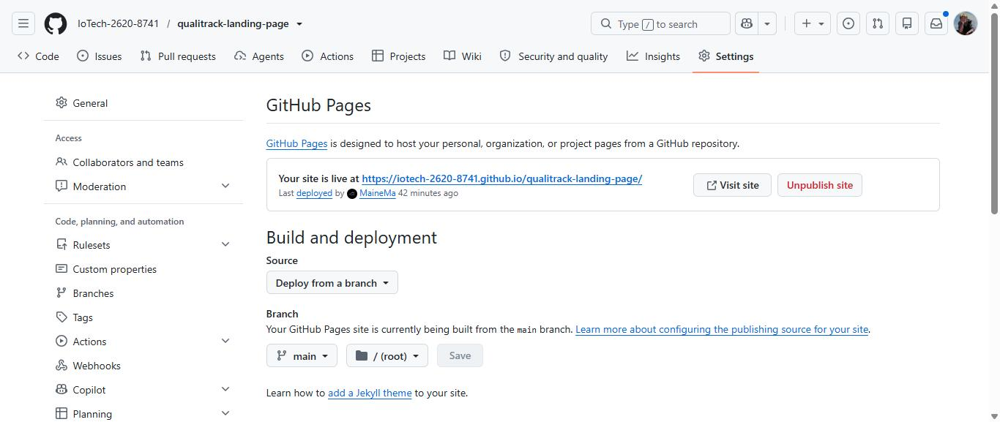
  <p><em>Figura: Configuración de GitHub Pages en el repositorio de la Landing Page. Esta vista evidencia el sitio publicado y su publicación desde la rama main y la carpeta raíz del repositorio.</em></p>
</div>

2) Con cada push a main, el workflow **pages-build-deployment** de GitHub Actions publica el sitio:

<div align="center">
  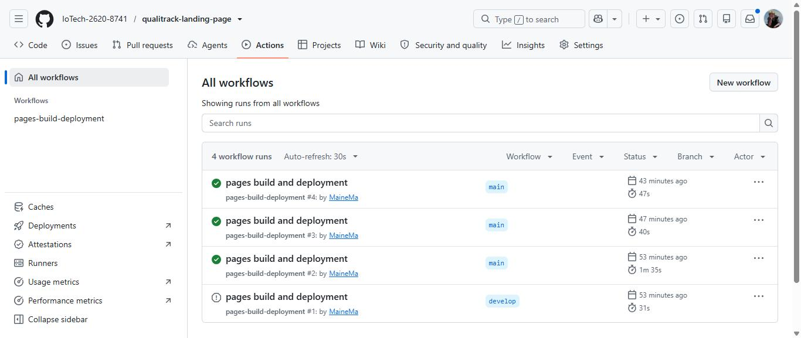
  <p><em>Figura: Ejecuciones del workflow pages-build-deployment en GitHub Actions. Esta evidencia muestra las publicaciones de la Landing Page realizadas desde la rama main.</em></p>
</div>

**Paso 2: Verificaciones**

1) Ingresamos a la Landing Page
   en [https://iotech-2620-8741.github.io/qualitrack-landing-page/](https://iotech-2620-8741.github.io/qualitrack-landing-page/)
   y recorremos sus secciones en inglés y en español:

<div align="center">
  
  <p><em>Figura: Landing Page publicada en GitHub Pages. Esta evidencia confirma que el sitio es accesible públicamente desde la URL de la organización.</em></p>
</div>

2) Verificamos que los botones Get started y los de cada plan lleven a la Web Application publicada en Firebase Hosting:

<div align="center">
  
  <p><em>Figura: Llamada a la acción de la Landing Page abierta en la Web Application. Esta evidencia muestra la conexión entre el sitio público y la aplicación desplegada.</em></p>
</div>


### 5.2.3. Implemented Frontend-Web Application Evidence

- **Web Application:** se construyó la base de la aplicación con Angular y Angular Material (layout, barra de
  navegación, selector de idioma e internacionalización) y los módulos de cada Bounded Context: autenticación,
  recuperación de contraseña y configuración inicial; planes, pago y resumen de suscripción; laboratorio, ambientes y
  personal; inventario de materias primas por ambiente; equipos, mantenimiento y dispositivos IoT; perfiles ambientales,
  monitoreo e historial de telemetría; productos, lotes, consumos, trazabilidad, liberación y rechazo; alertas de
  desviación y avisos; indicadores, auditoría y reportes; perfil del usuario y panel de control. Al final del sprint se
  documentó con TSDoc el módulo de Compliance & Alerting y se inició la documentación de entidades del módulo de
  inventario.

- **Web Application publicada:** [https://qualitrack-iotech.web.app](https://qualitrack-iotech.web.app)

En este sprint se publicó la primera versión de la Landing Page y de la Web Application. La Landing Page permite a los
visitantes conocer la propuesta de valor, el funcionamiento, los beneficios, el equipo y los planes de QualiTrack en
inglés o español. La Web Application permite al responsable de calidad crear su cuenta, contratar su plan y registrar su
laboratorio; y a todo el personal supervisar las condiciones ambientales, el inventario, los equipos, los lotes y las
alertas según su rol.

La revisión del sprint verificó que un visitante pueda recorrer la Landing Page, comprender la propuesta de valor y
llegar a la Web Application desde sus llamadas a la acción; y que, dentro de la aplicación, cada rol complete sus flujos
principales con datos reales del laboratorio de demostración SENKA LAB, en inglés y en español.

**Evidencia de ejecución**

**Web Application**

*Acceso y configuración inicial*

<div align="center">
  
  <p><em>Figura: Inicio de sesión. Esta pantalla valida el acceso del responsable de calidad, el personal operativo y los auditores con su usuario o correo, con mensajes claros cuando las credenciales no son válidas.</em></p>
</div>

<div align="center">
  
  <p><em>Figura: Registro de cuenta del responsable de calidad. Esta evidencia muestra los datos que se validan antes de crear la cuenta: usuario, correo único para recuperar la contraseña y contraseña con su confirmación.</em></p>
</div>

<div align="center">
  
  <p><em>Figura: Recuperación de contraseña. Esta vista evidencia la solicitud con el usuario o el correo de la cuenta, a cuyo correo se envía un código de seis dígitos para restablecer la contraseña.</em></p>
</div>

<div align="center">
  
  <p><em>Figura: Selección del plan de suscripción. Esta evidencia muestra los planes Standard Lab y Enterprise en modalidad mensual y anual, con sus cuentas de usuario y dispositivos conectados, que el responsable de calidad elige antes de usar las funciones operativas.</em></p>
</div>

*Panel de control*

<div align="center">
  
  <p><em>Figura: Panel de control del laboratorio. Esta evidencia reúne en una sola vista los equipos operativos, los lotes en proceso, las alertas abiertas, las materias primas con stock bajo, la telemetría reciente y el estado de la suscripción.</em></p>
</div>

*Laboratorio, ambientes y personal*

<div align="center">
  
  <p><em>Figura: Perfil del laboratorio. Esta vista muestra los datos registrados de la instalación y permite actualizarlos.</em></p>
</div>

<div align="center">
  
  <p><em>Figura: Ambientes del laboratorio. Esta evidencia muestra el registro de ambientes y la definición de su uso (laboratorio, producción, almacén de materias primas o de producto), que determina qué se puede almacenar en cada uno.</em></p>
</div>

<div align="center">
  
  <p><em>Figura: Personal del laboratorio. Esta pantalla muestra el registro de operarios y auditores, su cargo, su estado y la consulta de su actividad registrada.</em></p>
</div>

*Inventario de materias primas*

<div align="center">
  
  <p><em>Figura: Catálogo de materias primas por ambiente. Esta vista evidencia el stock utilizable y físico de cada material y resalta los que están por debajo del stock mínimo.</em></p>
</div>

<div align="center">
  
  <p><em>Figura: Detalle de una materia prima. Esta evidencia muestra sus lotes recibidos con estado y vencimiento, su contenedor, el historial de movimientos y los lotes de producto que la consumieron.</em></p>
</div>

*Equipos y dispositivos IoT*

<div align="center">
  
  <p><em>Figura: Equipos y dispositivos IoT. Esta pantalla lista los equipos del laboratorio con su ambiente y estado operativo, e identifica los dispositivos ambientales y monitores de contenedor con su estado de conexión.</em></p>
</div>

<div align="center">
  
  <p><em>Figura: Detalle de un equipo. Esta evidencia reúne sus datos generales, la reubicación entre ambientes, el registro de cambios de su estado operativo y su historial de mantenimiento con el técnico responsable.</em></p>
</div>

*Monitoreo ambiental*

<div align="center">
  
  <p><em>Figura: Monitoreo ambiental en tiempo real. Esta vista muestra las lecturas actuales de calidad de aire, temperatura, humedad y luminosidad con su estado (normal, advertencia o crítico) frente a los rangos del perfil vigente.</em></p>
</div>

<div align="center">
  
  <p><em>Figura: Historial de telemetría. Esta evidencia grafica las lecturas de un periodo de hasta 31 días junto con los rangos normal y crítico, resaltando las desviaciones.</em></p>
</div>

<div align="center">
  
  <p><em>Figura: Perfiles ambientales. Esta pantalla evidencia la configuración versionada de los límites normal y crítico por ambiente y por contenedor, que clasifican cada lectura como normal, advertencia o crítica.</em></p>
</div>

*Productos y lotes*

<div align="center">
  
  <p><em>Figura: Catálogo de productos farmacéuticos por ambiente. Esta vista muestra los productos registrados que pueden fabricarse en el laboratorio.</em></p>
</div>

<div align="center">
  
  <p><em>Figura: Lotes de producción. Esta evidencia lista los lotes con su producto, cantidad y estado (pendiente, en proceso, liberado o rechazado).</em></p>
</div>

<div align="center">
  
  <p><em>Figura: Detalle de un lote en proceso. Esta pantalla muestra el registro de consumos de materia prima desde un lote liberado de un ambiente, que descuenta el stock del inventario, y el historial de consumos del lote.</em></p>
</div>

<div align="center">
  
  <p><em>Figura: Trazabilidad de un lote liberado. Esta evidencia reúne las materias primas con sus lotes de origen, los equipos, el personal, el contenedor donde se almacenó el producto y la decisión de calidad firmada con su hash SHA-256.</em></p>
</div>

<div align="center">
  
  <p><em>Figura: Liberación de un lote. Esta vista evidencia que el responsable de calidad libera el lote con su fecha y sus notas de calidad, y que la liberación queda firmada con su usuario y ya no permite modificar el lote.</em></p>
</div>

*Alertas y avisos*

<div align="center">
  
  <p><em>Figura: Panel de alertas de desviación. Esta pantalla muestra las alertas por estado y severidad, con el ambiente, el dispositivo y la cantidad de desviaciones de cada incidente.</em></p>
</div>

<div align="center">
  
  <p><em>Figura: Detalle de una alerta. Esta evidencia muestra la inspección técnica de la desviación, las acciones automáticas del contenedor y las acciones para atenderla y resolverla con notas.</em></p>
</div>

<div align="center">
  
  <p><em>Figura: Campana de avisos y preferencias de notificación. Esta vista evidencia los avisos de alertas y lotes con su contador de no leídos, y la elección de qué avisos llegan a la aplicación y al correo.</em></p>
</div>

*Indicadores, reportes y auditoría*

<div align="center">
  
  <p><em>Figura: Resumen ambiental. Esta pantalla muestra, para el periodo elegido (24 horas, 7 o 31 días) y por ambiente, la cantidad de lecturas, el promedio, el mínimo, el máximo y la última lectura de cada variable de los dispositivos.</em></p>
</div>

<div align="center">
  
  <p><em>Figura: Generación de reportes. Esta evidencia muestra los reportes de lote, ambiental y de inventario en PDF, y la exportación del historial técnico y de mantenimiento de los equipos.</em></p>
</div>

<div align="center">
  
  <p><em>Figura: Registro de auditoría. Esta vista evidencia quién realizó cada acción y cuándo, con filtros por equipo, lote y periodo.</em></p>
</div>

*Perfil y suscripción*

<div align="center">
  
  <p><em>Figura: Perfil del usuario. Esta pantalla muestra los datos personales y la foto de perfil, junto con la información de la cuenta (los datos de identidad y teléfono se ocultaron en la imagen).</em></p>
</div>

<div align="center">
  
  <p><em>Figura: Resumen de la suscripción. Esta evidencia muestra el plan vigente, el periodo de facturación, el historial de pagos y la opción de cancelar la renovación.</em></p>
</div>

<div align="center">
  
  <p><em>Figura: Interfaz en español. Esta vista valida la internacionalización de la Web Application en inglés y español con el selector de idioma.</em></p>
</div>

En conjunto, estas evidencias muestran que el Sprint 1 entregó una Landing Page navegable y bilingüe que comunica la
propuesta de valor de QualiTrack, y una Web Application desplegada e integrada con el RESTful API que cubre el ciclo
completo del laboratorio: configuración inicial, inventario, equipos y dispositivos IoT, monitoreo ambiental,
trazabilidad y liberación de lotes, atención de alertas y generación de reportes.

**Commits de implementación**

**Web Application** ([IoTech-2620-8741/qualitrack-web-app](https://github.com/IoTech-2620-8741/qualitrack-web-app))

| Repository                          | Branch                                            | Commit Id | Commit Message                                                                                                                      | Commit Message Body                                                                                                                                                                | Committed on (Date) |
|-------------------------------------|---------------------------------------------------|-----------|-------------------------------------------------------------------------------------------------------------------------------------|------------------------------------------------------------------------------------------------------------------------------------------------------------------------------------|---------------------|
| Io​Tech-2620-8741/​qualitrack-web-app | feature/​foundation-onboarding                     | 93772bd   | feat(app): bootstrap routing providers and environments                                                                             | —                                                                                                                                                                                  | 12/09/2026          |
| Io​Tech-2620-8741/​qualitrack-web-app | develop                                           | ec96fc5   | chore: initial commit                                                                                                               | —                                                                                                                                                                                  | 12/09/2026          |
| Io​Tech-2620-8741/​qualitrack-web-app | feature/​foundation-onboarding                     | 311af67   | style​(theme): configure application styles and Material theme                                                                       | —                                                                                                                                                                                  | 12/09/2026          |
| Io​Tech-2620-8741/​qualitrack-web-app | feature/​foundation-onboarding                     | ed7df87   | feat​(shared): add entity contracts and API infrastructure                                                                           | —                                                                                                                                                                                  | 12/09/2026          |
| Io​Tech-2620-8741/​qualitrack-web-app | feature/​foundation-onboarding                     | 8f92322   | feat​(layout): add navigation toolbar and language switcher                                                                          | —                                                                                                                                                                                  | 12/09/2026          |
| Io​Tech-2620-8741/​qualitrack-web-app | feature/​foundation-onboarding                     | da7f567   | feat​(shared): add home about and fallback views                                                                                     | —                                                                                                                                                                                  | 12/09/2026          |
| Io​Tech-2620-8741/​qualitrack-web-app | feature/​foundation-onboarding                     | 8c6339d   | feat​(dashboard): summarize telemetry inventory and subscription data                                                                | —                                                                                                                                                                                  | 12/09/2026          |
| Io​Tech-2620-8741/​qualitrack-web-app | feature/​foundation-onboarding                     | 77e3757   | feat(i18n): add English and Spanish translations                                                                                    | —                                                                                                                                                                                  | 12/09/2026          |
| Io​Tech-2620-8741/​qualitrack-web-app | feature/​foundation-onboarding                     | 6b3a889   | style​(brand): add QualiTrack visual assets                                                                                          | —                                                                                                                                                                                  | 12/09/2026          |
| Io​Tech-2620-8741/​qualitrack-web-app | feature/​foundation-onboarding                     | a444f58   | feat(iam): define client domain models and commands                                                                                 | —                                                                                                                                                                                  | 12/09/2026          |
| Io​Tech-2620-8741/​qualitrack-web-app | feature/​foundation-onboarding                     | 342ae19   | feat(iam): integrate API clients and response assemblers                                                                            | —                                                                                                                                                                                  | 12/09/2026          |
| Io​Tech-2620-8741/​qualitrack-web-app | feature/​foundation-onboarding                     | 5f12de5   | feat(iam): manage reactive application state                                                                                        | —                                                                                                                                                                                  | 12/09/2026          |
| Io​Tech-2620-8741/​qualitrack-web-app | feature/​foundation-onboarding                     | b7069f1   | feat(iam): implement views forms and navigation                                                                                     | —                                                                                                                                                                                  | 12/09/2026          |
| Io​Tech-2620-8741/​qualitrack-web-app | feature/​foundation-onboarding                     | f399191   | feat​(subscription): define client domain models and commands                                                                        | —                                                                                                                                                                                  | 12/09/2026          |
| Io​Tech-2620-8741/​qualitrack-web-app | feature/​foundation-onboarding                     | 44c6280   | feat​(subscription): integrate API clients and response assemblers                                                                   | —                                                                                                                                                                                  | 12/09/2026          |
| Io​Tech-2620-8741/​qualitrack-web-app | feature/​foundation-onboarding                     | 2c2e506   | feat​(subscription): manage reactive application state                                                                               | —                                                                                                                                                                                  | 12/09/2026          |
| Io​Tech-2620-8741/​qualitrack-web-app | feature/​foundation-onboarding                     | 339b64a   | feat​(subscription): implement views forms and navigation                                                                            | —                                                                                                                                                                                  | 12/09/2026          |
| Io​Tech-2620-8741/​qualitrack-web-app | feature/​foundation-onboarding                     | d6383c9   | feat​(laboratory): define client domain models and commands                                                                          | —                                                                                                                                                                                  | 12/09/2026          |
| Io​Tech-2620-8741/​qualitrack-web-app | feature/​foundation-onboarding                     | bf034ff   | feat​(laboratory): integrate API clients and response assemblers                                                                     | —                                                                                                                                                                                  | 12/09/2026          |
| Io​Tech-2620-8741/​qualitrack-web-app | feature/​foundation-onboarding                     | ea65201   | feat​(laboratory): manage reactive application state                                                                                 | —                                                                                                                                                                                  | 12/09/2026          |
| Io​Tech-2620-8741/​qualitrack-web-app | feature/​foundation-onboarding                     | 9a415d2   | feat​(laboratory): implement views forms and navigation                                                                              | —                                                                                                                                                                                  | 12/09/2026          |
| Io​Tech-2620-8741/​qualitrack-web-app | feature/​foundation-onboarding                     | b7b2694   | feat​(equipment): define client domain models and commands                                                                           | —                                                                                                                                                                                  | 12/09/2026          |
| Io​Tech-2620-8741/​qualitrack-web-app | feature/​foundation-onboarding                     | 5003d2f   | feat​(equipment): integrate API clients and response assemblers                                                                      | —                                                                                                                                                                                  | 12/09/2026          |
| Io​Tech-2620-8741/​qualitrack-web-app | feature/​foundation-onboarding                     | 151a67d   | feat​(equipment): manage reactive application state                                                                                  | —                                                                                                                                                                                  | 12/09/2026          |
| Io​Tech-2620-8741/​qualitrack-web-app | feature/​foundation-onboarding                     | 7a79c11   | feat​(equipment): implement views forms and navigation                                                                               | —                                                                                                                                                                                  | 12/09/2026          |
| Io​Tech-2620-8741/​qualitrack-web-app | feature/​foundation-onboarding                     | 03532d8   | feat(batch): define client domain models and commands                                                                               | —                                                                                                                                                                                  | 12/09/2026          |
| Io​Tech-2620-8741/​qualitrack-web-app | feature/​foundation-onboarding                     | 13e2c53   | feat(batch): integrate API clients and response assemblers                                                                          | —                                                                                                                                                                                  | 12/09/2026          |
| Io​Tech-2620-8741/​qualitrack-web-app | feature/​foundation-onboarding                     | 5187168   | feat(batch): manage reactive application state                                                                                      | —                                                                                                                                                                                  | 12/09/2026          |
| Io​Tech-2620-8741/​qualitrack-web-app | feature/​foundation-onboarding                     | c08ba8d   | feat(batch): implement views forms and navigation                                                                                   | —                                                                                                                                                                                  | 12/09/2026          |
| Io​Tech-2620-8741/​qualitrack-web-app | feature/​foundation-onboarding                     | 0141d55   | feat(ca): define client domain models and commands                                                                                  | —                                                                                                                                                                                  | 12/09/2026          |
| Io​Tech-2620-8741/​qualitrack-web-app | feature/​foundation-onboarding                     | 1a39110   | feat(ca): integrate API clients and response assemblers                                                                             | —                                                                                                                                                                                  | 12/09/2026          |
| Io​Tech-2620-8741/​qualitrack-web-app | feature/​foundation-onboarding                     | 5fa3ebe   | feat(ca): manage reactive application state                                                                                         | —                                                                                                                                                                                  | 12/09/2026          |
| Io​Tech-2620-8741/​qualitrack-web-app | feature/​foundation-onboarding                     | ec4ccec   | feat(ca): implement views forms and navigation                                                                                      | —                                                                                                                                                                                  | 12/09/2026          |
| Io​Tech-2620-8741/​qualitrack-web-app | feature/​foundation-onboarding                     | f902471   | feat​(tracking): define client domain models and commands                                                                            | —                                                                                                                                                                                  | 12/09/2026          |
| Io​Tech-2620-8741/​qualitrack-web-app | feature/​foundation-onboarding                     | 2f8703a   | feat​(tracking): integrate API clients and response assemblers                                                                       | —                                                                                                                                                                                  | 12/09/2026          |
| Io​Tech-2620-8741/​qualitrack-web-app | feature/​foundation-onboarding                     | 2ed0760   | feat​(tracking): manage reactive application state                                                                                   | —                                                                                                                                                                                  | 12/09/2026          |
| Io​Tech-2620-8741/​qualitrack-web-app | feature/​foundation-onboarding                     | 2c799a8   | feat​(tracking): implement views forms and navigation                                                                                | —                                                                                                                                                                                  | 12/09/2026          |
| Io​Tech-2620-8741/​qualitrack-web-app | feature/​foundation-onboarding                     | 851b212   | feat(ra): define client domain models and commands                                                                                  | —                                                                                                                                                                                  | 12/09/2026          |
| Io​Tech-2620-8741/​qualitrack-web-app | feature/​foundation-onboarding                     | 830bff1   | feat(ra): integrate API clients and response assemblers                                                                             | —                                                                                                                                                                                  | 12/09/2026          |
| Io​Tech-2620-8741/​qualitrack-web-app | feature/​foundation-onboarding                     | 720f988   | feat(ra): manage reactive application state                                                                                         | —                                                                                                                                                                                  | 12/09/2026          |
| Io​Tech-2620-8741/​qualitrack-web-app | feature/​foundation-onboarding                     | da7ca89   | feat(ra): implement views forms and navigation                                                                                      | —                                                                                                                                                                                  | 12/09/2026          |
| Io​Tech-2620-8741/​qualitrack-web-app | feature/​foundation-onboarding                     | 626de53   | test(iam): verify onboarding guards and subscription mapping                                                                        | —                                                                                                                                                                                  | 12/09/2026          |
| Io​Tech-2620-8741/​qualitrack-web-app | feature/​foundation-onboarding                     | 3a2740d   | test​(inventory): verify batch consumption and material stock history                                                                | —                                                                                                                                                                                  | 12/09/2026          |
| Io​Tech-2620-8741/​qualitrack-web-app | feature/​foundation-onboarding                     | 6c8c5cf   | test(app): verify dashboard reporting alerts and telemetry state                                                                    | —                                                                                                                                                                                  | 12/09/2026          |
| Io​Tech-2620-8741/​qualitrack-web-app | feature/​foundation-onboarding                     | af47cdf   | test(e2e): cover onboarding and subscription catalog flows                                                                          | —                                                                                                                                                                                  | 12/09/2026          |
| Io​Tech-2620-8741/​qualitrack-web-app | feature/​foundation-onboarding                     | 486757a   | test(e2e): cover inventory movements and report generation                                                                          | —                                                                                                                                                                                  | 12/09/2026          |
| Io​Tech-2620-8741/​qualitrack-web-app | feature/​foundation-onboarding                     | 37c1950   | test(e2e): cover dashboard and responsive layouts                                                                                   | —                                                                                                                                                                                  | 12/09/2026          |
| Io​Tech-2620-8741/​qualitrack-web-app | feature/​foundation-onboarding                     | 730bd11   | docs​(architecture): add frontend bounded context diagrams                                                                           | —                                                                                                                                                                                  | 12/09/2026          |
| Io​Tech-2620-8741/​qualitrack-web-app | feature/​foundation-onboarding                     | 9f160f1   | chore​(fixtures): add local API sample data and tooling                                                                              | —                                                                                                                                                                                  | 12/09/2026          |
| Io​Tech-2620-8741/​qualitrack-web-app | feature/​foundation-onboarding                     | 8ba0003   | docs(setup): document frontend development and editor tooling                                                                       | —                                                                                                                                                                                  | 12/09/2026          |
| Io​Tech-2620-8741/​qualitrack-web-app | feature/​inventory-domain-foundation               | 039f606   | feat​(inventory): define typed catalog and receipt contracts                                                                         | —                                                                                                                                                                                  | 13/09/2026          |
| Io​Tech-2620-8741/​qualitrack-web-app | feature/​inventory-domain-foundation               | 483cfb5   | docs​(inventory): map client contracts for the next integration                                                                      | —                                                                                                                                                                                  | 13/09/2026          |
| Io​Tech-2620-8741/​qualitrack-web-app | feature/​inventory-domain-foundation               | 1d9b27f   | chore​(inventory): reserve remaining bounded context layers                                                                          | —                                                                                                                                                                                  | 13/09/2026          |
| Io​Tech-2620-8741/​qualitrack-web-app | feature/​inventory-domain-foundation               | d812a53   | test​(frontend): remove spec files after verification                                                                                | —                                                                                                                                                                                  | 13/09/2026          |
| Io​Tech-2620-8741/​qualitrack-web-app | feature/​inventory-domain-foundation               | 6c05daa   | feat​(inventory): connect catalogue receipts and movement history                                                                    | —                                                                                                                                                                                  | 13/09/2026          |
| Io​Tech-2620-8741/​qualitrack-web-app | feature/​inventory-domain-foundation               | a5f5417   | refactor​(inventory): align models routes and environment paths                                                                      | —                                                                                                                                                                                  | 13/09/2026          |
| Io​Tech-2620-8741/​qualitrack-web-app | feature/​inventory-domain-foundation               | 5f61af1   | feat​(inventory): add expandable sidebar navigation                                                                                  | —                                                                                                                                                                                  | 13/09/2026          |
| Io​Tech-2620-8741/​qualitrack-web-app | feature/​inventory-domain-foundation               | 2f84f9b   | fix​(inventory): separate material registration from catalogue                                                                       | —                                                                                                                                                                                  | 13/09/2026          |
| Io​Tech-2620-8741/​qualitrack-web-app | feature/​inventory-domain-foundation               | 73e2052   | docs​(inventory): document frontend classes and context integration                                                                  | —                                                                                                                                                                                  | 13/09/2026          |
| Io​Tech-2620-8741/​qualitrack-web-app | feature/​inventory-domain-foundation               | 3bcebfd   | docs​(inventory): remove superseded foundation diagram                                                                               | —                                                                                                                                                                                  | 13/09/2026          |
| Io​Tech-2620-8741/​qualitrack-web-app | feature/​laboratory-environments                   | 84be36d   | feat​(laboratory): add environment models and API client                                                                             | Map the Laboratory environment contract (TS15-TS18): entity, usage values, commands, resources, assembler and endpoint client under /​laboratories/​{laboratory​Id}/​environments.     | 02/10/2026          |
| Io​Tech-2620-8741/​qualitrack-web-app | feature/​laboratory-environments                   | 266ff43   | refactor​(iam): expose the quality management role check                                                                             | Centralize the ROLE_​QA_​MANAGER/​ROLE_​ADMIN check in IamStore and reuse it from Inventory instead of duplicating it per bounded context.                                             | 02/10/2026          |
| Io​Tech-2620-8741/​qualitrack-web-app | feature/​laboratory-environments                   | a5805bd   | feat​(laboratory): manage environments in the web app                                                                                | List environments with an empty state (US32), register them with an optional usage (US30, US31), edit them (US33) and reassign the usage from the list. Changes are offered only … | 02/10/2026          |
| Io​Tech-2620-8741/​qualitrack-web-app | feature/​inventory-environment-raw-materials       | 518ead6   | feat​(laboratory): add environment selector and remembered environment                                                               | Adds a reusable Material select of the laboratory environments and lets the environment store pick the environment to open by default: the last one used in this browser, otherwi… | 02/10/2026          |
| Io​Tech-2620-8741/​qualitrack-web-app | feature/​inventory-environment-raw-materials       | df526af   | feat(batch): read raw material usages inside an environment                                                                         | Consumes GET /​laboratories/​{laboratory​Id}/​environments/​{environment​Id}/​ raw-materials/​{raw​Material​Id}/​usages to trace which product batches used the lots of an inventory raw mat… | 02/10/2026          |
| Io​Tech-2620-8741/​qualitrack-web-app | feature/​inventory-environment-raw-materials       | 8549fcf   | feat​(inventory): scope raw materials and lots to environments                                                                       | Raw materials, lots, reviews, movements and legacy imports now use /​laboratories/​{laboratory​Id}/​environments/​{environment​Id}/​... so the inventory is kept per environment (TS21-T… | 02/10/2026          |
| Io​Tech-2620-8741/​qualitrack-web-app | feature/​product-batch-management                  | 577a396   | refactor​(shared): share the operations page layout                                                                                  | The inventory page stylesheet moves to shared/​presentation/​styles as operations-page.css (class operations-page) so the product batch pages can use the same headings, tables, no… | 02/10/2026          |
| Io​Tech-2620-8741/​qualitrack-web-app | feature/​product-batch-management                  | eac465f   | feat​(laboratory): remember the environment per feature                                                                              | Inventory and production remember their own environment, so opening a production environment for products no longer changes the warehouse that the inventory opens by default.     | 02/10/2026          |
| Io​Tech-2620-8741/​qualitrack-web-app | feature/​product-batch-management                  | 6c17fce   | refactor​(laboratory): remove unrouted legacy raw material views                                                                     | The raw material list and form of Laboratory were no longer reachable (their routes redirect to /inventory) and the form called the write endpoint that only answered 410. The vi… | 02/10/2026          |
| Io​Tech-2620-8741/​qualitrack-web-app | feature/​product-batch-management                  | 99d7829   | feat(batch): manage products and batches per environment                                                                            | The web app follows the nested Product Batch API: /​laboratories/​{laboratory​Id}/​environments/​{environment​Id}/​products/​{product​Id}/​batches. - products move from Laboratory to the … | 02/10/2026          |
| Io​Tech-2620-8741/​qualitrack-web-app | feature/​product-batch-management                  | f959dac   | docs(batch): document the environment-scoped frontend modules                                                                       | The Laboratory, Inventory and Product Batch frontend diagrams now show environments and the remembered environment per feature, the inventory kept per environment, products and … | 02/10/2026          |
| Io​Tech-2620-8741/​qualitrack-web-app | feature/​equipment-iot-devices                     | 86351b3   | refactor​(shared): place shared helpers by DDD layer                                                                                 | - The stock quantity rule (three decimals, whole counted units) is domain knowledge shared by Inventory and Product Batch: it now lives in shared/​domain/​model/​stock-unit.ts, mir… | 03/10/2026          |
| Io​Tech-2620-8741/​qualitrack-web-app | feature/​equipment-iot-devices                     | fb0b313   | feat​(equipment): manage equipment and IoT devices per laboratory and environment                                                    | Uses the nested API (TS31-TS40): equipment list with environment, type filter and IoT device type; registration of equipment (quality roles) and of ESP32 environmental devices a… | 03/10/2026          |
| Io​Tech-2620-8741/​qualitrack-web-app | feature/​equipment-iot-devices                     | 415cb2e   | feat​(tracking): show only IoT devices and their connection status (TS41)                                                            | Telemetry views select among environmental devices and container monitors, and the dashboard reads the connection status from /​laboratories/​{laboratory​Id}/​environments/​{environm… | 03/10/2026          |
| Io​Tech-2620-8741/​qualitrack-web-app | feature/​equipment-iot-devices                     | 1f87478   | docs​(equipment): document the equipment, IoT device and tracking frontend                                                           | Updates the Equipment and Tracking frontend class diagrams and the overall frontend diagram: IoT device types, location per environment, status changes, nested maintenance, the … | 03/10/2026          |
| Io​Tech-2620-8741/​qualitrack-web-app | feature/​equipment-iot-devices                     | ce36f24   | refactor​(equipment): align the equipment list with the operations pages                                                             | The list now uses the shared operations page layout of inventory and batches: heading with actions, a summary of process equipment, IoT devices and equipment in maintenance or o… | 03/10/2026          |
| Io​Tech-2620-8741/​qualitrack-web-app | feature/​equipment-iot-devices                     | 13355de   | refactor​(i18n): name the translation files en.json and es.json                                                                      | Renames public/​i18n/​en_​US.json and es_419.json to en.json and es.json and uses the en and es language codes in the translate configuration, the application bootstrap and the lan… | 03/10/2026          |
| Io​Tech-2620-8741/​qualitrack-web-app | feature/​staff-accounts                            | 0f2d1ff   | feat(iam): staff accounts sign in with their own credentials                                                                        | Public sign-up only creates quality manager accounts; operators and auditors use the account their quality manager creates. A staff account with a temporary password must change… | 03/10/2026          |
| Io​Tech-2620-8741/​qualitrack-web-app | feature/​staff-accounts                            | e2e71ea   | feat(staff): register operators and auditors and see what they did                                                                  | The staff form asks for the job title, the e-mail (their username) and whether the person is an operator or an auditor, and shows how the credentials were delivered: by e-mail, … | 03/10/2026          |
| Io​Tech-2620-8741/​qualitrack-web-app | feature/​staff-accounts                            | 6b5136c   | feat(staff): choose technicians and batch staff from the staff list                                                                 | The maintenance form picks the technician among the active operators of the laboratory (technician​Staff​Id) instead of a typed name; an operator can only choose themselves. In a … | 03/10/2026          |
| Io​Tech-2620-8741/​qualitrack-web-app | feature/​staff-accounts                            | 03cc0e8   | feat(iam): read-only views for auditors and no subscription for staff                                                               | Auditors no longer see the forms that register or change records: status changes, maintenance and BPM limits of an equipment, new batches, raw material usage and participants, r… | 03/10/2026          |
| Io​Tech-2620-8741/​qualitrack-web-app | feature/​staff-accounts                            | bbe83df   | docs(staff): document staff accounts in the frontend diagrams                                                                       | IAM (onboarding states, password change, role guards), Laboratory (staff access role, credentials delivery, staff detail), Equipment and Product Batch (staff pickers), RA (staff… | 03/10/2026          |
| Io​Tech-2620-8741/​qualitrack-web-app | feature/​tracking-environmental-profiles           | f4c6f67   | feat​(tracking): monitor environments and configure environmental profiles                                                           | Tracking now works per environment with the environmental device and the container monitors located in it: - Monitoring: latest reading per metric with its NORMAL/​WARNING/​CRITIC… | 03/10/2026          |
| Io​Tech-2620-8741/​qualitrack-web-app | feature/​tracking-environmental-profiles           | 7a8a98a   | docs​(tracking): document environmental monitoring and profiles in the frontend diagrams                                             | Tracking frontend diagram with the environmental profiles, readings, actions and the three views; the dashboard is documented with its view-scoped store and the BPM note reflect… | 03/10/2026          |
| Io​Tech-2620-8741/​qualitrack-web-app | feature/​rest-controllers-review                   | f845485   | refactor: add the API paths of the reviewed routes                                                                                  | Paths for alert acknowledgements and resolutions, report content and subscription cancellation requests; the equipment record paths now live under the laboratory; unused billing… | 03/10/2026          |
| Io​Tech-2620-8741/​qualitrack-web-app | feature/​rest-controllers-review                   | 9aaab1b   | refactor​(ca): acknowledge and resolve alerts as sub-resources                                                                       | Alerts and compliance events of an equipment are read under its laboratory; acknowledging and resolving post to /​acknowledgements and /resolutions without the user id, which the… | 03/10/2026          |
| Io​Tech-2620-8741/​qualitrack-web-app | feature/​rest-controllers-review                   | 4dbef42   | refactor​(ra): download reports after creating them and nest equipment records                                                       | Reports are created (201) and their PDF or CSV is then downloaded from /​reports/​{report​Id}/​content. The equipment log is exported from the environment where the equipment is loc… | 03/10/2026          |
| Io​Tech-2620-8741/​qualitrack-web-app | feature/​rest-controllers-review                   | db7e5af   | refactor​(equipment): save BPM ranges per parameter                                                                                  | The BPM form replaces the range of the parameter with PUT /​laboratories/​{laboratory​Id}/​equipments/​{equipment​Id}/​bpm-configs/​{parameter​Name} and receives the saved range; the unu… | 03/10/2026          |
| Io​Tech-2620-8741/​qualitrack-web-app | feature/​rest-controllers-review                   | 931a0bb   | refactor​(subscription): cancel through a cancellation request                                                                       | Billing summary cancels with POST /​subscriptions/​{subscription​Id}/​cancellation-requests and reads the active subscription from the filtered list of the laboratory.                | 03/10/2026          |
| Io​Tech-2620-8741/​qualitrack-web-app | feature/​rest-controllers-review                   | f38c77e   | refactor​(batch): read the legacy material history under the laboratory                                                              | The usages of a raw material registered before Inventory are read from /​laboratories/​{laboratory​Id}/​raw-materials/​{legacy​Raw​Material​Id}/​usages.                                    | 03/10/2026          |
| Io​Tech-2620-8741/​qualitrack-web-app | feature/​rest-controllers-review                   | 05b0bcc   | docs: document the reviewed API routes in the frontend diagrams                                                                     | Compliance, reporting, equipment, subscription, batch, inventory and laboratory diagrams show the new routes and requests without user ids; the message response is removed.       | 03/10/2026          |
| Io​Tech-2620-8741/​qualitrack-web-app | feature/​navigation-consistency                    | 1255785   | fix(shared): use one naming convention in the sidebar                                                                               | The menu reads only nav.* labels instead of page titles, subtitles and buttons: English in Title Case and Spanish with an initial capital, the American spelling Catalog, section… | 03/10/2026          |
| Io​Tech-2620-8741/​qualitrack-web-app | feature/​navigation-consistency                    | 7cdc45b   | feat​(shared): lead the logo and name to home or to the dashboard                                                                    | Before signing in, the QualiTrack logo and name of the toolbar lead to the home page; once signed in, they lead to the dashboard, also from the application layout. The link has … | 03/10/2026          |
| Io​Tech-2620-8741/​qualitrack-web-app | feature/​navigation-consistency                    | 320c116   | docs​(shared): document the brand link and the menu labels                                                                           | The shared frontend diagram shows where the logo and name lead and the naming convention of the sidebar.                                                                           | 03/10/2026          |
| Io​Tech-2620-8741/​qualitrack-web-app | feature/​rest-controllers-review                   | 47eb194   | refactor: keep the equipment record paths together                                                                                  | After Tracking, the API paths of the records of an equipment (BPM ranges, deviation trends and alerts, compliance events, audit logs and log reports) are listed together again, … | 03/10/2026          |
| Io​Tech-2620-8741/​qualitrack-web-app | feature/​navigation-consistency                    | 4292ff8   | fix(shared): name the tracking menu entries with nav labels                                                                         | With the Tracking views in develop, the sidebar names environmental monitoring, telemetry history and environmental profiles with nav.* labels in the same convention as the rest… | 03/10/2026          |
| Io​Tech-2620-8741/​qualitrack-web-app | feature/​container-assignments                     | e33589e   | feat​(tracking): open the history of a device from a link                                                                            | /​tracking/​history accepts environment​Id and deviceId query parameters, used to show the conditions of the container where a lot or batch is stored.                                | 04/10/2026          |
| Io​Tech-2620-8741/​qualitrack-web-app | feature/​container-assignments                     | 539ee9e   | feat​(inventory): store raw material lots in monitored containers                                                                    | The lots of a raw material show their container and, in raw material storage environments, operators and quality managers store them in an operational container monitor of the e… | 04/10/2026          |
| Io​Tech-2620-8741/​qualitrack-web-app | feature/​container-assignments                     | 3db79f3   | feat(batch): store product batches in monitored containers                                                                          | New Storage tab in the batch detail: operators and quality managers store the batch in an operational container monitor of a product storage environment, grouped by environment,​… | 04/10/2026          |
| Io​Tech-2620-8741/​qualitrack-web-app | feature/​container-assignments                     | 97458c1   | docs​(diagrams): add container assignments to the frontend diagrams                                                                  | Inventory detail and store, batch storage tab and API, and the tracking history deep link.                                                                                         | 04/10/2026          |
| Io​Tech-2620-8741/​qualitrack-web-app | feature/​compliance-environment-alerts             | 0543bff   | feat(ca): list and attend the alerts of an environment                                                                              | Alerts are read per environment (US85, TS74) with their origin, variable, value and limit, deviations of the incident and return to normal. The Active Alerts and Alert History v… | 04/10/2026          |
| Io​Tech-2620-8741/​qualitrack-web-app | feature/​compliance-environment-alerts             | c9c2658   | docs​(diagrams): add environment alerts to the frontend diagrams                                                                     | Compliance store, API, alert table and views, and the dashboard alerts of the shared diagram.                                                                                      | 04/10/2026          |
| Io​Tech-2620-8741/​qualitrack-web-app | feature/​reporting-environment-indicators          | c766ac8   | feat(ra): indicator periods, environment trends and inventory report clients                                                        | The KPI dashboard is requested for a period and an optional environment, deviation trends per environment with their time in range and deviations, the environmental report per e… | 04/10/2026          |
| Io​Tech-2620-8741/​qualitrack-web-app | feature/​reporting-environment-indicators          | f3813bf   | feat(ra): environmental summary, deviation indicators and inventory report views                                                    | Environmental summary of the last 24 hours, 7 or 31 days for every environment or one; deviation indicators per device and variable of an environment with a chart of the reading… | 04/10/2026          |
| Io​Tech-2620-8741/​qualitrack-web-app | feature/​reporting-environment-indicators          | 4a8f13d   | feat(i18n): texts of the reporting indicators and reports                                                                           | —                                                                                                                                                                                  | 04/10/2026          |
| Io​Tech-2620-8741/​qualitrack-web-app | feature/​reporting-environment-indicators          | 56a5d19   | docs​(diagrams): reporting frontend with indicators and inventory report                                                             | —                                                                                                                                                                                  | 04/10/2026          |
| Io​Tech-2620-8741/​qualitrack-web-app | feature/​reporting-environment-indicators          | cc1c9cd   | fix(ra): show the all environments option and hide the formula without readings                                                     | mat-select shows no option for a null value, so "All environments" uses the value 0 in the environmental summary and the environmental and inventory reports; the summary explain… | 04/10/2026          |
| Io​Tech-2620-8741/​qualitrack-web-app | feature/​account-recovery-and-renewal-cancellation | 419698d   | feat(iam): account e-mail at sign-up and password recovery with a code                                                              | The sign-up asks for the e-mail and explains a duplicated username or e-mail; the sign-in links to the recovery, a two-step view that requests the 6-digit code and sets the new … | 04/10/2026          |
| Io​Tech-2620-8741/​qualitrack-web-app | feature/​account-recovery-and-renewal-cancellation | 11830a6   | feat​(subscription): cancel the renewal from the billing summary                                                                     | Cancel renewal asks for confirmation and keeps the subscription with its access until the end of the period, shown as Active until with a notice (US23, TS11).                     | 04/10/2026          |
| Io​Tech-2620-8741/​qualitrack-web-app | feature/​account-recovery-and-renewal-cancellation | f5b3dd7   | feat(i18n): texts of the password recovery and the renewal cancellation                                                             | —                                                                                                                                                                                  | 04/10/2026          |
| Io​Tech-2620-8741/​qualitrack-web-app | feature/​account-recovery-and-renewal-cancellation | 3ea0003   | docs​(diagrams): password recovery and renewal cancellation in the frontend                                                          | The relations that used classes of the IAM diagram before their declaration no longer duplicate them.                                                                              | 04/10/2026          |
| Io​Tech-2620-8741/​qualitrack-web-app | feature/​profile-and-notifications                 | 0ff02bf   | feat(iam): change the username and e-mail of the account                                                                            | Iam​Store.update​Account sends PUT /users/me with the current password and keeps the session with the token the platform issues again, since the token names the user.               | 04/10/2026          |
| Io​Tech-2620-8741/​qualitrack-web-app | feature/​profile-and-notifications                 | f14b391   | feat​(profile): add the profile page and the profile in the toolbar and staff detail                                                 | New Profile bounded context: the name in the toolbar shows the photo and full name and opens /profile, where each person edits the photo (JPG, PNG or WebP up to 2 MB), personal … | 04/10/2026          |
| Io​Tech-2620-8741/​qualitrack-web-app | feature/​profile-and-notifications                 | 96f22a3   | feat(ca): add the notification bell and e-mail a critical alert on demand                                                           | The bell of the toolbar counts the unread notifications every 30 seconds and opens a panel over the current view with the latest ones; opening one marks it as read and shows the… | 04/10/2026          |
| Io​Tech-2620-8741/​qualitrack-web-app | feature/​profile-and-notifications                 | 467c2b7   | docs​(diagrams): profile, notification bell and account changes                                                                      | —                                                                                                                                                                                  | 04/10/2026          |
| Io​Tech-2620-8741/​qualitrack-web-app | feature/​mobile-toolbar-user                       | d329842   | fix(shared): keep the user in the toolbar on phones                                                                                 | Up to 720px wide the brand of the toolbar is hidden so the photo, name and role of the user stay visible next to the sign-out button; up to 480px the language switcher drops its… | 05/10/2026          |
| Io​Tech-2620-8741/​qualitrack-web-app | feature/​mobile-toolbar-user                       | 453962a   | docs​(diagrams): toolbar on narrow screens                                                                                           | —                                                                                                                                                                                  | 05/10/2026          |
| Io​Tech-2620-8741/​qualitrack-web-app | feature/​ca-domain-tsdoc                           | 4c864b2   | docs(ca): document deviation alert entity                                                                                           | —                                                                                                                                                                                  | 06/10/2026          |
| Io​Tech-2620-8741/​qualitrack-web-app | feature/​ca-domain-tsdoc                           | 9137203   | docs(ca): document notification entity                                                                                              | —                                                                                                                                                                                  | 06/10/2026          |
| Io​Tech-2620-8741/​qualitrack-web-app | feature/​ca-domain-tsdoc                           | b68f21e   | docs(ca): fix example indentation in compliance event and preference models                                                         | —                                                                                                                                                                                  | 06/10/2026          |
| Io​Tech-2620-8741/​qualitrack-web-app | feature/​ca-infrastructure-tsdoc                   | 92f0461   | docs(ca): document alert assembler                                                                                                  | —                                                                                                                                                                                  | 06/10/2026          |
| Io​Tech-2620-8741/​qualitrack-web-app | feature/​ca-infrastructure-tsdoc                   | 691ccf8   | docs(ca): document alert resources                                                                                                  | —                                                                                                                                                                                  | 06/10/2026          |
| Io​Tech-2620-8741/​qualitrack-web-app | feature/​ca-infrastructure-tsdoc                   | 3d57843   | docs(ca): document alert api endpoint                                                                                               | —                                                                                                                                                                                  | 06/10/2026          |
| Io​Tech-2620-8741/​qualitrack-web-app | feature/​ca-infrastructure-tsdoc                   | 25092df   | docs(ca): document compliance event api endpoint                                                                                    | —                                                                                                                                                                                  | 06/10/2026          |
| Io​Tech-2620-8741/​qualitrack-web-app | feature/​ca-infrastructure-tsdoc                   | 013dfe1   | docs(ca): document notification assembler                                                                                           | —                                                                                                                                                                                  | 06/10/2026          |
| Io​Tech-2620-8741/​qualitrack-web-app | feature/​ca-infrastructure-tsdoc                   | b2ea0e3   | docs(ca): document notification resources                                                                                           | —                                                                                                                                                                                  | 06/10/2026          |
| Io​Tech-2620-8741/​qualitrack-web-app | feature/​ca-infrastructure-tsdoc                   | e375ae2   | docs(ca): document notification api endpoint                                                                                        | —                                                                                                                                                                                  | 06/10/2026          |
| Io​Tech-2620-8741/​qualitrack-web-app | feature/​ca-infrastructure-tsdoc                   | dafda67   | docs(ca): document notification preference api endpoint                                                                             | —                                                                                                                                                                                  | 06/10/2026          |
| Io​Tech-2620-8741/​qualitrack-web-app | feature/​ca-infrastructure-tsdoc                   | b778287   | docs(ca): fix resolve alert request documentation                                                                                   | —                                                                                                                                                                                  | 06/10/2026          |
| Io​Tech-2620-8741/​qualitrack-web-app | feature/​ca-infrastructure-tsdoc                   | 2116dc6   | docs(ca): complete ca api facade documentation                                                                                      | —                                                                                                                                                                                  | 06/10/2026          |
| Io​Tech-2620-8741/​qualitrack-web-app | feature/​ca-application-tsdoc                      | 7b3180c   | docs(ca): document notification store                                                                                               | —                                                                                                                                                                                  | 06/10/2026          |
| Io​Tech-2620-8741/​qualitrack-web-app | feature/​ca-application-tsdoc                      | 9335ac5   | docs(ca): document ca store                                                                                                         | —                                                                                                                                                                                  | 06/10/2026          |
| Io​Tech-2620-8741/​qualitrack-web-app | feature/​ca-presentation-tsdoc                     | cc1ee21   | docs(ca): document ca routes                                                                                                        | —                                                                                                                                                                                  | 06/10/2026          |
| Io​Tech-2620-8741/​qualitrack-web-app | feature/​ca-presentation-tsdoc                     | 4558790   | docs(ca): document alert table                                                                                                      | —                                                                                                                                                                                  | 06/10/2026          |
| Io​Tech-2620-8741/​qualitrack-web-app | feature/​ca-presentation-tsdoc                     | 33d51ba   | docs(ca): document alert dashboard                                                                                                  | —                                                                                                                                                                                  | 06/10/2026          |
| Io​Tech-2620-8741/​qualitrack-web-app | feature/​ca-presentation-tsdoc                     | 5663cb7   | docs(ca): document alert history                                                                                                    | —                                                                                                                                                                                  | 06/10/2026          |
| Io​Tech-2620-8741/​qualitrack-web-app | feature/​ca-presentation-tsdoc                     | 8e765d3   | docs(ca): document deviation detail                                                                                                 | —                                                                                                                                                                                  | 06/10/2026          |
| Io​Tech-2620-8741/​qualitrack-web-app | feature/​ca-presentation-tsdoc                     | 6923e29   | docs(ca): document notification bell                                                                                                | —                                                                                                                                                                                  | 06/10/2026          |
| Io​Tech-2620-8741/​qualitrack-web-app | feature/​ca-presentation-tsdoc                     | 29e9b12   | docs(ca): document notification preferences form                                                                                    | —                                                                                                                                                                                  | 06/10/2026          |
| Io​Tech-2620-8741/​qualitrack-web-app | feature/​inventory                                 | fad621d   | feat​(inventory): add inventory movement entity                                                                                      | —                                                                                                                                                                                  | 07/10/2026          |
| Io​Tech-2620-8741/​qualitrack-web-app | feature/​inventory                                 | 8731e99   | feat​(inventory): add legacy material interface                                                                                      | —                                                                                                                                                                                  | 07/10/2026          |
| Io​Tech-2620-8741/​qualitrack-web-app | feature/​inventory                                 | 4837314   | feat​(inventory): add raw material entity                                                                                            | —                                                                                                                                                                                  | 07/10/2026          |
| Io​Tech-2620-8741/​qualitrack-web-app | feature/​inventory                                 | 429db31   | feat​(inventory): add raw material batch entity                                                                                      | —                                                                                                                                                                                  | 07/10/2026          |
| Io​Tech-2620-8741/​qualitrack-web-app | feature/​inventory                                 | 2b9b510   | feat​(inventory): add recieve raw material batch command                                                                             | —                                                                                                                                                                                  | 07/10/2026          |
| Io​Tech-2620-8741/​qualitrack-web-app | feature/​inventory                                 | 62cd24d   | feat​(inventory): add review raw material batch command interface                                                                    | —                                                                                                                                                                                  | 07/10/2026          |
| Io​Tech-2620-8741/​qualitrack-web-app | feature/​inventory                                 | f8f8639   | feat​(inventory): add save raw material command interface.                                                                           | —                                                                                                                                                                                  | 07/10/2026          |
| Io​Tech-2620-8741/​qualitrack-web-app | feature/​inventory                                 | ab10d61   | feat​(inventory): add inventory movement resource and response interfaces                                                            | —                                                                                                                                                                                  | 07/10/2026          |
| Io​Tech-2620-8741/​qualitrack-web-app | feature/​inventory                                 | bc30e45   | feat​(inventory): add inventory movement assembler                                                                                   | —                                                                                                                                                                                  | 07/10/2026          |
| Io​Tech-2620-8741/​qualitrack-web-app | feature/​inventory                                 | e14e7eb   | feat​(inventory): add legacy inventory response interface.                                                                           | —                                                                                                                                                                                  | 07/10/2026          |
| Io​Tech-2620-8741/​qualitrack-web-app | feature/​inventory                                 | b061dcc   | feat​(inventory): add save raw material request interface                                                                            | —                                                                                                                                                                                  | 07/10/2026          |
| Io​Tech-2620-8741/​qualitrack-web-app | feature/​inventory                                 | e9141d7   | feat​(inventory): add raw material resource and response interfaces.                                                                 | —                                                                                                                                                                                  | 07/10/2026          |
| Io​Tech-2620-8741/​qualitrack-web-app | feature/​inventory                                 | a1da7db   | feat​(inventory): add raw material assembler                                                                                         | —                                                                                                                                                                                  | 07/10/2026          |
| Io​Tech-2620-8741/​qualitrack-web-app | feature/​inventory                                 | 9b587b5   | feat​(inventory): add raw material batch request interface                                                                           | —                                                                                                                                                                                  | 07/10/2026          |
| Io​Tech-2620-8741/​qualitrack-web-app | feature/​inventory                                 | caed8fe   | feat​(inventory): add raw material batch response interface                                                                          | —                                                                                                                                                                                  | 07/10/2026          |
| Io​Tech-2620-8741/​qualitrack-web-app | feature/​inventory                                 | ae77176   | feat​(inventory): add raw material batch assembler                                                                                   | —                                                                                                                                                                                  | 07/10/2026          |
| Io​Tech-2620-8741/​qualitrack-web-app | feature/​inventory                                 | b1bd6e5   | feat​(inventory-movement): add api endpoint for inventory movement                                                                   | —                                                                                                                                                                                  | 07/10/2026          |
| Io​Tech-2620-8741/​qualitrack-web-app | feature/​inventory                                 | 769c43e   | feat​(legacy-inventory): add api endpoint for legacy inventory                                                                       | —                                                                                                                                                                                  | 07/10/2026          |
| Io​Tech-2620-8741/​qualitrack-web-app | feature/​inventory                                 | 591cd8b   | feat​(raw-material): add api endpoint for raw material                                                                               | —                                                                                                                                                                                  | 07/10/2026          |
| Io​Tech-2620-8741/​qualitrack-web-app | feature/​inventory                                 | deebba8   | feat​(raw-material-batch): add api endpoint for raw material batch                                                                   | —                                                                                                                                                                                  | 07/10/2026          |
| Io​Tech-2620-8741/​qualitrack-web-app | feature/​inventory                                 | 109aeb1   | feat​(inventory-api): implements api for inventory management.                                                                       | —                                                                                                                                                                                  | 07/10/2026          |
| Io​Tech-2620-8741/​qualitrack-web-app | feature/​inventory                                 | fb7a33e   | feat​(inventory-store): implements inventory store raw material management                                                           | —                                                                                                                                                                                  | 07/10/2026          |
| Io​Tech-2620-8741/​qualitrack-web-app | feature/​Trackingand​Telemetry                      | ba52769   | feat​(tracking): improve IoT device state management and telemetry handling                                                          | —                                                                                                                                                                                  | 08/10/2026          |
| Io​Tech-2620-8741/​qualitrack-web-app | feature/​Trackingand​Telemetry                      | 836e4a1   | feat​(tracking): improve IoT actuation event management and traceability                                                             | —                                                                                                                                                                                  | 08/10/2026          |
| Io​Tech-2620-8741/​qualitrack-web-app | feature/​Trackingand​Telemetry                      | 8169ac0   | feat​(tracking): improve IoT device connectivity state management                                                                    | —                                                                                                                                                                                  | 08/10/2026          |
| Io​Tech-2620-8741/​qualitrack-web-app | feature/​Trackingand​Telemetry                      | 3b7227f   | feat​(tracking): improve IoT monitoring metric management                                                                            | —                                                                                                                                                                                  | 08/10/2026          |
| Io​Tech-2620-8741/​qualitrack-web-app | feature/​Trackingand​Telemetry                      | fb6bfe3   | feat​(tracking): improve environmental profile management and automation rules                                                       | —                                                                                                                                                                                  | 08/10/2026          |
| Io​Tech-2620-8741/​qualitrack-web-app | feature/​Trackingand​Telemetry                      | 0f26f3e   | feat​(tracking): improve IoT device connection data mapping                                                                          | —                                                                                                                                                                                  | 08/10/2026          |
| Io​Tech-2620-8741/​qualitrack-web-app | feature/​Trackingand​Telemetry                      | e8b7f4e   | feat​(tracking): improve IoT device telemetry response handling                                                                      | —                                                                                                                                                                                  | 08/10/2026          |
| Io​Tech-2620-8741/​qualitrack-web-app | feature/​Trackingand​Telemetry                      | 0f574f9   | feat​(tracking): improve IoT telemetry API integration management                                                                    | —                                                                                                                                                                                  | 08/10/2026          |
| Io​Tech-2620-8741/​qualitrack-web-app | feature/​Trackingand​Telemetry                      | 2168ac8   | feat​(tracking): improve IoT telemetry endpoint management                                                                           | —                                                                                                                                                                                  | 08/10/2026          |
| Io​Tech-2620-8741/​qualitrack-web-app | feature/​Trackingand​Telemetry                      | a51f8a4   | feat​(tracking): improve IoT telemetry resource data management                                                                      | —                                                                                                                                                                                  | 08/10/2026          |
| Io​Tech-2620-8741/​qualitrack-web-app | feature/​iam-profile-tsdoc                         | 1a31d2f   | feat​(profile): improve profile API endpoint integration management                                                                  | —                                                                                                                                                                                  | 08/10/2026          |
| Io​Tech-2620-8741/​qualitrack-web-app | feature/​iam-profile-tsdoc                         | 468355a   | feat​(profile): improve profile API facade operations                                                                                | —                                                                                                                                                                                  | 08/10/2026          |
| Io​Tech-2620-8741/​qualitrack-web-app | feature/​iam-profile-tsdoc                         | 775fb19   | feat​(profile): improve profile resource data mapping                                                                                | —                                                                                                                                                                                  | 08/10/2026          |
| Io​Tech-2620-8741/​qualitrack-web-app | feature/​iam-profile-tsdoc                         | 53ce8f1   | docs​(profile): document profile resource                                                                                            | —                                                                                                                                                                                  | 08/10/2026          |
| Io​Tech-2620-8741/​qualitrack-web-app | feature/​iam-profile-tsdoc                         | fcc2bbd   | docs​(profile): document update profile request                                                                                      | —                                                                                                                                                                                  | 08/10/2026          |
| Io​Tech-2620-8741/​qualitrack-web-app | feature/​iam-profile-tsdoc                         | e49ba29   | feat​(profile): improve profile entity data model                                                                                    | —                                                                                                                                                                                  | 08/10/2026          |
| Io​Tech-2620-8741/​qualitrack-web-app | feature/​iam-profile-tsdoc                         | ec28c8c   | feat​(profile): improve profile update command workflow                                                                              | —                                                                                                                                                                                  | 08/10/2026          |
| Io​Tech-2620-8741/​qualitrack-web-app | feature/​iam-profile-tsdoc                         | 35f46bc   | feat​(profile): improve profile state management and photo handling                                                                  | —                                                                                                                                                                                  | 08/10/2026          |
| Io​Tech-2620-8741/​qualitrack-web-app | feature/​iam-profile-tsdoc                         | acb590d   | feat​(profile): improve profile page personal data workflow                                                                          | —                                                                                                                                                                                  | 08/10/2026          |
| Io​Tech-2620-8741/​qualitrack-web-app | feature/​iam-profile-tsdoc                         | c0dcd54   | feat​(profile): improve profile routing configuration                                                                                | —                                                                                                                                                                                  | 08/10/2026          |
| Io​Tech-2620-8741/​qualitrack-web-app | feature/​iam-profile-tsdoc                         | 3085458   | feat(iam): improve session state management and onboarding handling                                                                 | —                                                                                                                                                                                  | 08/10/2026          |
| Io​Tech-2620-8741/​qualitrack-web-app | feature/​Trackingand​Telemetry                      | 82ae3e6   | feat​(tracking): improve IoT actuation rules configuration workflow                                                                  | —                                                                                                                                                                                  | 08/10/2026          |
| Io​Tech-2620-8741/​qualitrack-web-app | feature/​iam-profile-tsdoc                         | 9c935ef   | feat(iam): improve onboarding state resolution workflow                                                                             | —                                                                                                                                                                                  | 08/10/2026          |
| Io​Tech-2620-8741/​qualitrack-web-app | feature/​iam-profile-tsdoc                         | 9fba06f   | feat(iam): improve account update command workflow                                                                                  | —                                                                                                                                                                                  | 08/10/2026          |
| Io​Tech-2620-8741/​qualitrack-web-app | feature/​iam-profile-tsdoc                         | 1fea386   | feat(iam): improve IAM API integration management                                                                                   | —                                                                                                                                                                                  | 08/10/2026          |
| Io​Tech-2620-8741/​qualitrack-web-app | feature/​iam-profile-tsdoc                         | 96968fc   | feat(iam): improve authentication interceptor request handling                                                                      | —                                                                                                                                                                                  | 08/10/2026          |
| Io​Tech-2620-8741/​qualitrack-web-app | feature/​iam-profile-tsdoc                         | 3af49cf   | feat(iam): improve onboarding guards access workflow                                                                                | —                                                                                                                                                                                  | 08/10/2026          |
| Io​Tech-2620-8741/​qualitrack-web-app | feature/​iam-profile-tsdoc                         | 19234ff   | feat(iam): improve password recovery endpoint management                                                                            | —                                                                                                                                                                                  | 08/10/2026          |
| Io​Tech-2620-8741/​qualitrack-web-app | feature/​iam-profile-tsdoc                         | 215b6b1   | feat(iam): improve password recovery request data management                                                                        | —                                                                                                                                                                                  | 08/10/2026          |
| Io​Tech-2620-8741/​qualitrack-web-app | feature/​iam-profile-tsdoc                         | aff8eb8   | docs(iam): document password recovery resources                                                                                     | —                                                                                                                                                                                  | 08/10/2026          |
| Io​Tech-2620-8741/​qualitrack-web-app | feature/​iam-profile-tsdoc                         | 6057507   | docs(iam): document update account request                                                                                          | —                                                                                                                                                                                  | 08/10/2026          |
| Io​Tech-2620-8741/​qualitrack-web-app | feature/​iam-profile-tsdoc                         | a2fccab   | feat(iam): improve onboarding view navigation workflow                                                                              | —                                                                                                                                                                                  | 08/10/2026          |
| Io​Tech-2620-8741/​qualitrack-web-app | feature/​iam-profile-tsdoc                         | 70c4692   | feat(iam): improve user session section display management                                                                          | —                                                                                                                                                                                  | 08/10/2026          |
| Io​Tech-2620-8741/​qualitrack-web-app | feature/​iam-profile-tsdoc                         | 60aa9d5   | feat(iam): improve change password form validation workflow                                                                         | —                                                                                                                                                                                  | 08/10/2026          |
| Io​Tech-2620-8741/​qualitrack-web-app | feature/​iam-profile-tsdoc                         | ac651ae   | feat(iam): improve sign-up request data management                                                                                  | —                                                                                                                                                                                  | 08/10/2026          |
| Io​Tech-2620-8741/​qualitrack-web-app | feature/​iam-profile-tsdoc                         | 48c4f5a   | feat(iam): improve sign-in form password reset handling                                                                             | —                                                                                                                                                                                  | 08/10/2026          |
| Io​Tech-2620-8741/​qualitrack-web-app | feature/​iam-profile-tsdoc                         | 28bd2bf   | feat(iam): improve password recovery view workflow                                                                                  | —                                                                                                                                                                                  | 08/10/2026          |
| Io​Tech-2620-8741/​qualitrack-web-app | feature/​angular-configuration                     | da13a74   | build​(angular): raise initial bundle budget error limit to 1.2MB                                                                    | Production build failed because the initial bundle (1.06 MB) exceeded the 1 MB maximumError budget.                                                                                | 08/10/2026          |
| Io​Tech-2620-8741/​qualitrack-web-app | feature/​iam-profile-tsdoc                         | f47ec51   | docs​(diagrams): add iam guard and dedupe guards in iam diagram                                                                      | —                                                                                                                                                                                  | 08/10/2026          |
| Io​Tech-2620-8741/​qualitrack-web-app | feature/​Trackingand​Telemetry                      | 0c70460   | feat​(tracking): improve environmental threshold configuration workflow                                                              | —                                                                                                                                                                                  | 08/10/2026          |
| Io​Tech-2620-8741/​qualitrack-web-app | feature/​Trackingand​Telemetry                      | b491394   | feat​(tracking): improve environmental monitoring workflow                                                                           | —                                                                                                                                                                                  | 08/10/2026          |
| Io​Tech-2620-8741/​qualitrack-web-app | feature/​Trackingand​Telemetry                      | 3170437   | feat​(tracking): improve environmental profile management workflow                                                                   | —                                                                                                                                                                                  | 08/10/2026          |
| Io​Tech-2620-8741/​qualitrack-web-app | feature/​Trackingand​Telemetry                      | 20cb9a3   | feat​(tracking): improve IoT telemetry history analysis workflow                                                                     | —                                                                                                                                                                                  | 08/10/2026          |
| Io​Tech-2620-8741/​qualitrack-web-app | feature/​environment-production-configuration      | 615a3df   | build​(environment): point production api to azure container apps backend                                                            | Replace the localhost server​Base​Path in the production environment with the deployed backend URL so the Firebase Hosting build can reach the API.                                  | 08/10/2026          |
| Io​Tech-2620-8741/​qualitrack-web-app | feature/​Trackingand​Telemetry                      | de2eb55   | feat​(tracking): improve IoT telemetry domain data mapping                                                                           | —                                                                                                                                                                                  | 08/10/2026          |
| Io​Tech-2620-8741/​qualitrack-web-app | feature/​Trackingand​Telemetry                      | a86ec29   | feat​(tracking): improve IoT device connectivity endpoint handling                                                                   | —                                                                                                                                                                                  | 08/10/2026          |
| Io​Tech-2620-8741/​qualitrack-web-app | feature/​laboratory                                | f19dd08   | feat​(laboratory): documentation for BC laboratory/​aplication                                                                        | —                                                                                                                                                                                  | 08/10/2026          |
| Io​Tech-2620-8741/​qualitrack-web-app | feature/​laboratory                                | e45ce77   | feat​(laboratory): documentation for BC laboratory/​domain/​model                                                                      | —                                                                                                                                                                                  | 08/10/2026          |
| Io​Tech-2620-8741/​qualitrack-web-app | feature/​laboratory                                | dc11012   | feat​(laboratory): documentation for BC laboratory/​infrastructure first half                                                         | —                                                                                                                                                                                  | 08/10/2026          |
| Io​Tech-2620-8741/​qualitrack-web-app | feature/​laboratory                                | e5e9dc3   | feat​(laboratory): documentation for BC laboratory/​infrastructure second half                                                        | —                                                                                                                                                                                  | 08/10/2026          |
| Io​Tech-2620-8741/​qualitrack-web-app | feature/​laboratory                                | b9eb2ae   | feat​(laboratory): documentation for BC laboratory/​presentation/​components and views for environment-form.ts and environment-list.ts | —                                                                                                                                                                                  | 08/10/2026          |
| Io​Tech-2620-8741/​qualitrack-web-app | feature/​laboratory                                | c6c9a4a   | feat​(laboratory): documentation for BC laboratory/​presentation/​view                                                                 | —                                                                                                                                                                                  | 08/10/2026          |
| Io​Tech-2620-8741/​qualitrack-web-app | feature/​firebase-hosting-ci                       | 7bd7ac5   | ci: deploy to Firebase Hosting on push to main                                                                                      | —                                                                                                                                                                                  | 08/10/2026          |
| Io​Tech-2620-8741/​qualitrack-web-app | develop                                           | 7e902bd   | feat​(equipment): add TSDoc documentation to Bpm​Parameter​Config entity                                                               | —                                                                                                                                                                                  | 08/10/2026          |
| Io​Tech-2620-8741/​qualitrack-web-app | develop                                           | e7b74cf   | feat​(equipment): add TSDoc documentation to Change​Equipment​Status​Command                                                            | —                                                                                                                                                                                  | 08/10/2026          |
| Io​Tech-2620-8741/​qualitrack-web-app | develop                                           | 768512a   | feat​(equipment): add TSDoc documentation to Configure​Bpm​Command                                                                     | —                                                                                                                                                                                  | 08/10/2026          |
| Io​Tech-2620-8741/​qualitrack-web-app | develop                                           | 8e3fef0   | feat​(equipment): add TSDoc documentation to Equipment entity                                                                        | —                                                                                                                                                                                  | 08/10/2026          |
| Io​Tech-2620-8741/​qualitrack-web-app | develop                                           | e162209   | feat​(equipment): enhance TSDoc documentation for Equipment​Status and related constants                                              | —                                                                                                                                                                                  | 08/10/2026          |
| Io​Tech-2620-8741/​qualitrack-web-app | develop                                           | f843e50   | feat​(equipment): add TSDoc documentation for Iot​Device​Type and IOT_​DEVICE_​TYPES                                                     | —                                                                                                                                                                                  | 08/10/2026          |
| Io​Tech-2620-8741/​qualitrack-web-app | develop                                           | 028f67f   | feat​(equipment): add TSDoc documentation for Maintenance​Record entity and environment​Id property                                    | —                                                                                                                                                                                  | 08/10/2026          |
| Io​Tech-2620-8741/​qualitrack-web-app | develop                                           | a403819   | feat​(equipment): add TSDoc documentation for Register​Equipment​Command interface                                                     | —                                                                                                                                                                                  | 08/10/2026          |
| Io​Tech-2620-8741/​qualitrack-web-app | develop                                           | d59508c   | feat​(equipment): add TSDoc documentation for Register​Iot​Device​Command interface                                                     | —                                                                                                                                                                                  | 08/10/2026          |
| Io​Tech-2620-8741/​qualitrack-web-app | develop                                           | 037edc5   | feat​(equipment): add TSDoc documentation for Register​Maintenance​Command interface                                                   | —                                                                                                                                                                                  | 08/10/2026          |
| Io​Tech-2620-8741/​qualitrack-web-app | develop                                           | 7b710af   | feat​(equipment): update TSDoc example formatting in Configure​Bpm​Request                                                             | —                                                                                                                                                                                  | 08/10/2026          |
| Io​Tech-2620-8741/​qualitrack-web-app | develop                                           | 72e1730   | feat​(equipment): enhance TSDoc documentation for Bpm​Config​Api​Endpoint methods                                                       | —                                                                                                                                                                                  | 08/10/2026          |
| Io​Tech-2620-8741/​qualitrack-web-app | develop                                           | 383f9c3   | feat​(equipment): enhance TSDoc documentation for BPM configuration methods                                                          | —                                                                                                                                                                                  | 08/10/2026          |
| Io​Tech-2620-8741/​qualitrack-web-app | develop                                           | 46c4317   | feat​(equipment): improve TSDoc example formatting in bpm-config-response.ts                                                         | —                                                                                                                                                                                  | 08/10/2026          |
| Io​Tech-2620-8741/​qualitrack-web-app | develop                                           | ca9df8e   | feat​(equipment): enhance TSDoc documentation for equipment and device request interfaces                                            | —                                                                                                                                                                                  | 08/10/2026          |
| Io​Tech-2620-8741/​qualitrack-web-app | develop                                           | 3d02d62   | feat​(equipment): enhance TSDoc documentation for EquipmentApi methods and endpoints                                                 | —                                                                                                                                                                                  | 08/10/2026          |
| Io​Tech-2620-8741/​qualitrack-web-app | develop                                           | 6b0cb82   | feat​(equipment): enhance TSDoc documentation for Equipment​Api​Endpoint methods                                                       | —                                                                                                                                                                                  | 08/10/2026          |
| Io​Tech-2620-8741/​qualitrack-web-app | develop                                           | 807351d   | feat​(equipment): enhance TSDoc documentation for equipment assembler methods                                                        | —                                                                                                                                                                                  | 08/10/2026          |
| Io​Tech-2620-8741/​qualitrack-web-app | develop                                           | e35912b   | feat​(equipment): enhance TSDoc documentation for Equipment​Resource and Equipments​Response interfaces                                | —                                                                                                                                                                                  | 08/10/2026          |
| Io​Tech-2620-8741/​qualitrack-web-app | develop                                           | 7e9fa63   | feat​(equipment): enhance TSDoc documentation for Register​Maintenance​Request interface                                               | —                                                                                                                                                                                  | 08/10/2026          |
| Io​Tech-2620-8741/​qualitrack-web-app | develop                                           | f541b63   | feat​(equipment): enhance TSDoc documentation for Maintenance​Api​Endpoint methods                                                     | —                                                                                                                                                                                  | 08/10/2026          |
| Io​Tech-2620-8741/​qualitrack-web-app | develop                                           | 844d2d4   | feat​(equipment): enhance TSDoc documentation for maintenance assembler methods                                                      | —                                                                                                                                                                                  | 08/10/2026          |
| Io​Tech-2620-8741/​qualitrack-web-app | develop                                           | eaf7fed   | feat​(equipment): add TSDoc documentation to maintenance resource and response                                                       | —                                                                                                                                                                                  | 08/10/2026          |
| Io​Tech-2620-8741/​qualitrack-web-app | develop                                           | 5e9054c   | feat​(equipment): enhance TSDoc documentation for Equipment​Store methods                                                             | —                                                                                                                                                                                  | 08/10/2026          |
| Io​Tech-2620-8741/​qualitrack-web-app | develop                                           | 8158b66   | feat​(equipment): enhance TSDoc documentation for lazy loading functions in equipment routes                                         | —                                                                                                                                                                                  | 08/10/2026          |
| Io​Tech-2620-8741/​qualitrack-web-app | feature/​batch                                     | 40f3c86   | feat(batch): add batch entity.                                                                                                      | —                                                                                                                                                                                  | 08/10/2026          |
| Io​Tech-2620-8741/​qualitrack-web-app | feature/​batch                                     | d9cf0fa   | feat(batch): add batch request.                                                                                                     | —                                                                                                                                                                                  | 08/10/2026          |
| Io​Tech-2620-8741/​qualitrack-web-app | feature/​batch                                     | 2339438   | feat(batch): add batch store.                                                                                                       | —                                                                                                                                                                                  | 08/10/2026          |
| Io​Tech-2620-8741/​qualitrack-web-app | feature/​batch                                     | 56c7f43   | feat(batch): add batch api.                                                                                                         | —                                                                                                                                                                                  | 08/10/2026          |
| Io​Tech-2620-8741/​qualitrack-web-app | feature/​batch                                     | 7eb4faa   | feat(batch): add batch api endpoint.                                                                                                | —                                                                                                                                                                                  | 08/10/2026          |
| Io​Tech-2620-8741/​qualitrack-web-app | feature/​batch                                     | afdd92f   | feat(batch): add batch api assembler.                                                                                               | —                                                                                                                                                                                  | 08/10/2026          |
| Io​Tech-2620-8741/​qualitrack-web-app | feature/​batch                                     | 8f384b5   | feat(batch): add batch detail view template.                                                                                        | —                                                                                                                                                                                  | 08/10/2026          |
| Io​Tech-2620-8741/​qualitrack-web-app | feature/​batch                                     | 4ee6d98   | feat(batch): add batch detail view logic.                                                                                           | —                                                                                                                                                                                  | 08/10/2026          |
| Io​Tech-2620-8741/​qualitrack-web-app | feature/​batch                                     | 9b741d8   | feat(batch): add batch form view logic.                                                                                             | —                                                                                                                                                                                  | 08/10/2026          |
| Io​Tech-2620-8741/​qualitrack-web-app | feature/​batch                                     | 6af5263   | feat(batch): add batch home view logic.                                                                                             | —                                                                                                                                                                                  | 08/10/2026          |
| Io​Tech-2620-8741/​qualitrack-web-app | feature/​batch                                     | e61f5af   | feat(batch): add batch list view logic.                                                                                             | —                                                                                                                                                                                  | 08/10/2026          |
| Io​Tech-2620-8741/​qualitrack-web-app | feature/​batch                                     | 6ce6b70   | feat(batch): add batch participants view logic.                                                                                     | —                                                                                                                                                                                  | 08/10/2026          |
| Io​Tech-2620-8741/​qualitrack-web-app | feature/​batch                                     | 35f0c8e   | feat(batch): add batch redirect view logic.                                                                                         | —                                                                                                                                                                                  | 08/10/2026          |
| Io​Tech-2620-8741/​qualitrack-web-app | feature/​batch                                     | 81863d8   | feat(batch): add batch reject form view logic.                                                                                      | —                                                                                                                                                                                  | 08/10/2026          |
| Io​Tech-2620-8741/​qualitrack-web-app | feature/​batch                                     | 98c94fb   | feat(batch): add batch release form view logic.                                                                                     | —                                                                                                                                                                                  | 08/10/2026          |
| Io​Tech-2620-8741/​qualitrack-web-app | feature/​batch                                     | 2d0f007   | feat(batch): add batch storage view logic.                                                                                          | —                                                                                                                                                                                  | 08/10/2026          |
| Io​Tech-2620-8741/​qualitrack-web-app | feature/​batch                                     | afc244f   | feat(batch): add batch traceability view logic.                                                                                     | —                                                                                                                                                                                  | 08/10/2026          |
| Io​Tech-2620-8741/​qualitrack-web-app | feature/​batch                                     | 0830c4b   | feat(batch): add batch catalog view logic.                                                                                          | —                                                                                                                                                                                  | 08/10/2026          |
| Io​Tech-2620-8741/​qualitrack-web-app | feature/​batch                                     | 29332ee   | feat(batch): add product detail view logic.                                                                                         | —                                                                                                                                                                                  | 08/10/2026          |
| Io​Tech-2620-8741/​qualitrack-web-app | feature/​batch                                     | 916c39a   | feat(batch): add product form view logic.                                                                                           | —                                                                                                                                                                                  | 08/10/2026          |
| Io​Tech-2620-8741/​qualitrack-web-app | feature/​batch                                     | 8d96151   | feat(batch): add raw material usage view logic.                                                                                     | —                                                                                                                                                                                  | 08/10/2026          |
| Io​Tech-2620-8741/​qualitrack-web-app | feature/​batch                                     | 3d9ba12   | feat(batch): add raw material usage view template.                                                                                  | —                                                                                                                                                                                  | 08/10/2026          |
| Io​Tech-2620-8741/​qualitrack-web-app | feature/​batch                                     | 05252c2   | feat(batch): add product form view template.                                                                                        | —                                                                                                                                                                                  | 08/10/2026          |
| Io​Tech-2620-8741/​qualitrack-web-app | feature/​batch                                     | 367cfe4   | feat(batch): add product detail view template.                                                                                      | —                                                                                                                                                                                  | 08/10/2026          |
| Io​Tech-2620-8741/​qualitrack-web-app | feature/​batch                                     | fb5f8f7   | feat(batch): add product catalog view template.                                                                                     | —                                                                                                                                                                                  | 08/10/2026          |
| Io​Tech-2620-8741/​qualitrack-web-app | feature/​batch                                     | 89d2b28   | feat(batch): add batch traceability view template.                                                                                  | —                                                                                                                                                                                  | 08/10/2026          |
| Io​Tech-2620-8741/​qualitrack-web-app | feature/​batch                                     | 24cd12a   | feat(batch): add batch storage view template.                                                                                       | —                                                                                                                                                                                  | 08/10/2026          |
| Io​Tech-2620-8741/​qualitrack-web-app | feature/​batch                                     | 2aae348   | feat(batch): add batch release form view template.                                                                                  | —                                                                                                                                                                                  | 08/10/2026          |
| Io​Tech-2620-8741/​qualitrack-web-app | feature/​batch                                     | 28cae7f   | feat(batch): add batch reject form view template.                                                                                   | —                                                                                                                                                                                  | 08/10/2026          |
| Io​Tech-2620-8741/​qualitrack-web-app | feature/​batch                                     | 3243869   | feat(batch): add batch list view template.                                                                                          | —                                                                                                                                                                                  | 08/10/2026          |
| Io​Tech-2620-8741/​qualitrack-web-app | feature/​batch                                     | 8dd2097   | feat(batch): add batch participants view template.                                                                                  | —                                                                                                                                                                                  | 08/10/2026          |
| Io​Tech-2620-8741/​qualitrack-web-app | feature/​batch                                     | b2646a9   | feat(batch): add batch form view template.                                                                                          | —                                                                                                                                                                                  | 08/10/2026          |
| Io​Tech-2620-8741/​qualitrack-web-app | feature/​batch                                     | 9b4b756   | feat(batch): add batch routes.                                                                                                      | —                                                                                                                                                                                  | 08/10/2026          |
| Io​Tech-2620-8741/​qualitrack-web-app | feature/​batch                                     | c45225b   | feat(batch): add product store.                                                                                                     | —                                                                                                                                                                                  | 08/10/2026          |
| Io​Tech-2620-8741/​qualitrack-web-app | feature/​batch                                     | e7d3212   | feat(batch): add raw material consumption store.                                                                                    | —                                                                                                                                                                                  | 08/10/2026          |
| Io​Tech-2620-8741/​qualitrack-web-app | feature/​batch                                     | 1e88e4c   | feat(batch): add batch participation entity.                                                                                        | —                                                                                                                                                                                  | 08/10/2026          |
| Io​Tech-2620-8741/​qualitrack-web-app | feature/​batch                                     | fca3801   | feat(batch): add batch traceability entity.                                                                                         | —                                                                                                                                                                                  | 08/10/2026          |
| Io​Tech-2620-8741/​qualitrack-web-app | feature/​batch                                     | be62231   | feat(batch): add raw material usage entity.                                                                                         | —                                                                                                                                                                                  | 08/10/2026          |
| Io​Tech-2620-8741/​qualitrack-web-app | feature/​batch                                     | aae349c   | feat(batch): add pharmaceutical product entity.                                                                                     | —                                                                                                                                                                                  | 08/10/2026          |
| Io​Tech-2620-8741/​qualitrack-web-app | feature/​batch                                     | 703855d   | feat(batch): add create batch command.                                                                                              | —                                                                                                                                                                                  | 08/10/2026          |
| Io​Tech-2620-8741/​qualitrack-web-app | feature/​batch                                     | 058d928   | feat(batch): add create product command.                                                                                            | —                                                                                                                                                                                  | 08/10/2026          |
| Io​Tech-2620-8741/​qualitrack-web-app | feature/​batch                                     | d900abe   | feat(batch): add reject batch command.                                                                                              | —                                                                                                                                                                                  | 08/10/2026          |
| Io​Tech-2620-8741/​qualitrack-web-app | feature/​batch                                     | 2e6c568   | feat(batch): add release batch command.                                                                                             | —                                                                                                                                                                                  | 08/10/2026          |
| Io​Tech-2620-8741/​qualitrack-web-app | feature/​batch                                     | f2c80e4   | feat(batch): add register raw material usage command.                                                                               | —                                                                                                                                                                                  | 08/10/2026          |
| Io​Tech-2620-8741/​qualitrack-web-app | feature/​batch                                     | 9893009   | feat(batch): add batch response.                                                                                                    | —                                                                                                                                                                                  | 08/10/2026          |
| Io​Tech-2620-8741/​qualitrack-web-app | feature/​batch                                     | e97a39e   | feat(batch): add product response.                                                                                                  | —                                                                                                                                                                                  | 08/10/2026          |
| Io​Tech-2620-8741/​qualitrack-web-app | feature/​batch                                     | 3dfcbea   | feat(batch): add raw material usage response.                                                                                       | —                                                                                                                                                                                  | 08/10/2026          |
| Io​Tech-2620-8741/​qualitrack-web-app | feature/​batch                                     | 9714321   | feat(batch): add product request.                                                                                                   | —                                                                                                                                                                                  | 08/10/2026          |
| Io​Tech-2620-8741/​qualitrack-web-app | feature/​batch                                     | cc9a3f9   | feat(batch): add raw material usage request.                                                                                        | —                                                                                                                                                                                  | 08/10/2026          |
| Io​Tech-2620-8741/​qualitrack-web-app | feature/​batch                                     | c9da3d7   | feat(batch): add raw material usage api endpoint.                                                                                   | —                                                                                                                                                                                  | 08/10/2026          |
| Io​Tech-2620-8741/​qualitrack-web-app | feature/​batch                                     | 69a06b9   | feat(batch): add raw material usage assembler.                                                                                      | —                                                                                                                                                                                  | 08/10/2026          |
| Io​Tech-2620-8741/​qualitrack-web-app | feature/​batch                                     | 86c6fd5   | feat(batch): add product assembler.                                                                                                 | —                                                                                                                                                                                  | 08/10/2026          |
| Io​Tech-2620-8741/​qualitrack-web-app | feature/​batch                                     | 71b6291   | feat(batch): add product api endpoint.                                                                                              | —                                                                                                                                                                                  | 08/10/2026          |
| Io​Tech-2620-8741/​qualitrack-web-app | feature/​app-metadata                              | bead0ba   | fix(ui): correct application favicon                                                                                                | —                                                                                                                                                                                  | 08/10/2026          |
| Io​Tech-2620-8741/​qualitrack-web-app | feature/​app-metadata                              | 5d4ad45   | fix(seo): add missing meta description                                                                                              | Added a meta description for the QualiTrack platform.                                                                                                                              | 08/10/2026          |
| Io​Tech-2620-8741/​qualitrack-web-app | feature/​app-metadata                              | 5a5c357   | fix(i18n): add Spanish hero image description                                                                                       | —                                                                                                                                                                                  | 08/10/2026          |
| Io​Tech-2620-8741/​qualitrack-web-app | feature/​app-metadata                              | f9ae415   | fix(i18n): add English hero image description                                                                                       | —                                                                                                                                                                                  | 08/10/2026          |
| Io​Tech-2620-8741/​qualitrack-web-app | feature/​app-metadata                              | 0859764   | fix(a11y): localize home hero image alt text                                                                                        | Updated image tag to use translation for alt text.                                                                                                                                 | 08/10/2026          |
| Io​Tech-2620-8741/​qualitrack-web-app | feature/​app-metadata                              | b070443   | perf(home): define hero image dimensions                                                                                            | Updated image tag to include translation and attributes.                                                                                                                           | 08/10/2026          |

**Despliegue de la aplicación web**

**Pasos previos**

1) Para el despliegue en producción, cambiamos la url base de nuestra api a la desplegada para que nuestra aplicación
   web funcione con nuestro backend en Azure:

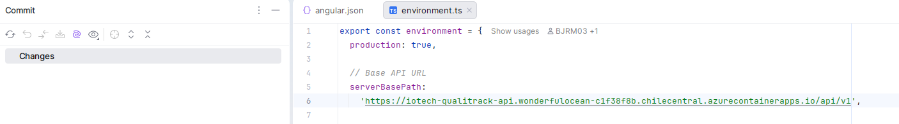

2) Creamos un pull request hacia develop con el cambio de la configuración de producción:


3) Finalmente, el pull request fue fusionado en develop:


**Paso 1: Creación de proyecto en Firebase**

1) Creamos nuestro proyecto llamado **iotech-qualitrack** en Firebase:

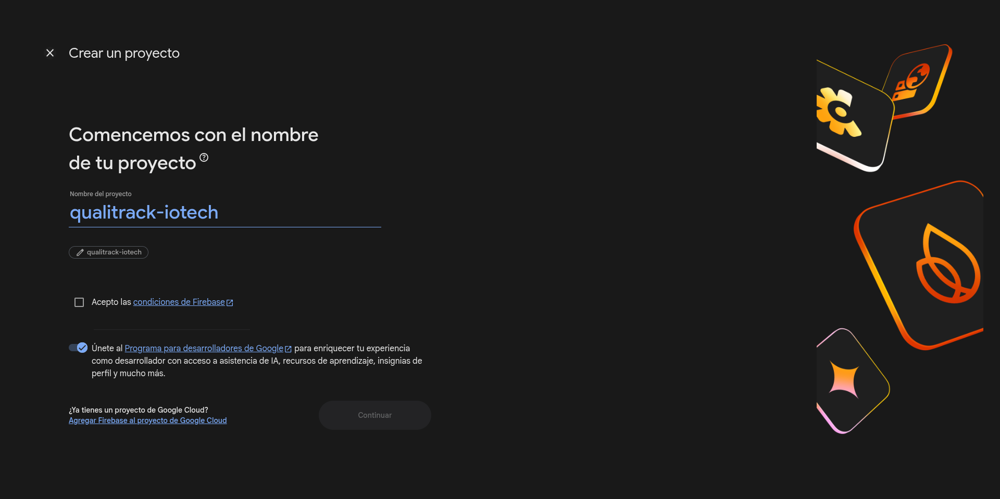

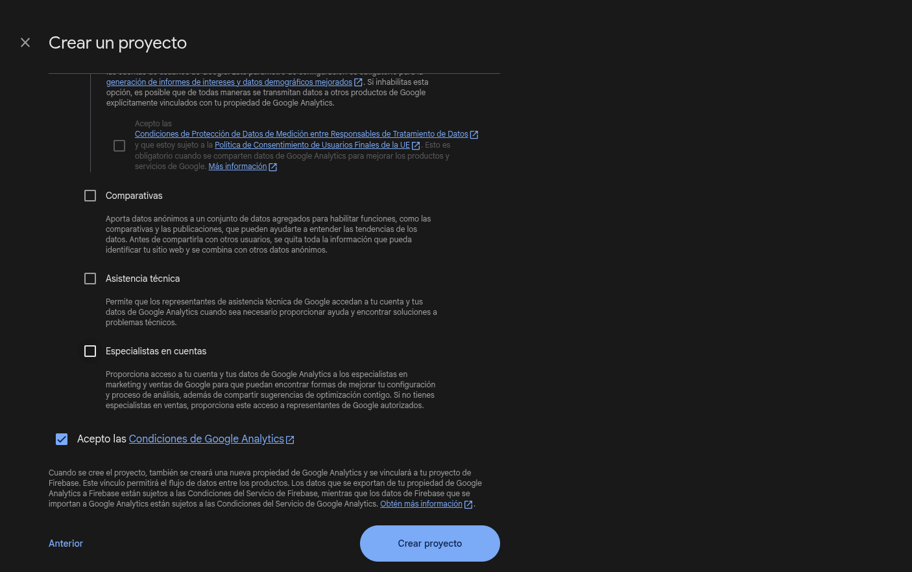

**Paso 2: Inicializar Firebase en el repositorio**

1) Desde develop, creamos una rama feature para inicializar firebase

* Realizamos los siguientes comandos:

```bash
npm ci
npx firebase-tools login
npx firebase-tools init hosting
```


2) Se crean 2 archivos: .firebaserc y firebase.json:

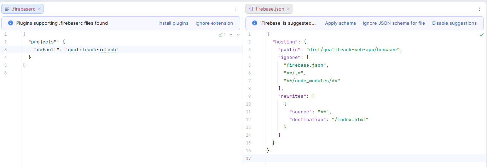

3) Conectamos GitHub con Firebase:


4) Hacemos push a la rama feature y realizamos un PR a develop para el release.

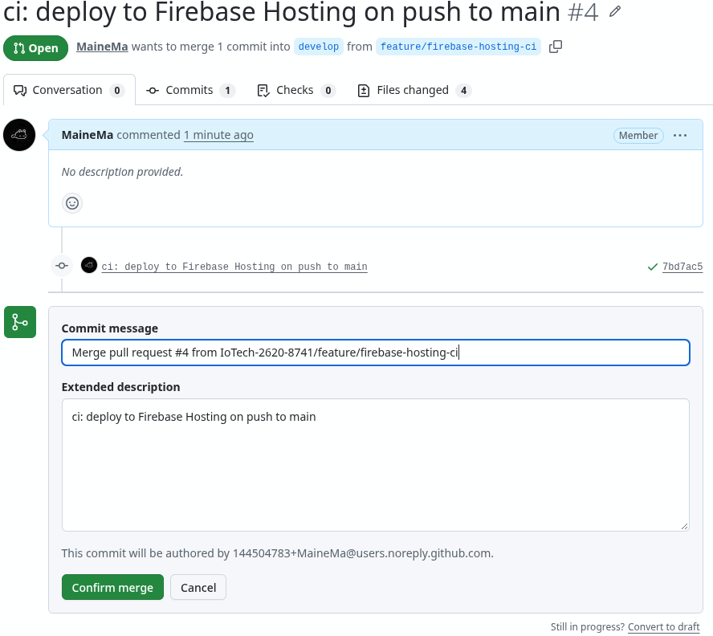

**Paso 3: Release y despliegue a Firebase**

1) Realizamos un release version 1.0.0 y realizamos un PR a main:


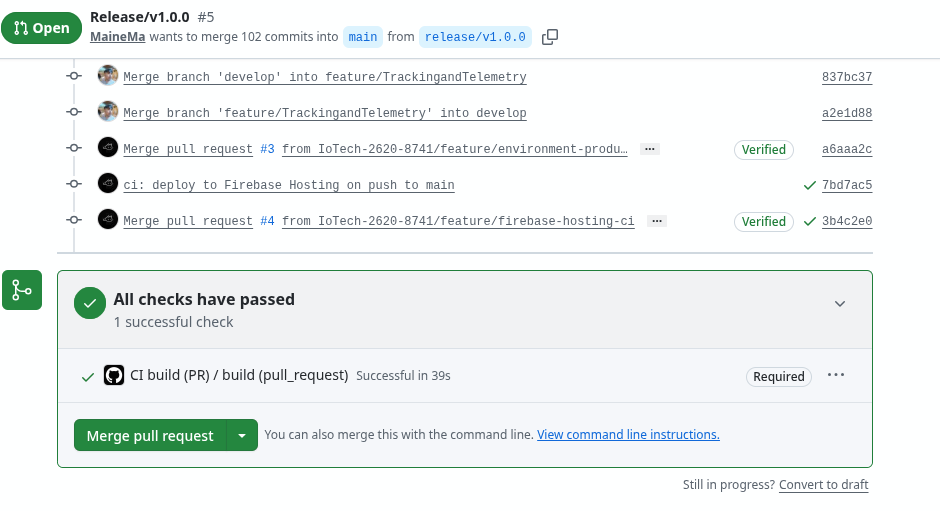

2) Esperamos a que el despliegue configurado en workflows termine:


3) Cuando ya termino, accedemos al link de nuestra aplicación web:


### 5.2.4. Acuerdo de Servicio - SaaS

_Pendiente: el material de origen (Sprint 1) no contiene este contenido._

### 5.2.5. Implemented Native-Mobile Application Evidence

_Pendiente: la Mobile Application no forma parte del alcance del Sprint 1 del material de origen._

### 5.2.6. Implemented RESTful API and/or Serverless Backend Evidence

El alcance del Sprint 1 comprende la Landing Page y la Web Application. Para estos productos no se elaboró una suite de
pruebas automatizadas en este sprint: su verificación se realizó de forma manual en el navegador, recorriendo los
escenarios de los criterios de aceptación de cada User Story e inspeccionando las peticiones HTTP con las herramientas
de desarrollo del navegador.

Las funcionalidades de la Web Application consumen el RESTful API de QualiTrack, cuyos servicios cuentan con pruebas
automatizadas desarrolladas con JUnit 5 y Spring Boot Test en el
repositorio [IoTech-2620-8741/qualitrack-platform](https://github.com/IoTech-2620-8741/qualitrack-platform/tree/develop/src/test/java/com/iotech/qualitrack/platform).
La suite contiene 36 clases de prueba (17 de pruebas unitarias del dominio y 19 de pruebas de integración con el
contexto de Spring y la base de datos de prueba) y 164 métodos de prueba; como tres de ellos son parametrizados, Maven
ejecuta 172 casos de prueba con `mvn test`, todos aprobados en el workflow de integración continua. En este sprint no se
elaboraron pruebas de aceptación BDD con archivos `.feature`.

La siguiente tabla relaciona cada clase de prueba con el Bounded Context, los comportamientos que verifica y las User
Stories que soporta.

| Clase de prueba                        | Tipo        | Bounded Context                             | Comportamientos verificados (métodos de prueba)                                                                                                                                                                                                         | User Stories relacionadas                                  |
|----------------------------------------|-------------|---------------------------------------------|---------------------------------------------------------------------------------------------------------------------------------------------------------------------------------------------------------------------------------------------------------|------------------------------------------------------------|
| Account​Recovery​Domain​Tests             | Unitaria    | IAM                                         | the code expires after fifteen minutes and is used once; five wrong codes revoke the recovery; a new code waits one minute and replaces the previous one; (+3 más)                                                                                      | US14, US15                                                 |
| Account​Recovery​Integration​Tests        | Integración | IAM / Payments & Subscriptions              | sign up requires a unique email; the password is reset with the code sent to the email; the answer does not reveal which accounts exist; (+2 más)                                                                                                       | US14, US15, US23                                           |
| Batch​Lifecycle​Tests                    | Unitaria    | Product Batch Management                    | the first raw material consumption starts a pending batch; closed batches are not started again                                                                                                                                                         | US77, US79, US85, US86                                     |
| Batch​Report​Pdf​Tests                    | Unitaria    | Reporting & Audit                           | empty deviations produce a short record without fabricated scores; included alerts produce counts charts and traceable details; excluded alerts are not leaked into summary or details; (+1 más)                                                        | US102                                                      |
| Compliance​Alerts​Integration​Tests       | Integración | Compliance & Alerting                       | an incident detected by tracking is one alert with its actions until it is resolved; deviations confirmed through the api open or join the alert of their device                                                                                        | US89, US90, US91, US92                                     |
| Compliance​Scope​Tests                   | Unitaria    | Compliance & Alerting                       | matching numeric ids do not mix events from different resource types                                                                                                                                                                                    | US89                                                       |
| Container​Assignment​Integration​Tests    | Integración | Inventory / Product Batch                   | raw material lots are stored in containers of their raw material storage environment; product batches are stored in containers of product storage environments                                                                                          | US45, US46, US82, US83                                     |
| Environmental​Profile​Tests              | Unitaria    | Tracking & Telemetry                        | a value is normal inside the normal range warning up to the critical limits and critical beyond; contradictory or incomplete limits are rejected; an environment only configures the metrics of its environmental device; (+3 más)                      | US60, US61, US62, US63                                     |
| Environment​Domain​Tests                 | Unitaria    | Laboratory Management                       | registration normalizes code and starts without usage; registration rejects missing or oversized data; usage can change but not be reassigned to the same value; (+1 más)                                                                               | US30, US31                                                 |
| Environment​Integration​Tests            | Integración | Laboratory Management                       | quality manager registers lists updates and classifies environments; environments of another laboratory are not available; laboratory operator can consult but not change environments                                                                  | US30, US31, US32, US33                                     |
| Environment​Inventory​Integration​Tests   | Integración | Inventory Management                        | quality manager registers raw materials and reviews their lots; low stock and near expiry filters identify materials and lots; raw materials are scoped to their environment and laboratory; (+2 más)                                                   | US37, US38, US39, US40                                     |
| Equipment​Domain​Tests                   | Unitaria    | Equipment Management                        | iot device is an equipment with type and identity; equipment is located only in environments of its laboratory; status change keeps the history and rejects the current status                                                                          | US48, US51                                                 |
| Equipment​Integration​Tests              | Integración | Equipment Management                        | quality manager registers and lists equipment of the laboratory; equipment is located in an environment of the same laboratory; status changes are traceable and rejected when not allowed; (+3 más)                                                    | US48, US49, US50, US51, US52, US53, US54, US55, US56, US57 |
| Inventory​Domain​Tests                   | Unitaria    | Inventory Management                        | receipt requires review and preserves received quantity after consumption; rejects overdraft without changing stock; rejects different units without conversion; (+12 más)                                                                              | US39, US41, US42, US44                                     |
| Inventory​Persistence​Tests              | Integración | Inventory Management                        | only quality reviewer in same laboratory can release; simultaneous retries record only one consumption; quarantine review consumption and affected batch history persist; (+6 más)                                                                      | US37, US39, US42, US47                                     |
| Notification​Domain​Tests                | Unitaria    | Compliance & Alerting                       | preferences decide which notices reach the bell and the email; a notification is read once and alert notices carry their severity                                                                                                                       | US96, US97                                                 |
| Onboarding​Integration​Tests             | Integración | IAM / Payments & Subscriptions / Laboratory | account must pay then create laboratory and cannot create twice; expired and unverified subscriptions do not unlock the api; account cannot register in another laboratory or self assign administrator; (+11 más)                                      | US12, US13, US24, US25, US26, US27                         |
| Open​Api​Documentation​Tests              | Integración | Shared (documentación)                      | groups every operation by the first segment after the api version                                                                                                                                                                                       | Documentación OpenAPI                                      |
| Period​Report​Tests                      | Unitaria    | Reporting & Audit                           | environmental pdf shows indicators alerts actions and method; inventory pdf shows stock lots expiration and containers; inventory csv has one column per value; (+5 más)                                                                                | US101, US103, US104                                        |
| Product​Batch​Integration​Tests           | Integración | Product Batch Management                    | quality manager registers lists and reads products of an environment; product codes and names are unique in the laboratory only; only quality roles register products and other laboratories cannot read them; (+5 más)                                 | US75, US76, US77, US78, US80, US81, US84                   |
| Profile​And​Notification​Integration​Tests | Integración | Profile / Compliance & Alerting             | each person keeps a profile that the quality manager sees in the staff list; a person changes the username and email of the account with the current password; the laboratory is notified of what others do with its alerts and batches                 | US18, US96, US106, US107, US108                            |
| Profile​Domain​Tests                     | Unitaria    | Profile                                     | personal data is validated and blank optional values are cleared; the profile tells when the name changed; only real images up to two megabytes are accepted as photos                                                                                  | US106, US107                                               |
| Qualitrack​Platform​Application​Tests     | Integración | Shared                                      | context loads                                                                                                                                                                                                                                           | Arranque de la aplicación                                  |
| Reporting​Indicators​Integration​Tests    | Integración | Reporting & Audit                           | indicators summarize the readings of the period with time in range and deviations; the environmental report combines indicators alerts and actions of each environment; the inventory report lists raw materials lots and quantities; (+1 más)          | US99, US100                                                |
| Reporting​Tests                         | Unitaria    | Reporting & Audit                           | empty repository produces no invented metric or health score; counts use only the requested laboratory records; time in range weighs each evaluated reading until the next one; (+4 más)                                                                | US98, US101                                                |
| Rest​Api​Integration​Tests                | Integración | Shared (convenciones REST)                  | alerts are acknowledged and resolved as sub resources by the authenticated user; bpm parameter ranges are resources of the equipment identified by their name; created laboratories and users answer with their location                                | Todas las US con API                                       |
| Staff​Account​Integration​Tests           | Integración | Laboratory Management / IAM                 | registered staff signs in with temporary credentials and must change the password; only quality managers register staff and emails are unique; staff cannot manage the subscription and auditors only consult; (+2 más)                                 | US17, US34, US35, US36                                     |
| Staff​Credentials​Email​Tests             | Integración | Laboratory Management                       | credentials are emailed to the staff member; a failed delivery leaves the temporary password for the quality manager                                                                                                                                    | US34                                                       |
| Stock​Rollback​Tests                     | Integración | Inventory Management                        | a failed usage write rolls back the inventory consumption                                                                                                                                                                                               | US79                                                       |
| Stock​Unit​Tests                         | Unitaria    | Inventory Management                        | accepts unit aliases but never implicitly converts mass to volume; registration does not round stock or allow fractional countable units                                                                                                                | US37, US42                                                 |
| Stripe​Webhook​Tests                     | Unitaria    | Payments & Subscriptions                    | unpaid checkout never grants access; paid checkout waits for active stripe subscription; active paid checkout persists subscription and payment without laboratory; (+4 más)                                                                            | US20                                                       |
| Subscription​Access​Tests                | Unitaria    | Payments & Subscriptions                    | active future period allows access before laboratory creation; expired or unknown periods never grant access; cancelled or unpaid subscription does not grant access; (+3 más)                                                                          | US21, US23, US24                                           |
| Subscription​Plan​Seed​Integration​Tests   | Integración | Payments & Subscriptions                    | startup creates the catalog plans only once; stored plans are not changed and a taken stripe price is not reused                                                                                                                                        | US19                                                       |
| Subscription​Plan​Tests                  | Unitaria    | Payments & Subscriptions                    | preserves finite equipment allowances; represents unlimited equipment without an invented numeric limit; rejects negative equipment limits; (+2 más)                                                                                                    | US19                                                       |
| Tracking​Integration​Tests               | Integración | Tracking & Telemetry                        | a quality manager configures the air quality of an environment with its environmental device; a container monitor has thresholds and actuation rules that need them; readings are evaluated and the deviations of an incident share one alert; (+2 más) | US60, US61, US63, US64, US67, US69                         |
| Tracking​Query​Tests                     | Unitaria    | Tracking & Telemetry                        | an action of the device also counts as communication; device requires review when silent for longer than the expected period                                                                                                                            | US58                                                       |

Ejecución de la suite de pruebas del backend:

<div align="center">
  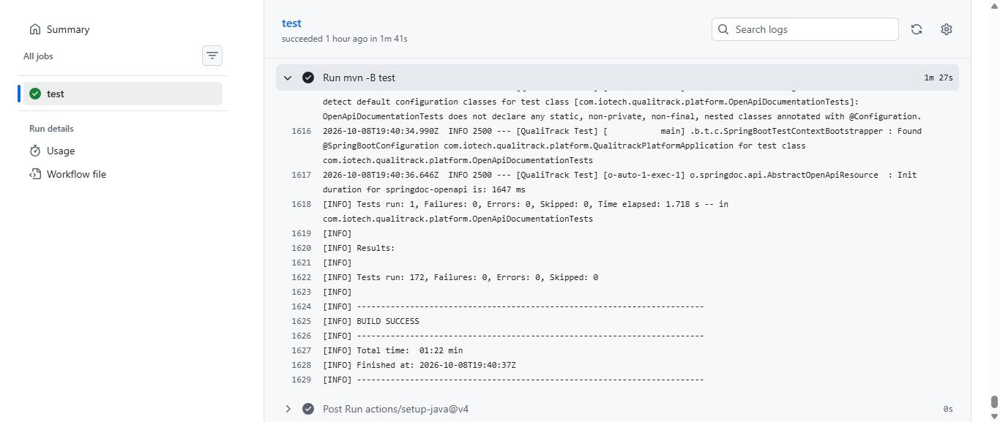
  <p><em>Figura: Ejecución de la suite de pruebas del backend en GitHub Actions. Esta evidencia muestra el workflow de integración continua que ejecuta con Maven las 172 pruebas unitarias y de integración del RESTful API, todas aprobadas (BUILD SUCCESS).</em></p>
</div>

Commits relacionados con las pruebas en este sprint:

| Repository                           | Branch                                            | Commit Id | Commit Message                                                                           | Commit Message Body                                                                                                                                                                | Committed on (Date) |
|--------------------------------------|---------------------------------------------------|-----------|------------------------------------------------------------------------------------------|------------------------------------------------------------------------------------------------------------------------------------------------------------------------------------|---------------------|
| Io​Tech-2620-8741/​qualitrack-platform | feature/​foundation-onboarding                     | 517e573   | test(iam): verify onboarding and subscription access                                     | —                                                                                                                                                                                  | 12/09/2026          |
| Io​Tech-2620-8741/​qualitrack-platform | feature/​foundation-onboarding                     | 1b0a85a   | test​(subscription): verify plans and Stripe webhook processing                           | —                                                                                                                                                                                  | 12/09/2026          |
| Io​Tech-2620-8741/​qualitrack-platform | feature/​foundation-onboarding                     | 3744cde   | test​(inventory): verify stock units and transactional rollback                           | —                                                                                                                                                                                  | 12/09/2026          |
| Io​Tech-2620-8741/​qualitrack-platform | feature/​foundation-onboarding                     | 34d9ba9   | test​(reporting): verify scoped reports PDFs and telemetry queries                        | —                                                                                                                                                                                  | 12/09/2026          |
| Io​Tech-2620-8741/​qualitrack-platform | feature/​inventory-domain-foundation               | a6d62be   | test​(inventory): cover receipt eligibility and stock invariants                          | —                                                                                                                                                                                  | 13/09/2026          |
| Io​Tech-2620-8741/​qualitrack-platform | feature/​inventory-domain-foundation               | 350a97e   | feat​(inventory): implement reviewed receipts and atomic stock consumption                | —                                                                                                                                                                                  | 13/09/2026          |
| Io​Tech-2620-8741/​qualitrack-platform | feature/​laboratory-environments                   | 49a3973   | test​(laboratory): cover environment rules and API                                        | Domain tests for code normalization and usage transitions; integration tests for TS15-TS18 status codes, tenant isolation and role restrictions.                                   | 02/10/2026          |
| Io​Tech-2620-8741/​qualitrack-platform | feature/​inventory-environment-raw-materials       | f0915e0   | feat​(shared): return Location headers for created resources                              | Add Response​Entity​Assembler.to​Created​Response​Entity​From​Result so POST endpoints that create resources answer 201 Created with a Location header; apply it to environment registra… | 02/10/2026          |
| Io​Tech-2620-8741/​qualitrack-platform | feature/​inventory-environment-raw-materials       | 1fece4d   | feat​(inventory): manage raw materials and lots per environment                           | Raw materials belong to an environment and expose TS21-TS28 under /​api/​v1/​laboratories/​{laboratory​Id}/​environments/​{environment​Id}: raw-materials (stock​Status=LOW filter), stock… | 02/10/2026          |
| Io​Tech-2620-8741/​qualitrack-platform | feature/​inventory-environment-raw-materials       | ed7b47b   | test​(inventory): cover environment inventory API                                         | Integration tests for TS21-TS28 and TS79: status codes, Location header, stock and expiration filters, environment and laboratory isolation, and quality role restrictions.        | 02/10/2026          |
| Io​Tech-2620-8741/​qualitrack-platform | feature/​product-batch-management                  | 49e3f1b   | docs​(openapi): group operations by root resource                                         | Swagger UI now lists each operation under the first path segment after /api/v1 (Laboratories, Batches, Equipments...) through a shared OpenAPI customizer, so resources nested un… | 02/10/2026          |
| Io​Tech-2620-8741/​qualitrack-platform | feature/​product-batch-management                  | e97e23b   | feat(batch): register pharmaceutical products per environment                            | Pharmaceutical products move from Laboratory to Product Batch Management, which owns the product catalog according to the bounded context definition, and are now registered insi… | 02/10/2026          |
| Io​Tech-2620-8741/​qualitrack-platform | feature/​product-batch-management                  | ca42723   | feat(batch): manage product batches under their product                                  | Product batches are now addressed through /​laboratories/​{laboratory​Id}/​environments/​{environment​Id}/​products/​{product​Id}/​batches: - POST and GET for the batches of a product and… | 02/10/2026          |
| Io​Tech-2620-8741/​qualitrack-platform | feature/​product-batch-management                  | 33e8ac1   | feat(batch): register raw material usages from the product batch                         | POST .../​products/​{product​Id}/​batches/​{batch​Id}/​raw-material-usages (TS65) asks Inventory Management to consume a released lot and returns the recorded usage with 201; retrying … | 02/10/2026          |
| Io​Tech-2620-8741/​qualitrack-platform | feature/​product-batch-management                  | bc5fd6e   | feat(batch): record equipment and staff taking part in a batch                           | POST .../​batches/​{batch​Id}/​equipment-usages (TS66) associates an operational equipment of the laboratory and answers 409 when it is in maintenance, out of service or inactive (U… | 02/10/2026          |
| Io​Tech-2620-8741/​qualitrack-platform | feature/​product-batch-management                  | add2496   | feat(batch): reconstruct the traceability of a product batch                             | GET .../​products/​{product​Id}/​batches/​{batch​Id}/​traceability (TS70) returns in one response the batch and its product, the raw material lots it consumed with the environment wher… | 02/10/2026          |
| Io​Tech-2620-8741/​qualitrack-platform | feature/​product-batch-management                  | 019f2da   | test(batch): register the fixture environment without an ignored usage                   | Environment registration does not take a usage (it is assigned through usage-assignments), so the production fixture no longer sends one.                                          | 02/10/2026          |
| Io​Tech-2620-8741/​qualitrack-platform | feature/​equipment-iot-devices                     | a9cc765   | feat​(equipment): manage equipment and IoT devices per laboratory and environment         | Implements US45-US54 (TS31-TS40) under /​api/​v1/​laboratories/​{laboratory​Id}: - equipments: register (quality roles, unique serial number), list and read. - devices/​environmental-… | 03/10/2026          |
| Io​Tech-2620-8741/​qualitrack-platform | feature/​equipment-iot-devices                     | 0909fb5   | feat​(tracking): report whether an IoT device is communicating (TS41)                     | GET /​api/​v1/​laboratories/​{laboratory​Id}/​environments/​{environment​Id}/​devices/​{device​Id}/​telemetry-status answers CONNECTED when the environmental device or container monitor sen… | 03/10/2026          |
| Io​Tech-2620-8741/​qualitrack-platform | feature/​staff-accounts                            | 0c1315c   | feat(staff): sign-in accounts for the operators and auditors a quality manager registers | - POST /​laboratories/​{laboratory​Id}/​staff (quality roles) registers an OPERATOR or AUDITOR and creates their IAM account: the e-mail is the username and a temporary password is … | 03/10/2026          |
| Io​Tech-2620-8741/​qualitrack-platform | feature/​staff-accounts                            | da82eea   | feat(staff): keep auditors out of operations and the laboratory profile                  | Auditors only consult the records, so they cannot be chosen as the technician of a maintenance or take part in a batch (400). The staff reference shared with other contexts carr… | 03/10/2026          |
| Io​Tech-2620-8741/​qualitrack-platform | feature/​staff-accounts                            | 861752a   | feat(staff): link the credentials e-mail to the deployed web front                       | The sign-in link of the credentials e-mail follows the web front URL (APPLICATION_​FRONTEND_​URL) unless QUALITRACK_​WEB_​SIGN_​IN_​URL is set. The prod profile points the front URL a… | 03/10/2026          |
| Io​Tech-2620-8741/​qualitrack-platform | feature/​tracking-environmental-profiles           | 6c20e1f   | feat​(tracking): environmental profiles, readings and actuation events per environment    | Tracking follows the Report (US56-US69, TS42-TS45, TS54-TS60): - Environmental​Profile: versioned air quality thresholds of an environment and temperature, humidity and luminosit… | 03/10/2026          |
| Io​Tech-2620-8741/​qualitrack-platform | feature/​tracking-environmental-profiles           | ccc13d6   | test​(tracking): cover environmental profiles, readings and actuation events              | Domain tests for the threshold and profile rules and integration tests for the profile endpoints, reading evaluation and idempotency, deviation alerts only when the state worsen… | 03/10/2026          |
| Io​Tech-2620-8741/​qualitrack-platform | feature/​rest-controllers-review                   | bbc3724   | refactor​(ra): create reports with 201 and nest equipment records under the laboratory    | Report generation answers 201 with the stored report and Location /​api/​v1/​reports/​{report​Id}; its PDF or CSV is downloaded from /​reports/​{report​Id}/​content (TS83, TS84, TS87). E… | 03/10/2026          |
| Io​Tech-2620-8741/​qualitrack-platform | feature/​rest-controllers-review                   | 1718793   | refactor​(subscription): request cancellations as a sub-resource and list subscriptions   | POST /​subscriptions/​{subscription​Id}/​cancellation-requests (TS11) replaces the PATCH, answers 201 with the subscription and 409 when it is not active, and records the authentica… | 03/10/2026          |
| Io​Tech-2620-8741/​qualitrack-platform | feature/​rest-controllers-review                   | fe6b425   | test: cover the reviewed REST conventions                                                | Alert acknowledgements and resolutions with 201, 409 and 405 for the removed PATCH, BPM ranges by parameter, Location of new laboratories and users, subscriptions as a filtered … | 03/10/2026          |
| Io​Tech-2620-8741/​qualitrack-platform | feature/​rest-controllers-review                   | 84b1780   | test​(tracking): read deviation alerts from the laboratory equipment route                | The flat /​equipments/​{id}/​deviation-alerts route no longer exists; the tracking tests read the alerts of the monitors from /​laboratories/​{laboratory​Id}/​equipments/​{equipment​Id}/​… | 03/10/2026          |
| Io​Tech-2620-8741/​qualitrack-platform | feature/​container-assignments                     | 4b78e3d   | test: cover container assignments of raw material lots and product batches               | Checks the storage area rules (404, 400, 409 for other environments, unknown monitors, monitors in maintenance and environments with another usage), idempotent reassignment, the… | 04/10/2026          |
| Io​Tech-2620-8741/​qualitrack-platform | feature/​compliance-environment-alerts             | 4105c6a   | feat(ca): one alert per incident of an environment or container                          | Deviation alerts keep their laboratory, environment, origin (environment or container), measurements, number of deviations, return to normal and attention and resolution times. … | 04/10/2026          |
| Io​Tech-2620-8741/​qualitrack-platform | feature/​compliance-environment-alerts             | 27202ad   | test: cover the alerts of environments and containers                                    | Correlated incidents from Tracking, related actions, return to normal, attention and resolution by operators, read-only auditors, tenant isolation, TS73 deviations through the A… | 04/10/2026          |
| Io​Tech-2620-8741/​qualitrack-platform | feature/​reporting-environment-indicators          | 300a77f   | test(ra): cover environmental indicators and reports                                     | Time in range, deviations and measurement summaries, the indicators and environmental, inventory and batch reports through the API, and the updated report documents.              | 04/10/2026          |
| Io​Tech-2620-8741/​qualitrack-platform | feature/​reporting-environment-indicators          | 3ff7db0   | test(ra): integration tests of the reporting indicators and reports                      | Indicators of a laboratory and of an environment, environmental report per environment, inventory report and batch report with container and release through the REST API.         | 04/10/2026          |
| Io​Tech-2620-8741/​qualitrack-platform | feature/​account-recovery-and-renewal-cancellation | 3265260   | test: account recovery, e-mail provider and renewal cancellation                         | Recovery codes (expiry, single use, attempts, resend interval), account e-mail rules, Resend request and SMTP fallback, the recovery and reset endpoints, unique e-mail at sign-u… | 04/10/2026          |
| Io​Tech-2620-8741/​qualitrack-platform | feature/​profile-and-notifications                 | 429e549   | test: cover profiles, account changes and notifications                                  | —                                                                                                                                                                                  | 04/10/2026          |
| Io​Tech-2620-8741/​qualitrack-platform | feature/​subscription-plan-seed                    | 9d14dc0   | test​(subscription): cover the subscription plan seed                                     | —                                                                                                                                                                                  | 04/10/2026          |
| Io​Tech-2620-8741/​qualitrack-platform | feature/​batch-in-progress                         | be46afe   | test(batch): cover the start of a batch with its first consumption                       | —                                                                                                                                                                                  | 05/10/2026          |
| Io​Tech-2620-8741/​qualitrack-platform | feature/​timezone-independent-tests                | 7edc50f   | test: compute today in Lima time so tests do not depend on the machine time zone         | Tests sent Local​Date.now​() in the JVM zone to endpoints validated against the America/Lima clocks of equipment and inventory, so on a UTC machine between 00:00 and 05:00 UTC the… | 07/10/2026          |


#### 6.2.1.8. Software Deployment Evidence for Sprint Review

En esta sección, se mostrarán las evidencias guardadas y documentadas sobre el despliegue del software que nosotros
hemos incluido en el alcance de este primer sprint. Es importante documentar las acciones de despliegue para replicarlas
y/o mejorarlas en los siguientes sprints.

**Despliegue de la aplicación backend, incluyendo base de datos**:

Nombre del repositorio en la organización: qualitrack-platform

Previo a iniciar los pasos:

* Para el uso del servicio SMTP con Gmail, debes tener creado una contraseña de aplicacion en tu cuenta de correo a
  usar:

1) En myaccount.google.com, buscamos **Contraseñas de aplicaciones** o entramos
   a [Contraseñas de aplicaciones](https://myaccount.google.com/apppasswords):

2) Ingresas el nombre de la aplicación, en este caso, escribimos **iotech-qualitrack**:

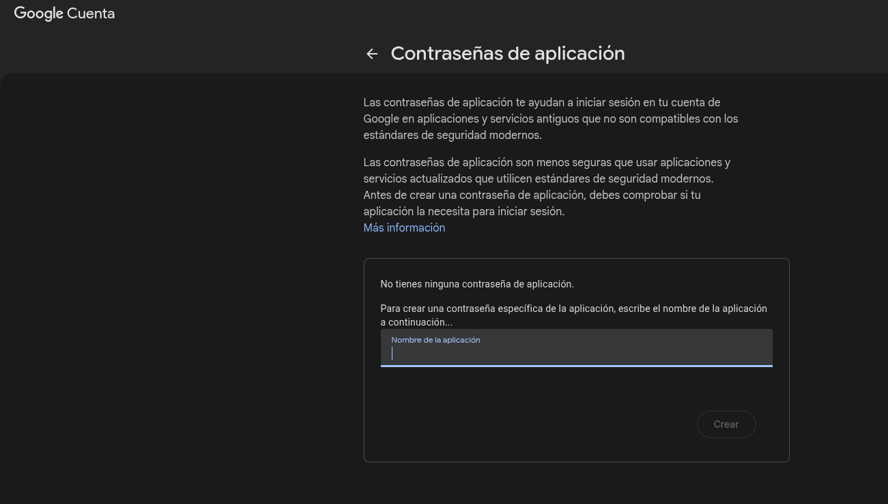

3) Finalmente, mostrará la contraseña para la aplicación, que nos permitirá usar la cuenta de correo para las
   aplicaciones externas:

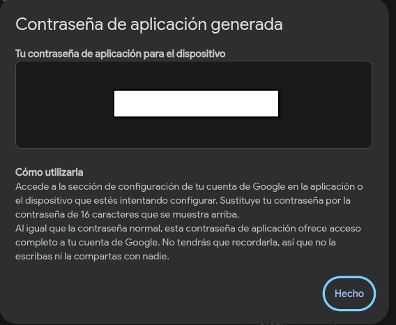

**Paso 1: Registro de proveedores en Azure:**

1) En [Portal de Azure](https://portal.azure.com/), buscamos en la barra de navegación **Suscripciones**:

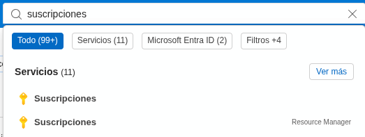

2) Seleccionamos la suscripción que tenemos:

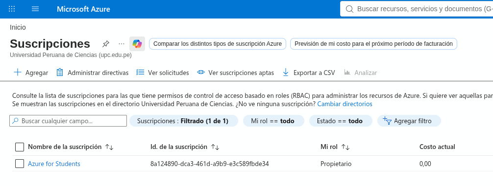

3) Vamos a Configuración y después Proveedores de Recursos:


4) Seleccionamos los siguientes recursos: Microsoft.App, Microsoft.OperationalInsights, Microsoft.ContainerRegistry,
   Microsoft.DBforMySQL y Microsoft.ManagedIdentity y le damos a registrar.

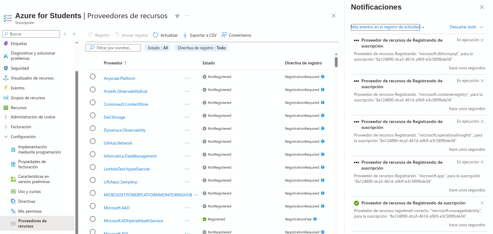

**Paso 2: Creación de grupo de recursos, identidad en GitHub y permisos:**

1) Buscamos **Grupos de recursos**:


2) Le damos a Crear grupo de recursos:


3) Ingresamos el nombre y la región del grupo de recursos a crear:


4) Le damos a crear grupo de recursos:


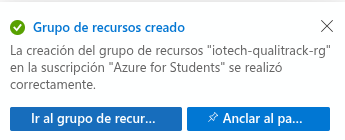

5) Ahora, vamos a **Identidades administradas**:


6) Le damos a crear, seleccionamos nuestro grupo, el nombre y la región para la identidad:

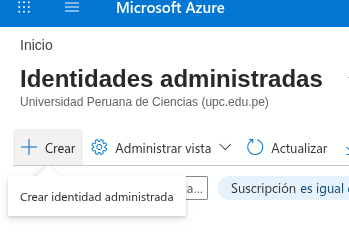


7) Creamos la identidad administrada:


8) Dentro de la identidad, vamos a Configuración y después Credenciales federadas:


9) Agregaremos una credencial para Github Actions que nos permitirá realizar CI/CD con todos los valores que nos piden:


10) Volvemos a grupos de recursos, entramos a Control de Acceso (IAM) y agregamos una asignación de roles con rol de
    **Colaborador**, en miembros, seleccionamos la credencial dentro de la identidad administrada:

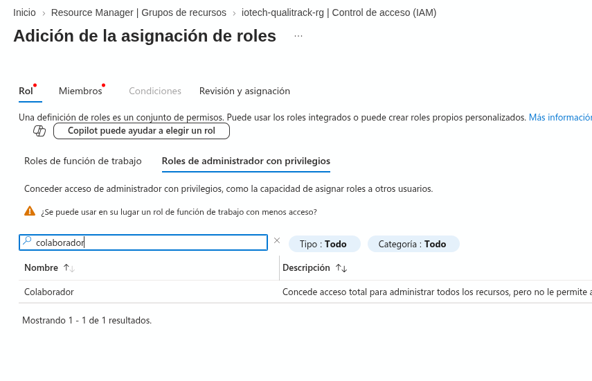

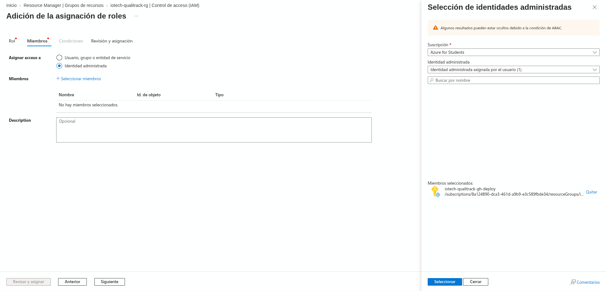

**Paso 3: Registro de imagen de contenedor**

1) Buscamos y entramos a **Container registries** y creamos un registro, seleccionando nuestro grupo e ingresando un
   nombre con una región y un plan de precios y lo creamos:

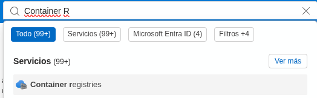


**Paso 4: Creación de la base de datos MySQL**

1) Buscamos y entramos a **Azure Database for MySQL servers**:


2) Le damos a Crear y seleccionamos la opción **Servidor flexible**:


3) En Datos básicos, seleccionamos nuestro grupo de recursos **iotech-qualitrack-rg**, ingresamos el nombre
   **iotech-qualitrack-mysql**, la región **Chile Central** y la versión **8.4**:

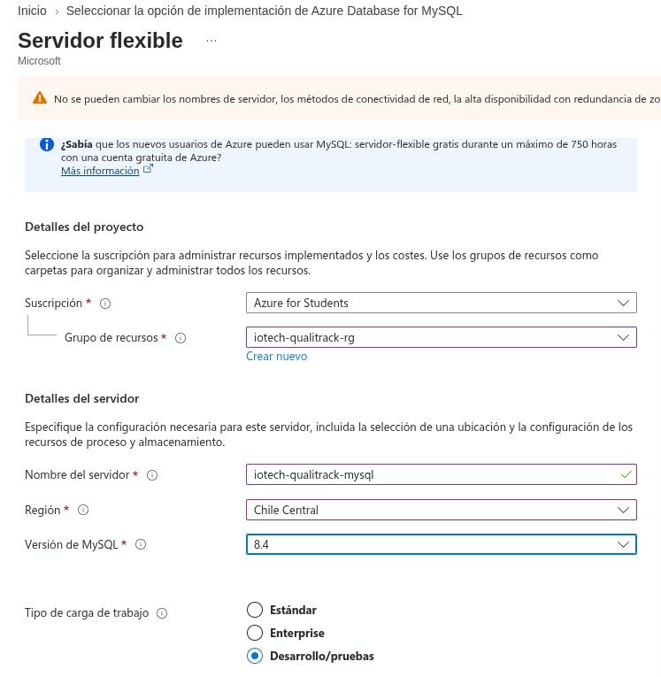

4) En Carga de trabajo, seleccionamos **Desarrollo o aficionado** y verificamos que quede el tamaño **Burstable B1ms**
   con **20 GiB** de almacenamiento. Además, dejamos desactivada la opción de Alta disponibilidad:

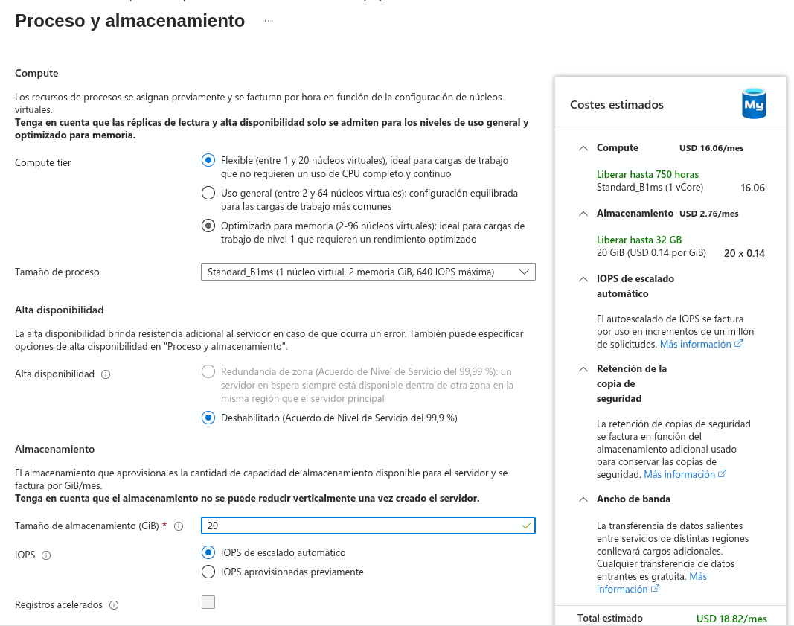

5) En Autenticación, seleccionamos únicamente **MySQL**, ingresamos el usuario **iotechadmin** y una contraseña segura.
   Es importante guardar esta contraseña, ya que no se puede recuperar después:


6) En la pestaña Redes, seleccionamos como método de conectividad **Acceso público** y marcamos la opción **Permitir
   acceso público desde cualquier servicio de Azure dentro de Azure a este servidor**, lo que permitirá que nuestra
   Container App se conecte a la base de datos. Opcionalmente, podemos agregar nuestra IP actual si queremos conectarnos
   desde MySQL Workbench:


7) Le damos a Revisar y crear, verificamos que la validación sea superada y creamos el servidor. Este proceso puede
   tardar varios minutos:


8) Cuando termine el despliegue, entramos al servidor, vamos a **Bases de datos** y le damos a Agregar:

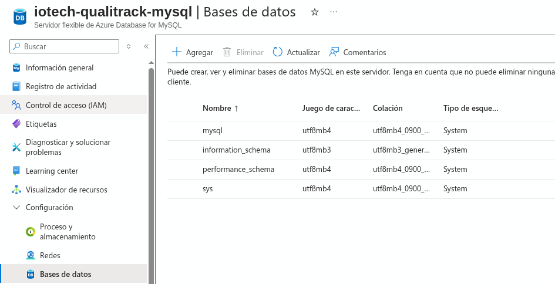

9) Ingresamos el nombre de la base de datos **iotech_qualitrack** y la guardamos:


10) Finalmente, en **Información general**, copiamos el nombre del servidor, que termina en
    **.mysql.database.azure.com**, ya que lo usaremos más adelante para la configuración del back-end:


**Paso 5: Creación en Container Apps con imagen temporal**

1) Creamos una aplicación contenedora de Container Apps, lo crearemos desde bash porque la creación mediante la GUI de
   Azure crea una versión que no admite secretos:

* Registramos las variables del nombre de grupo de recursos y región:

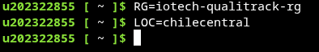

* Creamos el entorno para la aplicación de contenedores en el grupo de recursos y región:


* Creamos la aplicación de contenedores dentro del entorno creado:


**Paso 6: Agregación de identidad, permisos, secretos y variables**

1) Para la agregación de identidad, usaremos Shell:

* Obtener el ID de la identidad de la aplicación de contenedor dentro del grupo de recursos:


* Asigna permisos para descargar imágenes de contenedores en el ACR:

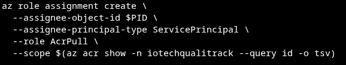

* Configura la identidad administrada por el sistema de la aplicación de contenedor:


2) Para los secretos, ingresamos desde la aplicación de contenedor a seguridad, secretos y agregamos los secretos que
   necesitamos:

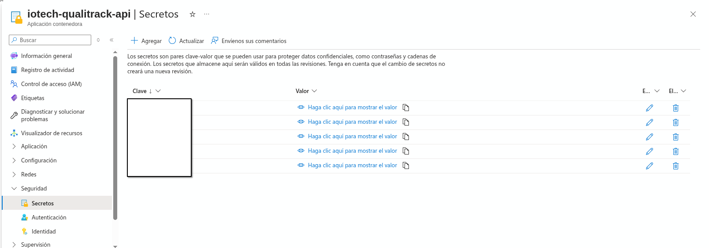

3) Configuramos la entrada en Redes, entradas y cambiamos el puerto de entrada a 8080 (el que escucha Spring Boot):


4) Ingresaremos las variables de entorno para la aplicación, en este caso, haremos referencia a los secretos para
   algunas variables de entorno:

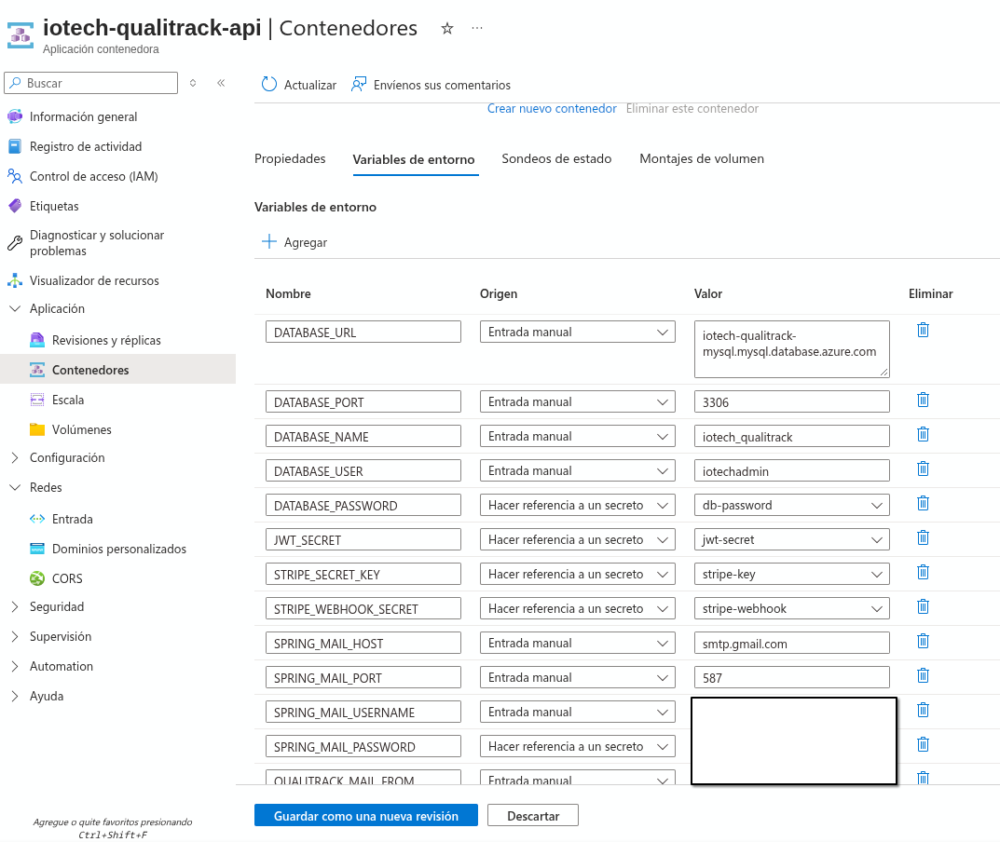

**Paso 7: Ingreso de secretos en el repositorio**

1) Entramos en nuestro repositorio, opciones, secretos y variables y agregamos los secretos de repositorio para conexión
   a Azure:

* Los datos AZURE_SUBSCRIPTION_ID y AZURE_TENANT_ID se consiguen con este comando:

```bash
az account show --query "{tenant:tenantId, subscription:id}" -o table
```

* El AZURE_CLIENT_ID es del paso 2

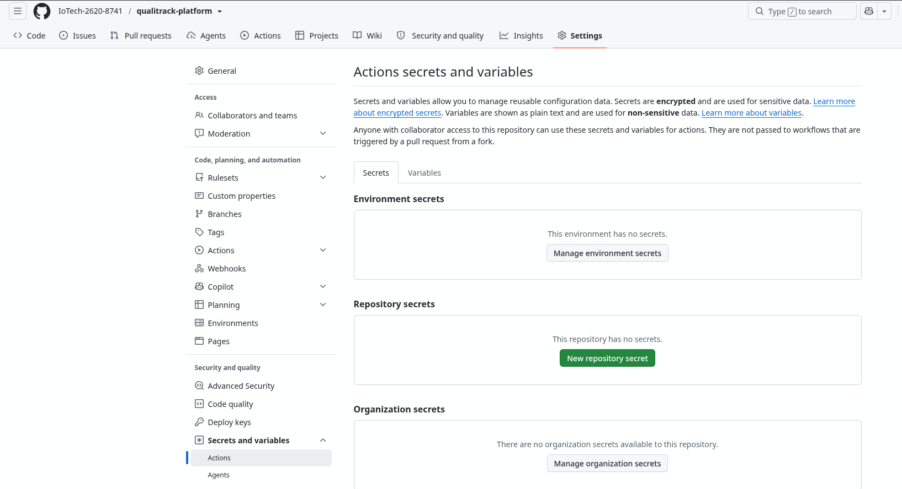

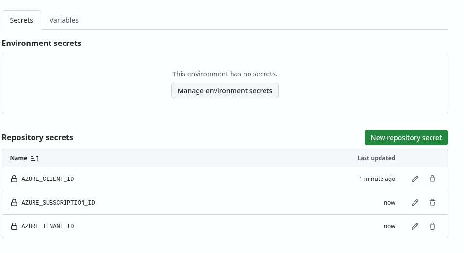

**Paso 8: Creación de rama en repositorio para CI-CD junto a Azure**

1) Creamos una nueva rama feature para la integración de workflows:


2) Creamos los archivos deploy.yml y ci.yml dentro de .github/workflows

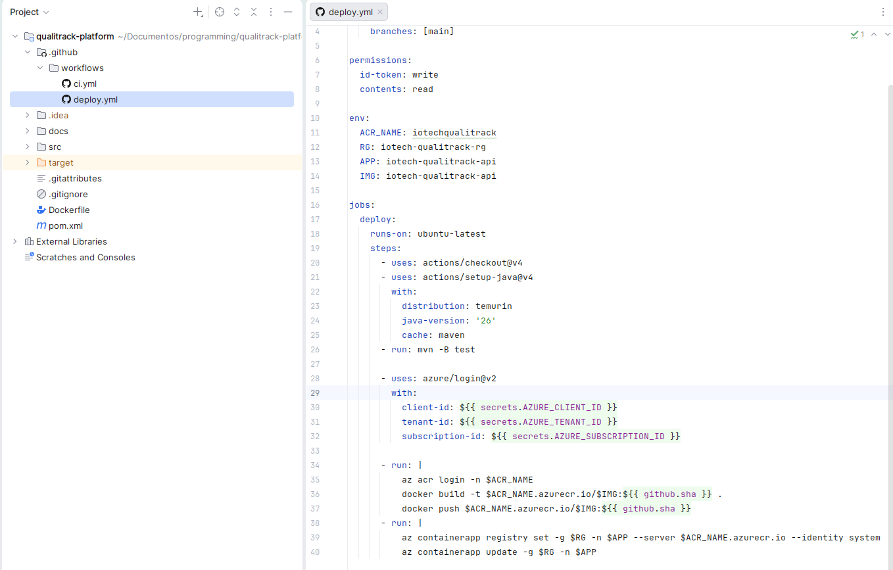


3) Hacemos push a la rama feature, creamos un PR, esperamos que el test de CI termine y hacemos merge:

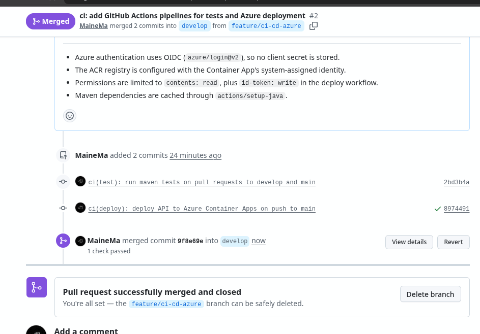

* Para que funcionen correctamente los workflows creados, deben restringir los merge sin previa creación de un PR.

**Paso 9: Creación de rama release versión 1.0.0**

1) Creamos nuestra rama release, en la versión 1.0.0 y la pasamos a remoto:

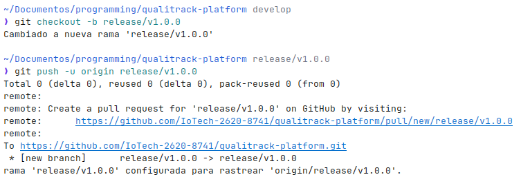

2) Creamos nuestro PR hacia main:

* Previo a la creación del PR, verificamos que todo lo creado en Azure funcione correctamente.

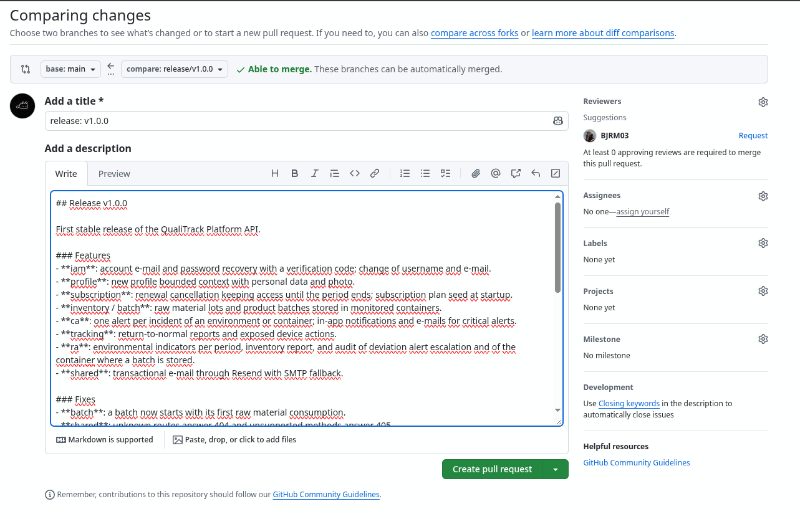

3) Esperamos a que las pruebas y el despliegue integrados en workflows terminen:


4) Después de aceptar y realizar el merge a main, esperamos a que termine el workflow de despliegue hacia Azure
   Container Apps que hemos creado:

* Posteriormente, se realizó un hotfix (**hotfix/deploy-image-flag**) hacia main para corregir la construcción de la
  imagen Docker en el workflow de despliegue. Este es el workflow que terminó correctamente:

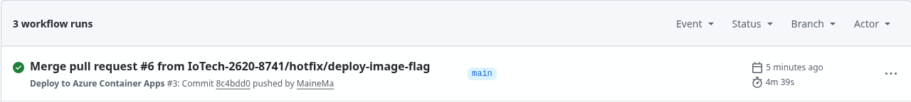

**Paso 10: Verificaciones y pasos finales**

1) Entramos a la aplicación del contenedor, dentro, entramos a revisiones y réplicas:


2) Verificamos que podemos entrar a la documentación Swagger con el
   link: [Qualitrack Swagger Documentation](https://iotech-qualitrack-api.wonderfulocean-c1f38f8b.chilecentral.azurecontainerapps.io/swagger-ui/index.html)

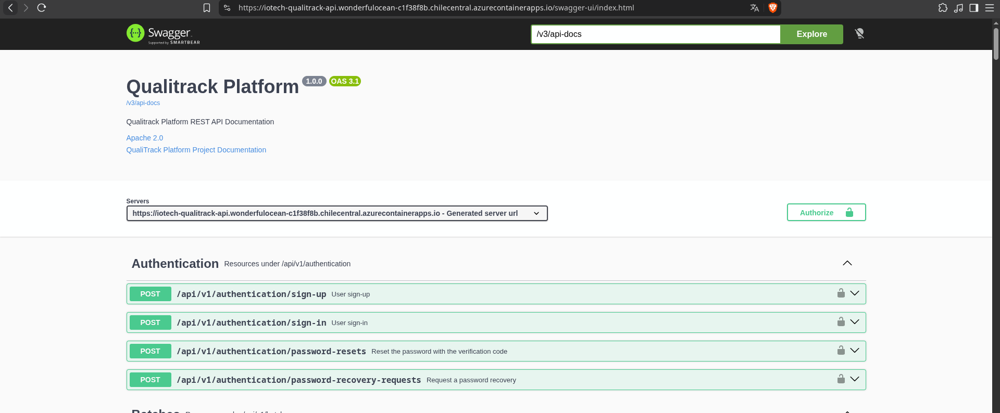

3) Verificamos la base de datos usando MySQL Workbench mediante una conexión remota y si existen las tablas:


4) Etiquetamos la rama main con la nueva versión de lanzamiento:


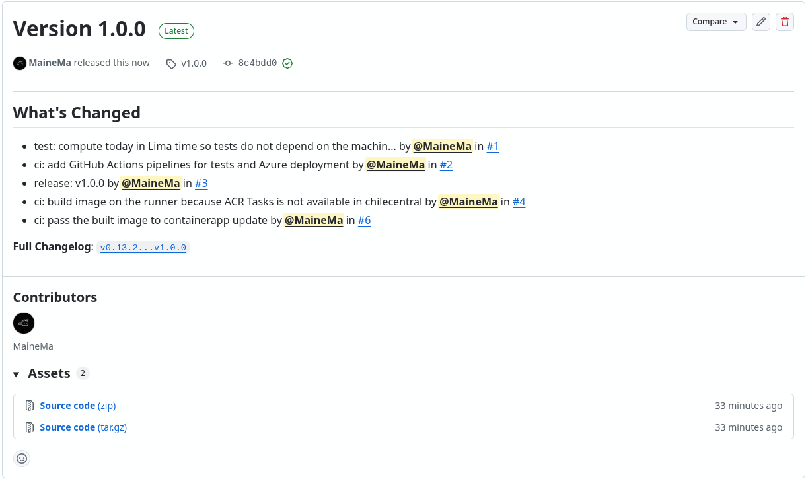

* También eliminamos las ramas release y hotfix, cumpliendo el estándar Gitflow

5) En nuestra aplicación de contenedores, en la sección aplicaciones, contenedores y variables de entorno quitamos
   SPRING_JPA_HIBERNATE_DDL_AUTO para evitar cambios de esquema:

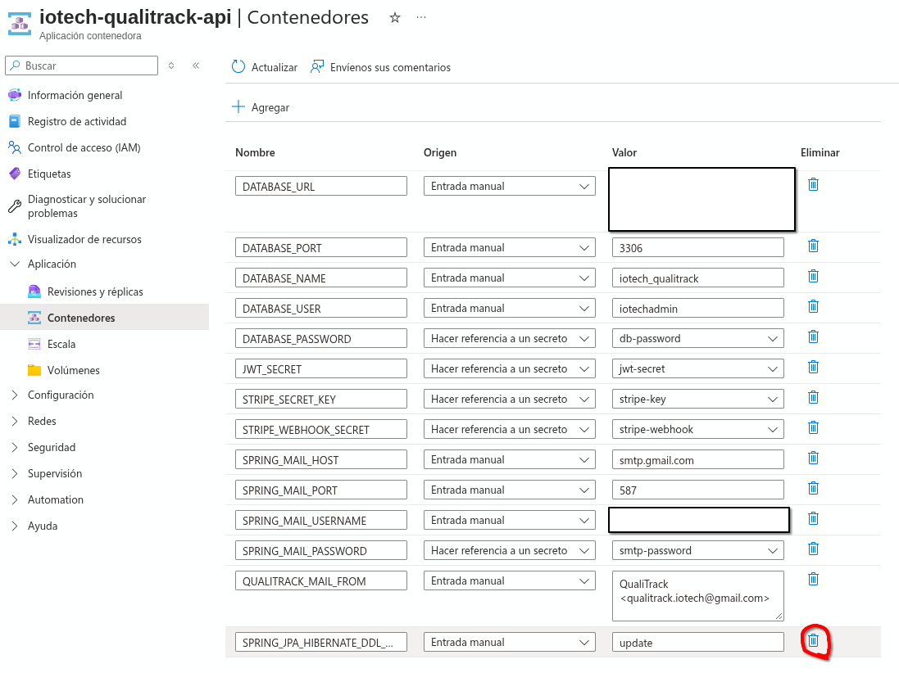


### 5.2.7. RESTful API documentation

La Web Application del Sprint 1 consume el RESTful API de QualiTrack, desarrollado con Spring Boot y documentado con
OpenAPI mediante Swagger UI. La documentación agrupa las operaciones por recurso raíz y describe, para cada una, su
propósito, parámetros, cuerpo de la petición y posibles respuestas, incluidos los errores con la estructura
`ErrorResource {code, message, details}`. Todas las rutas comienzan con `/api/v1` y, salvo las de autenticación,
requieren el encabezado `Authorization: Bearer <JWT>`.

- **Documentación desplegada (Swagger
  UI):** [Qualitrack Swagger Documentation](https://iotech-qualitrack-api.wonderfulocean-c1f38f8b.chilecentral.azurecontainerapps.io/swagger-ui/index.html)
- **Documentación local:** `http://localhost:8080/swagger-ui/index.html` (especificación en `/v3/api-docs`)
- **Repositorio:** [IoTech-2620-8741/qualitrack-platform](https://github.com/IoTech-2620-8741/qualitrack-platform)

En total se documentan 124 operaciones. Las siguientes tablas las presentan por Bounded Context con su verbo HTTP, la
sintaxis de llamada, sus parámetros y los códigos de respuesta (con el recurso devuelto en las respuestas exitosas).

**IAM**

| Endpoint                                            | Acción                                        | Parámetros                     | Respuestas                                     |
|-----------------------------------------------------|-----------------------------------------------|--------------------------------|------------------------------------------------|
| **POST** /​authentication/​password-recovery-requests | Request a password recovery                   | body: Password​Recovery​Request  | 202 (Password​Recovery​Accepted), 400            |
| **POST** /​authentication/​password-resets            | Reset the password with the verification code | body: Password​Reset​Request     | 200 (Password​Reset​Completed), 400              |
| **POST** /​authentication/​sign-in                    | User sign-in                                  | body: Sign​In​Resource           | 200                                            |
| **POST** /​authentication/​sign-up                    | User sign-up                                  | body: Sign​Up​Resource           | 200                                            |
| **GET** /roles                                      | Get roles                                     | —                              | 200 (Role​Resource[])                           |
| **GET** /users                                      | Get users                                     | —                              | 200 (User​Resource[])                           |
| **GET** /​users/​{user​Id}                             | Get a user                                    | userId (path)                  | 200 (User​Resource), 403, 404                   |
| **PUT** /​users/​{user​Id}/​roles/​{role​Name}            | Assign a role to a user                       | userId (path), roleName (path) | 200 (User​Resource), 400, 404                   |
| **GET** /users/me                                   | Get the account of the authenticated user     | —                              | 200 (User​Resource), 401                        |
| **PUT** /users/me                                   | Update the username and the e-mail            | body: Update​Account​Request     | 200 (Authenticated​User​Resource), 400, 401, 409 |
| **GET** /​users/​me/​onboarding                        | Get current user's onboarding state           | —                              | 200 (User​Onboarding​Resource), 401              |
| **POST** /​users/​me/​password-changes                 | Change the password                           | body: Change​Password​Request    | 204, 400, 401                                  |

**Payments & Subscriptions**

| Endpoint                                                       | Acción                                | Parámetros                                    | Respuestas                                |
|----------------------------------------------------------------|---------------------------------------|-----------------------------------------------|-------------------------------------------|
| **GET** /​laboratories/​{laboratory​Id}/​subscriptions             | Get the subscriptions of a laboratory | laboratoryId (path), status (query, opcional) | 200 (Subscription​Resource[])              |
| **POST** /​stripe/​webhooks                                      | Process Stripe webhook                | Stripe-Signature (query), body: string        | 200 (Stripe​Webhook​Resource)               |
| **POST** /​subscription-checkout-sessions                       | Create subscription checkout session  | body: Create​Checkout​Session​Resource           | 200                                       |
| **GET** /​subscription-plans                                    | Get subscription plans                | —                                             | 200 (Subscription​Plan​Resource[])          |
| **POST** /​subscriptions/​{subscription​Id}/​cancellation-requests | Cancel the renewal of a subscription  | subscription​Id (path)                         | 201 (Subscription​Resource), 403, 404, 409 |
| **GET** /​subscriptions/​{subscription​Id}/​payments               | Get the payments of a subscription    | subscription​Id (path)                         | 200 (Subscription​Payment​Resource[])       |

**Laboratory Management**

| Endpoint                                                                             | Acción                                | Parámetros                                                                     | Respuestas                                                   |
|--------------------------------------------------------------------------------------|---------------------------------------|--------------------------------------------------------------------------------|--------------------------------------------------------------|
| **POST** /​laboratories                                                               | Create a new laboratory               | body: Create​Laboratory​Request                                                  | 201 (Laboratory​Response), 400, 409                           |
| **GET** /​laboratories/​{laboratory​Id}                                                 | Get laboratory by ID                  | laboratoryId (path)                                                            | 200 (Laboratory​Response), 404                                |
| **PUT** /​laboratories/​{laboratory​Id}                                                 | Update laboratory profile             | laboratoryId (path), body: Update​Laboratory​Request                             | 200 (Laboratory​Response), 403, 404                           |
| **GET** /​laboratories/​{laboratory​Id}/​environments                                    | List the environments of a laboratory | laboratoryId (path)                                                            | 200 (Environment​Response[]), 403, 404                        |
| **POST** /​laboratories/​{laboratory​Id}/​environments                                   | Register an environment               | laboratoryId (path), body: Create​Environment​Request                            | 201 (Environment​Response), 400, 403, 404, 409                |
| **GET** /​laboratories/​{laboratory​Id}/​environments/​{environment​Id}                    | Get an environment of a laboratory    | laboratoryId (path), environment​Id (path)                                      | 200 (Environment​Response), 403, 404                          |
| **PUT** /​laboratories/​{laboratory​Id}/​environments/​{environment​Id}                    | Update an environment                 | laboratoryId (path), environment​Id (path), body: Update​Environment​Request      | 200 (Environment​Response), 400, 403, 404, 409                |
| **POST** /​laboratories/​{laboratory​Id}/​environments/​{environment​Id}/​usage-assignments | Assign the usage of an environment    | laboratoryId (path), environment​Id (path), body: Assign​Environment​Usage​Request | 201 (Environment​Usage​Assignment​Response), 400, 403, 404, 409 |
| **GET** /​laboratories/​{laboratory​Id}/​staff                                           | List staff                            | laboratoryId (path)                                                            | 200 (Staff​Member​Response[]), 403                             |
| **POST** /​laboratories/​{laboratory​Id}/​staff                                          | Register a staff member               | laboratoryId (path), body: Register​Staff​Request                                | 201 (Registered​Staff​Response), 400, 403, 409                 |
| **GET** /​laboratories/​{laboratory​Id}/​staff/​{staff​Id}                                 | Get a staff member                    | laboratoryId (path), staffId (path)                                            | 200 (Staff​Member​Response), 403, 404                          |
| **POST** /​laboratories/​{laboratory​Id}/​staff/​{staff​Id}/​deactivations                  | Deactivate a staff member             | laboratoryId (path), staffId (path)                                            | 201 (Staff​Member​Response), 403, 404, 409                     |

**Inventory Management**

| Endpoint                                                                                                                                          | Acción                                                                    | Parámetros                                                                                                                               | Respuestas                                               |
|---------------------------------------------------------------------------------------------------------------------------------------------------|---------------------------------------------------------------------------|------------------------------------------------------------------------------------------------------------------------------------------|----------------------------------------------------------|
| **GET** /​laboratories/​{laboratory​Id}/​environments/​{environment​Id}/​raw-material-batches                                                            | List the raw material lots of an environment                              | laboratoryId (path), environment​Id (path), expiration​Status (query, opcional), withinDays (query, opcional)                              | 200 (Raw​Material​Batch​Response[]), 400, 404               |
| **POST** /​laboratories/​{laboratory​Id}/​environments/​{environment​Id}/​raw-material-imports                                                           | Import a legacy raw material into the environment                         | laboratoryId (path), environment​Id (path), body: Import​Raw​Material​Request                                                                | 201 (Raw​Material​Response), 404, 409                      |
| **GET** /​laboratories/​{laboratory​Id}/​environments/​{environment​Id}/​raw-materials                                                                   | List raw materials                                                        | laboratoryId (path), environment​Id (path), stockStatus (query, opcional)                                                                 | 200 (Raw​Material​Response[]), 400, 404                    |
| **POST** /​laboratories/​{laboratory​Id}/​environments/​{environment​Id}/​raw-materials                                                                  | Register a raw material                                                   | laboratoryId (path), environment​Id (path), body: Save​Raw​Material​Resource                                                                 | 201 (Raw​Material​Response), 400, 403, 404, 409            |
| **GET** /​laboratories/​{laboratory​Id}/​environments/​{environment​Id}/​raw-materials/​{raw​Material​Id}                                                   | Get a raw material                                                        | laboratoryId (path), environment​Id (path), raw​Material​Id (path)                                                                          | 200 (Raw​Material​Response), 404                           |
| **PUT** /​laboratories/​{laboratory​Id}/​environments/​{environment​Id}/​raw-materials/​{raw​Material​Id}                                                   | Update a raw material                                                     | laboratoryId (path), environment​Id (path), raw​Material​Id (path), body: Save​Raw​Material​Resource                                           | 200 (Raw​Material​Response), 400, 404, 409                 |
| **GET** /​laboratories/​{laboratory​Id}/​environments/​{environment​Id}/​raw-materials/​{raw​Material​Id}/​batches                                           | List the lots of a raw material                                           | laboratoryId (path), environment​Id (path), raw​Material​Id (path), usable (query, opcional)                                                | 200 (Raw​Material​Batch​Response[]), 404                    |
| **POST** /​laboratories/​{laboratory​Id}/​environments/​{environment​Id}/​raw-materials/​{raw​Material​Id}/​batches                                          | Register a received raw material lot                                      | laboratoryId (path), environment​Id (path), raw​Material​Id (path), body: Receive​Raw​Material​Batch​Resource                                   | 201 (Raw​Material​Batch​Response), 400, 404, 409            |
| **GET** /​laboratories/​{laboratory​Id}/​environments/​{environment​Id}/​raw-materials/​{raw​Material​Id}/​batches/​{raw​Material​Batch​Id}                      | Get a raw material lot                                                    | laboratoryId (path), environment​Id (path), raw​Material​Id (path), raw​Material​Batch​Id (path)                                               | 200 (Raw​Material​Batch​Response), 404                      |
| **GET** /​laboratories/​{laboratory​Id}/​environments/​{environment​Id}/​raw-materials/​{raw​Material​Id}/​batches/​{raw​Material​Batch​Id}/​container-assignment | Get the container of a raw material lot                                   | laboratoryId (path), environment​Id (path), raw​Material​Id (path), raw​Material​Batch​Id (path)                                               | 200 (Raw​Material​Batch​Container​Response), 404             |
| **PUT** /​laboratories/​{laboratory​Id}/​environments/​{environment​Id}/​raw-materials/​{raw​Material​Id}/​batches/​{raw​Material​Batch​Id}/​container-assignment | Store a raw material lot in a container                                   | laboratoryId (path), environment​Id (path), raw​Material​Id (path), raw​Material​Batch​Id (path), body: Assign​Raw​Material​Batch​Container​Request | 200 (Raw​Material​Batch​Container​Response), 400, 404, 409   |
| **POST** /​laboratories/​{laboratory​Id}/​environments/​{environment​Id}/​raw-materials/​{raw​Material​Id}/​batches/​{raw​Material​Batch​Id}/​reviews             | Review a raw material lot                                                 | laboratoryId (path), environment​Id (path), raw​Material​Id (path), raw​Material​Batch​Id (path), body: Review​Raw​Material​Batch​Resource         | 201 (Raw​Material​Batch​Review​Response), 400, 403, 404, 409 |
| **GET** /​laboratories/​{laboratory​Id}/​environments/​{environment​Id}/​raw-materials/​{raw​Material​Id}/​movements                                         | List the stock and review movements of a raw material                     | laboratoryId (path), environment​Id (path), raw​Material​Id (path)                                                                          | 200 (Inventory​Movement​Resource[])                        |
| **GET** /​laboratories/​{laboratory​Id}/​environments/​{environment​Id}/​raw-materials/​{raw​Material​Id}/​stock                                             | Get the usable stock of a raw material                                    | laboratoryId (path), environment​Id (path), raw​Material​Id (path)                                                                          | 200 (Raw​Material​Stock​Response), 404                      |
| **GET** /​laboratories/​{laboratory​Id}/​environments/​{environment​Id}/​raw-materials/​{raw​Material​Id}/​usages                                            | List the product batches that used a raw material                         | laboratoryId (path), environment​Id (path), raw​Material​Id (path)                                                                          | 200 (Raw​Material​Usage​Response[]), 403, 404               |
| **GET** /​laboratories/​{laboratory​Id}/​inventory/​legacy-materials                                                                                   | Preview pre-Inventory records pending explicit import into an environment | laboratoryId (path)                                                                                                                      | 200 (Legacy​Material​Resource[])                           |
| **GET** /​laboratories/​{laboratory​Id}/​raw-materials                                                                                                |                                                                           | laboratoryId (path), lowStock (query, opcional)                                                                                          | 200 (Raw​Material​Response[])                              |
| **GET** /​laboratories/​{laboratory​Id}/​raw-materials/​{legacy​Raw​Material​Id}/​usages                                                                   | Get material consumption history                                          | laboratoryId (path), legacy​Raw​Material​Id (path)                                                                                          | 200 (Raw​Material​Usage​Response[])                         |

**Equipment Management**

| Endpoint                                                                                                        | Acción                                                 | Parámetros                                                                                        | Respuestas                                         |
|-----------------------------------------------------------------------------------------------------------------|--------------------------------------------------------|---------------------------------------------------------------------------------------------------|----------------------------------------------------|
| **POST** /​laboratories/​{laboratory​Id}/​devices/​container-monitors                                                | Register a container monitor                           | laboratoryId (path), body: Register​Iot​Device​Request                                               | 201 (Equipment​Response), 400, 403, 409             |
| **POST** /​laboratories/​{laboratory​Id}/​devices/​environmental-devices                                             | Register an environmental device                       | laboratoryId (path), body: Register​Iot​Device​Request                                               | 201 (Equipment​Response), 400, 403, 409             |
| **POST** /​laboratories/​{laboratory​Id}/​environments/​{environment​Id}/​container-monitors                           | Associate a container monitor with the environment     | laboratoryId (path), environment​Id (path), body: Assign​Device​Request                              | 201 (Equipment​Response), 400, 403, 404             |
| **POST** /​laboratories/​{laboratory​Id}/​environments/​{environment​Id}/​environmental-devices                        | Associate an environmental device with the environment | laboratoryId (path), environment​Id (path), body: Assign​Device​Request                              | 201 (Equipment​Response), 400, 403, 404, 409        |
| **POST** /​laboratories/​{laboratory​Id}/​environments/​{environment​Id}/​equipments                                   | Associate an equipment with the environment            | laboratoryId (path), environment​Id (path), body: Assign​Equipment​Request                           | 201 (Equipment​Response), 400, 403, 404, 409        |
| **GET** /​laboratories/​{laboratory​Id}/​environments/​{environment​Id}/​equipments/​{equipment​Id}/​maintenance-records  | List maintenance records                               | laboratoryId (path), environment​Id (path), equipmentId (path)                                     | 200 (Maintenance​Record​Response[]), 403, 404        |
| **POST** /​laboratories/​{laboratory​Id}/​environments/​{environment​Id}/​equipments/​{equipment​Id}/​maintenance-records | Register a maintenance                                 | laboratoryId (path), environment​Id (path), equipmentId (path), body: Register​Maintenance​Request   | 201 (Maintenance​Record​Response), 400, 403, 404     |
| **POST** /​laboratories/​{laboratory​Id}/​environments/​{environment​Id}/​equipments/​{equipment​Id}/​status-changes      | Register a status change                               | laboratoryId (path), environment​Id (path), equipmentId (path), body: Change​Equipment​Status​Request | 201 (Equipment​Status​Change​Response), 400, 403, 404 |
| **GET** /​laboratories/​{laboratory​Id}/​equipments                                                                 | List equipment                                         | laboratoryId (path)                                                                               | 200 (Equipment​Response[]), 403                     |
| **POST** /​laboratories/​{laboratory​Id}/​equipments                                                                | Register an equipment                                  | laboratoryId (path), body: Register​Equipment​Request                                               | 201 (Equipment​Response), 400, 403, 409             |
| **GET** /​laboratories/​{laboratory​Id}/​equipments/​{equipment​Id}                                                   | Get an equipment                                       | laboratoryId (path), equipmentId (path)                                                           | 200 (Equipment​Response), 403, 404                  |
| **GET** /​laboratories/​{laboratory​Id}/​equipments/​{equipment​Id}/​bpm-configs                                       | Get the BPM parameter ranges of an equipment           | laboratoryId (path), equipmentId (path)                                                           | 200 (Bpm​Parameter​Config​Response[])                 |
| **GET** /​laboratories/​{laboratory​Id}/​equipments/​{equipment​Id}/​bpm-configs/​{parameter​Name}                       | Get the range of a BPM parameter of an equipment       | laboratoryId (path), equipmentId (path), parameter​Name (path)                                     | 200 (Bpm​Parameter​Config​Response), 404              |
| **PUT** /​laboratories/​{laboratory​Id}/​equipments/​{equipment​Id}/​bpm-configs/​{parameter​Name}                       | Configure the range of a BPM parameter of an equipment | laboratoryId (path), equipmentId (path), parameter​Name (path), body: Configure​Bpm​Request          | 200 (Bpm​Parameter​Config​Response), 400, 403         |

**Tracking & Telemetry**

| Endpoint                                                                                                                              | Acción                                                 | Parámetros                                                                                                                         | Respuestas                                           |
|---------------------------------------------------------------------------------------------------------------------------------------|--------------------------------------------------------|------------------------------------------------------------------------------------------------------------------------------------|------------------------------------------------------|
| **GET** /​laboratories/​{laboratory​Id}/​environments/​{environment​Id}/​container-monitors/​{device​Id}/​actuation-events                      | Get the actions of the container monitor               | laboratoryId (path), environment​Id (path), deviceId (path), from (query, opcional), to (query, opcional)                           | 200 (Actuation​Event[]), 400, 403, 404                |
| **POST** /​laboratories/​{laboratory​Id}/​environments/​{environment​Id}/​container-monitors/​{device​Id}/​actuation-events                     | Record an action of the container monitor              | laboratoryId (path), environment​Id (path), deviceId (path), body: Record​Actuation​Event​Request                                      | 200 (Actuation​Event), 201 (Actuation​Event), 400, 403 |
| **GET** /​laboratories/​{laboratory​Id}/​environments/​{environment​Id}/​container-monitors/​{device​Id}/​environmental-profile                 | Get the environmental profile of the container monitor | laboratoryId (path), environment​Id (path), deviceId (path)                                                                         | 200 (Environmental​Profile), 403, 404                 |
| **PUT** /​laboratories/​{laboratory​Id}/​environments/​{environment​Id}/​container-monitors/​{device​Id}/​environmental-profile/​actuation-rules | Save the actuation rules of the container monitor      | laboratoryId (path), environment​Id (path), deviceId (path), body: Update​Actuation​Rules​Request                                      | 200 (Environmental​Profile), 400, 403                 |
| **PUT** /​laboratories/​{laboratory​Id}/​environments/​{environment​Id}/​container-monitors/​{device​Id}/​environmental-profile/​thresholds      | Save the thresholds of the container monitor           | laboratoryId (path), environment​Id (path), deviceId (path), body: Update​Thresholds​Request                                          | 200 (Environmental​Profile), 400, 403                 |
| **GET** /​laboratories/​{laboratory​Id}/​environments/​{environment​Id}/​container-monitors/​{device​Id}/​telemetry-measurements                | Get the readings of the container monitor              | laboratoryId (path), environment​Id (path), deviceId (path), from (query, opcional), to (query, opcional), metric (query, opcional) | 200 (Measurement[]), 400, 403, 404                   |
| **POST** /​laboratories/​{laboratory​Id}/​environments/​{environment​Id}/​container-monitors/​{device​Id}/​telemetry-measurements               | Record a reading of the container monitor              | laboratoryId (path), environment​Id (path), deviceId (path), body: Record​Measurement​Request                                         | 200 (Measurement), 201 (Measurement), 400, 403       |
| **GET** /​laboratories/​{laboratory​Id}/​environments/​{environment​Id}/​devices/​{device​Id}/​environmental-profile                            | Get the profile the device applies                     | laboratoryId (path), environment​Id (path), deviceId (path)                                                                         | 200 (Environmental​Profile), 403, 404                 |
| **GET** /​laboratories/​{laboratory​Id}/​environments/​{environment​Id}/​devices/​{device​Id}/​telemetry-status                                 | Get the connection status of a device                  | laboratoryId (path), environment​Id (path), deviceId (path)                                                                         | 200 (Device​Telemetry​Status​Response), 403, 404        |
| **GET** /​laboratories/​{laboratory​Id}/​environments/​{environment​Id}/​environmental-profile                                               | Get the environmental profile of the environment       | laboratoryId (path), environment​Id (path)                                                                                          | 200 (Environmental​Profile), 403, 404                 |
| **PUT** /​laboratories/​{laboratory​Id}/​environments/​{environment​Id}/​environmental-profile/​thresholds                                    | Save the thresholds of the environment                 | laboratoryId (path), environment​Id (path), body: Update​Thresholds​Request                                                           | 200 (Environmental​Profile), 400, 403                 |
| **GET** /​laboratories/​{laboratory​Id}/​environments/​{environment​Id}/​telemetry-measurements                                              | Get the readings of the environmental device           | laboratoryId (path), environment​Id (path), from (query, opcional), to (query, opcional), metric (query, opcional)                  | 200 (Measurement[]), 400, 403, 404                   |
| **POST** /​laboratories/​{laboratory​Id}/​environments/​{environment​Id}/​telemetry-measurements                                             | Record a reading of the environmental device           | laboratoryId (path), environment​Id (path), body: Record​Measurement​Request                                                          | 200 (Measurement), 201 (Measurement), 400, 403       |

**Product Batch Management**

| Endpoint                                                                                                                       | Acción                               | Parámetros                                                                                                           | Respuestas                                              |
|--------------------------------------------------------------------------------------------------------------------------------|--------------------------------------|----------------------------------------------------------------------------------------------------------------------|---------------------------------------------------------|
| **GET** /​laboratories/​{laboratory​Id}/​batches                                                                                   | Get laboratory batches               | laboratoryId (path)                                                                                                  | 200 (Batch​Response[]), 400                              |
| **GET** /​laboratories/​{laboratory​Id}/​environments/​{environment​Id}/​products                                                     | List products                        | laboratoryId (path), environment​Id (path)                                                                            | 200 (Pharmaceutical​Product​Response[]), 403              |
| **POST** /​laboratories/​{laboratory​Id}/​environments/​{environment​Id}/​products                                                    | Register a product                   | laboratoryId (path), environment​Id (path), body: Create​Product​Request                                                | 201 (Pharmaceutical​Product​Response), 400, 403, 404, 409 |
| **GET** /​laboratories/​{laboratory​Id}/​environments/​{environment​Id}/​products/​{product​Id}                                         | Get a product                        | laboratoryId (path), environment​Id (path), productId (path)                                                          | 200 (Pharmaceutical​Product​Response), 403, 404           |
| **GET** /​laboratories/​{laboratory​Id}/​environments/​{environment​Id}/​products/​{product​Id}/​batches                                 | List product batches                 | laboratoryId (path), environment​Id (path), productId (path)                                                          | 200 (Batch​Response[]), 403, 404                         |
| **POST** /​laboratories/​{laboratory​Id}/​environments/​{environment​Id}/​products/​{product​Id}/​batches                                | Register a product batch             | laboratoryId (path), environment​Id (path), productId (path), body: Create​Batch​Request                                | 201 (Batch​Response), 400, 403, 404, 409                 |
| **GET** /​laboratories/​{laboratory​Id}/​environments/​{environment​Id}/​products/​{product​Id}/​batches/​{batch​Id}                       | Get a product batch                  | laboratoryId (path), environment​Id (path), productId (path), batchId (path)                                          | 200 (Batch​Response), 403, 404                           |
| **GET** /​laboratories/​{laboratory​Id}/​environments/​{environment​Id}/​products/​{product​Id}/​batches/​{batch​Id}/​container-assignment  | Get the container of a product batch | laboratoryId (path), environment​Id (path), productId (path), batchId (path)                                          | 200 (Batch​Container​Response), 403, 404                  |
| **PUT** /​laboratories/​{laboratory​Id}/​environments/​{environment​Id}/​products/​{product​Id}/​batches/​{batch​Id}/​container-assignment  | Store a product batch in a container | laboratoryId (path), environment​Id (path), productId (path), batchId (path), body: Assign​Batch​Container​Request       | 200 (Batch​Container​Response), 400, 403, 404, 409        |
| **POST** /​laboratories/​{laboratory​Id}/​environments/​{environment​Id}/​products/​{product​Id}/​batches/​{batch​Id}/​equipment-usages     | Register an equipment usage          | laboratoryId (path), environment​Id (path), productId (path), batchId (path), body: Register​Equipment​Usage​Request     | 201 (Equipment​Usage​Response), 400, 403, 404, 409        |
| **POST** /​laboratories/​{laboratory​Id}/​environments/​{environment​Id}/​products/​{product​Id}/​batches/​{batch​Id}/​raw-material-usages  | Register a raw material usage        | laboratoryId (path), environment​Id (path), productId (path), batchId (path), body: Register​Raw​Material​Usage​Request   | 201 (Raw​Material​Usage​Response), 400, 403, 404, 409      |
| **POST** /​laboratories/​{laboratory​Id}/​environments/​{environment​Id}/​products/​{product​Id}/​batches/​{batch​Id}/​rejections           | Reject a product batch               | laboratoryId (path), environment​Id (path), productId (path), batchId (path), body: Reject​Batch​Request                | 201 (Batch​Rejection​Response), 400, 403, 404, 409        |
| **POST** /​laboratories/​{laboratory​Id}/​environments/​{environment​Id}/​products/​{product​Id}/​batches/​{batch​Id}/​releases             | Release a product batch              | laboratoryId (path), environment​Id (path), productId (path), batchId (path), body: Release​Batch​Request               | 201 (Batch​Release​Response), 400, 403, 404, 409          |
| **POST** /​laboratories/​{laboratory​Id}/​environments/​{environment​Id}/​products/​{product​Id}/​batches/​{batch​Id}/​staff-participations | Register a staff participation       | laboratoryId (path), environment​Id (path), productId (path), batchId (path), body: Register​Staff​Participation​Request | 201 (Staff​Participation​Response), 400, 403, 404, 409    |
| **GET** /​laboratories/​{laboratory​Id}/​environments/​{environment​Id}/​products/​{product​Id}/​batches/​{batch​Id}/​traceability          | Get the traceability of a batch      | laboratoryId (path), environment​Id (path), productId (path), batchId (path)                                          | 200 (Batch​Traceability​Response), 403, 404               |

**Compliance & Alerting**

| Endpoint                                                                            | Acción                                                        | Parámetros                                                                                                                                            | Respuestas                                                                |
|-------------------------------------------------------------------------------------|---------------------------------------------------------------|-------------------------------------------------------------------------------------------------------------------------------------------------------|---------------------------------------------------------------------------|
| **GET** /​batches/​{batch​Id}/​compliance-events                                        | Get the compliance events of a batch                          | batchId (path)                                                                                                                                        | 200 (Compliance​Event​Resource[])                                           |
| **GET** /​deviation-alerts/​{alert​Id}                                                 | Get a deviation alert                                         | alertId (path)                                                                                                                                        | 200 (Deviation​Alert​Detail​Response), 403, 404                              |
| **POST** /​deviation-alerts/​{alert​Id}/​acknowledgements                               | Acknowledge a deviation alert                                 | alertId (path)                                                                                                                                        | 201 (Deviation​Alert​Response), 403, 404, 409                               |
| **POST** /​deviation-alerts/​{alert​Id}/​email-notifications                            | E-mail a critical alert to the laboratory                     | alertId (path)                                                                                                                                        | 201 (Alert​Email​Notification), 403, 404, 409, 502                          |
| **POST** /​deviation-alerts/​{alert​Id}/​resolutions                                    | Resolve a deviation alert                                     | alertId (path), body: Resolve​Alert​Request                                                                                                             | 201 (Deviation​Alert​Response), 400, 403, 404, 409                          |
| **GET** /​laboratories/​{laboratory​Id}/​environments/​{environment​Id}/​deviation-alerts  | Get the deviation alerts of an environment                    | laboratoryId (path), environment​Id (path), status (query, opcional), severity (query, opcional), deviceId (query, opcional), active (query, opcional) | 200 (Deviation​Alert​Response[]), 400, 403, 404                             |
| **POST** /​laboratories/​{laboratory​Id}/​environments/​{environment​Id}/​deviation-alerts | Register a deviation of an environment or container           | laboratoryId (path), environment​Id (path), body: Create​Deviation​Alert​Request                                                                          | 200 (Deviation​Alert​Response), 201 (Deviation​Alert​Response), 400, 403, 404 |
| **GET** /​laboratories/​{laboratory​Id}/​equipments/​{equipment​Id}/​compliance-events     | Get the compliance events of an equipment                     | laboratoryId (path), equipmentId (path)                                                                                                               | 200 (Compliance​Event​Resource[])                                           |
| **GET** /​users/​me/​notification-preferences                                          | Get the notification preferences of the authenticated user    | —                                                                                                                                                     | 200 (Notification​Preference​Resource)                                      |
| **PUT** /​users/​me/​notification-preferences                                          | Update the notification preferences of the authenticated user | body: Update​Notification​Preference​Request                                                                                                             | 200 (Notification​Preference​Resource), 400                                 |
| **GET** /​users/​me/​notifications                                                     | Get the notifications of the authenticated user               | unread (query, opcional), limit (query, opcional)                                                                                                     | 200 (Notification[]), 400                                                 |
| **POST** /​users/​me/​notifications/​{notification​Id}/​read-receipts                     | Mark a notification as read                                   | notification​Id (path)                                                                                                                                 | 201 (Notification), 404                                                   |
| **POST** /​users/​me/​notifications/​read-receipts                                      | Mark every notification as read                               | —                                                                                                                                                     | 201 (Notifications​Read)                                                   |
| **GET** /​users/​me/​notifications/​unread-count                                        | Count the unread notifications of the authenticated user      | —                                                                                                                                                     | 200 (Unread​Notifications)                                                 |

**Reporting & Audit**

| Endpoint                                                                                                | Acción                                         | Parámetros                                                                                         | Respuestas                                    |
|---------------------------------------------------------------------------------------------------------|------------------------------------------------|----------------------------------------------------------------------------------------------------|-----------------------------------------------|
| **GET** /​batches/​{batch​Id}/​audit-logs                                                                   | Get the audit log of a batch                   | batchId (path), dateFrom (query, opcional), dateTo (query, opcional)                               | 200 (Audit​Log​Entry​Resource[])                 |
| **GET** /​batches/​{batch​Id}/​reports                                                                      | Get the reports of a batch                     | batchId (path)                                                                                     | 200 (Audit​Report​Resource[])                   |
| **POST** /​batches/​{batch​Id}/​reports                                                                     | Generate a batch traceability report           | batchId (path), body: Generate​Batch​Report​Resource                                                  | 201 (Audit​Report​Resource), 400, 403           |
| **POST** /​laboratories/​{laboratory​Id}/​compliance-reports                                                | Generate the environmental report of a period  | laboratoryId (path), body: Generate​Compliance​Report​Resource                                        | 201 (Audit​Report​Resource), 400, 403           |
| **GET** /​laboratories/​{laboratory​Id}/​environments/​{environment​Id}/​deviation-trends                      | Get the deviation indicators of an environment | laboratoryId (path), environment​Id (path), from (query, opcional), to (query, opcional)            | 200 (Deviation​Trend​Response[]), 400, 403, 404 |
| **POST** /​laboratories/​{laboratory​Id}/​environments/​{environment​Id}/​equipments/​{equipment​Id}/​log-reports | Generate a log report of an equipment          | laboratoryId (path), environment​Id (path), equipmentId (path), body: Export​Equipment​Log​Resource    | 201 (Audit​Report​Resource), 400, 403, 404      |
| **GET** /​laboratories/​{laboratory​Id}/​equipments/​{equipment​Id}/​audit-logs                                | Get the audit log of an equipment              | laboratoryId (path), equipmentId (path), dateFrom (query, opcional), dateTo (query, opcional)      | 200 (Audit​Log​Entry​Resource[])                 |
| **POST** /​laboratories/​{laboratory​Id}/​inventory/​reports                                                 | Generate the inventory report                  | laboratoryId (path), body: Generate​Inventory​Report​Request                                          | 201 (Audit​Report​Resource), 400, 403           |
| **GET** /​laboratories/​{laboratory​Id}/​kpi-dashboards                                                     | Get the indicators of the laboratory           | laboratoryId (path), from (query, opcional), to (query, opcional), environment​Id (query, opcional) | 200 (Kpi​Dashboard​Response), 400, 403, 404     |
| **GET** /​laboratories/​{laboratory​Id}/​reports                                                            | Get the reports generated in the laboratory    | laboratoryId (path)                                                                                | 200 (Audit​Report​Resource[])                   |
| **GET** /​laboratories/​{laboratory​Id}/​staff/​{staff​Id}/​audit-logs                                         | Get the activity of a staff member             | laboratoryId (path), staffId (path)                                                                | 200 (Audit​Log​Entry​Resource[]), 403, 404       |
| **GET** /​reports/​{report​Id}                                                                             | Get audit report by ID                         | reportId (path)                                                                                    | 200                                           |
| **GET** /​reports/​{report​Id}/​content                                                                     | Download a stored report                       | reportId (path)                                                                                    | 200                                           |

**Profile**

| Endpoint                                                           | Acción                                       | Parámetros                          | Respuestas                   |
|--------------------------------------------------------------------|----------------------------------------------|-------------------------------------|------------------------------|
| **GET** /​laboratories/​{laboratory​Id}/​staff/​{staff​Id}/​profile       | Get the profile of a staff member            | laboratoryId (path), staffId (path) | 200 (Profile), 403, 404      |
| **GET** /​laboratories/​{laboratory​Id}/​staff/​{staff​Id}/​profile/​photo | Get the photo of a staff member              | laboratoryId (path), staffId (path) | 200 (string), 403, 404       |
| **GET** /​users/​me/​profile                                          | Get the profile of the authenticated user    | —                                   | 200 (Profile), 401           |
| **PUT** /​users/​me/​profile                                          | Update the profile of the authenticated user | body: Update​Profile​Request          | 200 (Profile), 400, 401      |
| **GET** /​users/​me/​profile/​photo                                    | Get the photo of the authenticated user      | —                                   | 200 (string), 404            |
| **PUT** /​users/​me/​profile/​photo                                    | Replace the photo of the authenticated user  | body: string                        | 200 (Profile), 400, 413, 415 |
| **DELETE** /​users/​me/​profile/​photo                                 | Remove the photo of the authenticated user   | —                                   | 204, 401                     |

**Ejemplos de interacción**

Inicio de sesión (`POST /api/v1/authentication/sign-in`):

```json
{
  "username": "qa.manager@senkalab.test",
  "password": "********"
}
```

Respuesta `200 OK` con el usuario autenticado y su token JWT, que se envía en las siguientes peticiones:

```json
{
  "id": 1,
  "username": "qa.manager@senkalab.test",
  "token": "eyJhbGciOiJIUzI1NiJ9...",
  "roles": [
    "ROLE_QA_MANAGER"
  ],
  "laboratoryId": 1,
  "passwordChangeRequired": false
}
```

Ambientes del laboratorio (`GET /api/v1/laboratories/1/environments`), respuesta `200 OK`:

```json
[
  {
    "id": 1,
    "laboratoryId": 1,
    "code": "ALM-MP",
    "name": "Almacén de materias primas",
    "description": "Recepción y almacenamiento de insumos",
    "usage": "RAW_MATERIAL_STORAGE",
    "usageAssignedBy": 1,
    "usageAssignedAt": "2026-10-05T14:10:00Z"
  }
]
```

Mediciones de un ambiente en un periodo
(`GET /api/v1/laboratories/1/environments/1/telemetry-measurements?from=2026-10-05T00:00:00.000Z&to=2026-10-06T00:00:00.000Z&metric=AIR_QUALITY`),
respuesta `200 OK` con el estado evaluado por el perfil ambiental vigente:

```json
[
  {
    "id": 2841,
    "deviceId": 1,
    "environmentId": 1,
    "metric": "AIR_QUALITY",
    "value": 945,
    "textValue": null,
    "unit": "ppm",
    "measuredAt": "2026-10-05T06:04:00Z",
    "state": "CRITICAL",
    "thresholdValue": 900,
    "profileVersion": 1
  }
]
```

Interacción con la documentación usando datos de muestra:

<div align="center">
  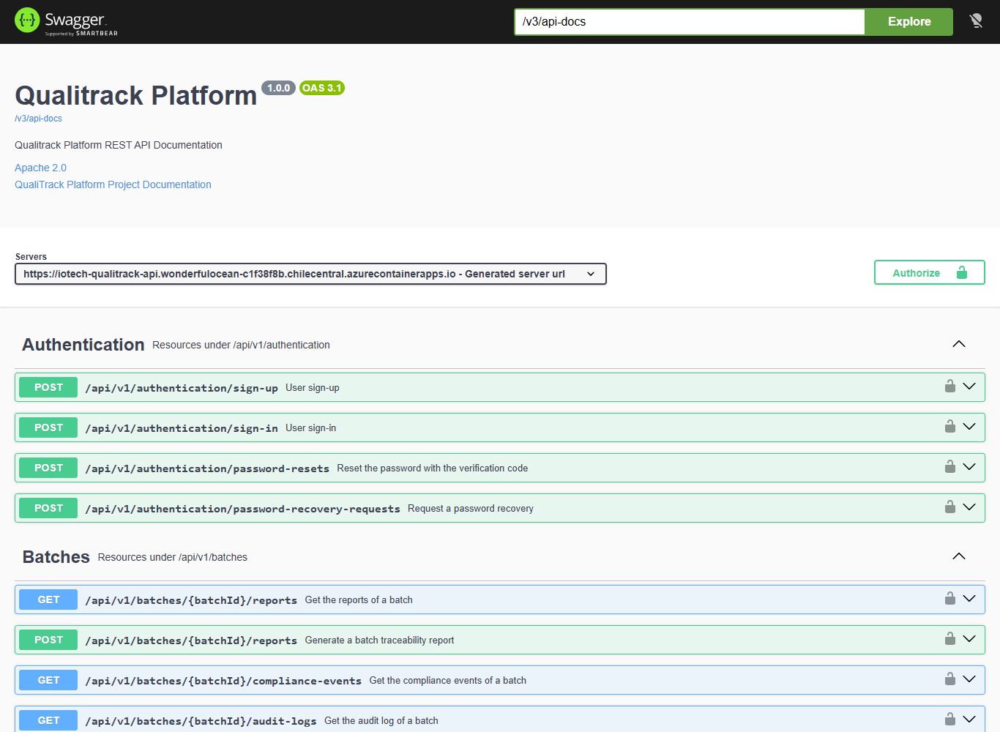
  <p><em>Figura: Documentación del RESTful API en Swagger UI. Esta vista muestra las operaciones agrupadas por recurso raíz, con su verbo HTTP, ruta y descripción.</em></p>
</div>

<div align="center">
  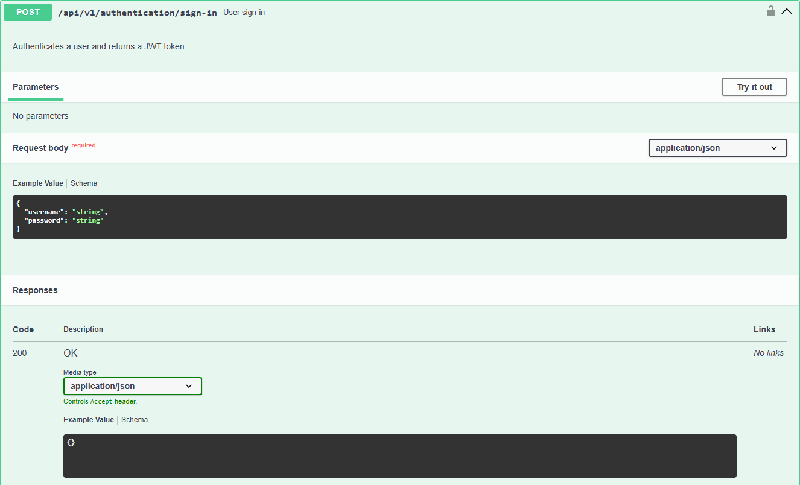
  <p><em>Figura: Operación de inicio de sesión en Swagger UI. Esta evidencia muestra su descripción, el cuerpo de la petición con el usuario y la contraseña, y la respuesta exitosa, que devuelve el usuario autenticado con su token JWT.</em></p>
</div>

<div align="center">
  
  <p><em>Figura: Consulta de mediciones de telemetría de un ambiente en Swagger UI. Esta evidencia muestra los parámetros del laboratorio, el ambiente, el periodo y la métrica, y las respuestas documentadas con el estado de cada lectura y los errores posibles.</em></p>
</div>

Commits relacionados con la documentación de los servicios en este sprint:

| Repository                           | Branch                                            | Commit Id | Commit Message                                                                         | Commit Message Body                                                                                                                                                                | Committed on (Date) |
|--------------------------------------|---------------------------------------------------|-----------|----------------------------------------------------------------------------------------|------------------------------------------------------------------------------------------------------------------------------------------------------------------------------------|---------------------|
| Io​Tech-2620-8741/​qualitrack-platform | feature/​foundation-onboarding                     | f346796   | docs​(architecture): add bounded context and database diagrams                          | —                                                                                                                                                                                  | 12/09/2026          |
| Io​Tech-2620-8741/​qualitrack-platform | feature/​inventory-domain-foundation               | c5da809   | docs​(inventory): document domain boundaries and rollout                                | —                                                                                                                                                                                  | 13/09/2026          |
| Io​Tech-2620-8741/​qualitrack-platform | feature/​inventory-domain-foundation               | 4ef1328   | docs​(inventory): document backend classes and database relationships                   | —                                                                                                                                                                                  | 13/09/2026          |
| Io​Tech-2620-8741/​qualitrack-platform | feature/​inventory-domain-foundation               | 1d8b662   | docs​(inventory): remove superseded foundation diagram                                  | —                                                                                                                                                                                  | 13/09/2026          |
| Io​Tech-2620-8741/​qualitrack-platform | feature/​laboratory-environments                   | a30c371   | docs​(laboratory): document environments model and migration                            | Update the laboratory backend and database PlantUML diagrams and add the MySQL migration script for profiles without ddl-auto.                                                     | 02/10/2026          |
| Io​Tech-2620-8741/​qualitrack-platform | feature/​inventory-environment-raw-materials       | 3e2c746   | docs​(inventory): document environment-scoped inventory                                 | Update inventory backend and database PlantUML diagrams with environment ownership, new queries, value objects and endpoints.                                                      | 02/10/2026          |
| Io​Tech-2620-8741/​qualitrack-platform | feature/​product-batch-management                  | 49e3f1b   | docs​(openapi): group operations by root resource                                       | Swagger UI now lists each operation under the first path segment after /api/v1 (Laboratories, Batches, Equipments...) through a shared OpenAPI customizer, so resources nested un… | 02/10/2026          |
| Io​Tech-2620-8741/​qualitrack-platform | feature/​product-batch-management                  | 5835ed5   | docs(batch): document products and batches per environment                             | The Product Batch diagrams now show the products moved from Laboratory, batches nested under their product, raw material usages with their operation id, equipment and staff part… | 02/10/2026          |
| Io​Tech-2620-8741/​qualitrack-platform | feature/​equipment-iot-devices                     | 5c24faa   | docs​(equipment): document equipment per environment, IoT devices and connection status | Adds the MySQL migration for the environment, device type, firmware and unique device identity of equipment, the environment of maintenance records and the equipment_​status_​chan… | 03/10/2026          |
| Io​Tech-2620-8741/​qualitrack-platform | feature/​staff-accounts                            | af385ed   | docs(staff): document staff accounts, auditor permissions and staff activity           | Adds the MySQL migration for the temporary password flag of IAM users, the access role and account of staff members and the technician of maintenance records, and updates the IA… | 03/10/2026          |
| Io​Tech-2620-8741/​qualitrack-platform | feature/​staff-accounts                            | 4f1cf1f   | docs(staff): document the staff access role shared with other contexts                 | —                                                                                                                                                                                  | 03/10/2026          |
| Io​Tech-2620-8741/​qualitrack-platform | feature/​tracking-environmental-profiles           | 3b05064   | docs​(tracking): document environmental profiles in the backend and database diagrams   | Tracking class and database diagrams with the profiles, readings and actuation events; the global, equipment, compliance and audit diagrams show the new integration events and t… | 03/10/2026          |
| Io​Tech-2620-8741/​qualitrack-platform | feature/​rest-controllers-review                   | 8ad6dff   | docs: document the REST review in the backend diagrams                                 | Compliance, reporting, equipment, IAM, subscription, batch, shared and global diagrams show the nested routes, the sub-resource actions, the report creation with Location and th… | 03/10/2026          |
| Io​Tech-2620-8741/​qualitrack-platform | feature/​container-assignments                     | 7aaaf06   | docs​(diagrams): add container assignments to the backend diagrams                      | Inventory, Product Batch, Equipment, Laboratory, RA and global class diagrams, and the inventory_​receipts and batches container columns in the database diagrams.                  | 04/10/2026          |
| Io​Tech-2620-8741/​qualitrack-platform | feature/​compliance-environment-alerts             | 15cc2e7   | docs​(diagrams): add environment alerts to the backend diagrams                         | Compliance class and database diagrams, Tracking facade and normalization event, RA audit of the escalation and the global diagrams.                                               | 04/10/2026          |
| Io​Tech-2620-8741/​qualitrack-platform | feature/​reporting-environment-indicators          | b60f742   | docs​(diagrams): reporting indicators, facades and declaration order                    | Reporting calculates the indicators on request and reads the other contexts through their facades; the stored KPI tables leave the database diagrams. Relations that used a class… | 04/10/2026          |
| Io​Tech-2620-8741/​qualitrack-platform | feature/​account-recovery-and-renewal-cancellation | eae6905   | docs​(diagrams): password recovery, e-mail provider and renewal cancellation            | IAM, subscription, shared and global diagrams with the account e-mail, the password recoveries, the e-mail senders and cancel_​at_​period_​end.                                       | 04/10/2026          |
| Io​Tech-2620-8741/​qualitrack-platform | feature/​profile-and-notifications                 | 28ef10c   | docs​(diagrams): profile context, notifications and account changes                     | —                                                                                                                                                                                  | 04/10/2026          |
| Io​Tech-2620-8741/​qualitrack-platform | feature/​subscription-plan-seed                    | 0b8f807   | docs​(diagrams): subscription plan seed at startup                                      | —                                                                                                                                                                                  | 04/10/2026          |
| Io​Tech-2620-8741/​qualitrack-platform | feature/​batch-in-progress                         | 8bbd7e5   | docs​(diagrams): batch started by its first raw material consumption                    | —                                                                                                                                                                                  | 05/10/2026          |
| Io​Tech-2620-8741/​qualitrack-platform | release/​v1.0.1                                    | c52d7c8   | docs: add README and stop ignoring it                                                  | —                                                                                                                                                                                  | 08/10/2026          |


### 5.2.8. Team Collaboration Insights

Durante el Sprint 1 el equipo trabajó con GitFlow: cada funcionalidad se desarrolló en una rama `feature/*` creada desde
`develop`, se integró en `develop` con un merge sin fast-forward y las versiones estables se publicaron en `main`
mediante ramas `release/*` con su etiqueta. Los mensajes de commit siguen Conventional Commits.

Todos los integrantes del equipo participaron en la implementación de los productos del sprint, organizados según la
matriz de liderazgo y colaboración: cada líder desarrolló las funcionalidades de su aspecto y los colaboradores apoyaron
en la implementación de vistas, la integración con el RESTful API, la documentación del código y la revisión de los
cambios antes de integrarlos en `develop`.

**Landing Page.** En el repositorio de la Landing Page, los 24 commits de implementación del sprint fueron realizados
por Huapaya Galindo, Dyron (MaineMa). El trabajo se desarrolló en las ramas `feature/previous-landing-page` y
`feature/team-members` y `feature/landing-page`, que se integraron en `develop` y luego en `main`, e incluye la
estructura y estilos del sitio, el cambio de idioma con sus traducciones, las páginas legales y los perfiles del equipo.

<div align="center">
  
  <p><em>Figura: Analíticos de contribución del repositorio de la Landing Page en GitHub Insights. Esta evidencia muestra los commits realizados durante el sprint e integrados en la rama main.</em></p>
</div>

**Web Application.** Cada Bounded Context del core business fue desarrollado por su líder con el apoyo del resto del
equipo: Laboratory Management por Ruiz Madrid, Billy Jake; Inventory Management y Product Batch Management por Cutiri
Agüero, Fabrizio Alexander; Equipment Management por Guzmán Cabrejos, Yaku Mateo; Tracking & Telemetry por Torres
Apolinario, Giovany Smith; y Compliance & Alerting por Lopez Roman, Franco Mauricio. Los contextos de soporte
(Identity & Access Management, Payments & Subscriptions, Reporting & Audit y Profile) se trabajaron de forma
transversal, y la documentación del código con TSDoc se distribuyó entre los integrantes por módulo.

<div align="center">
  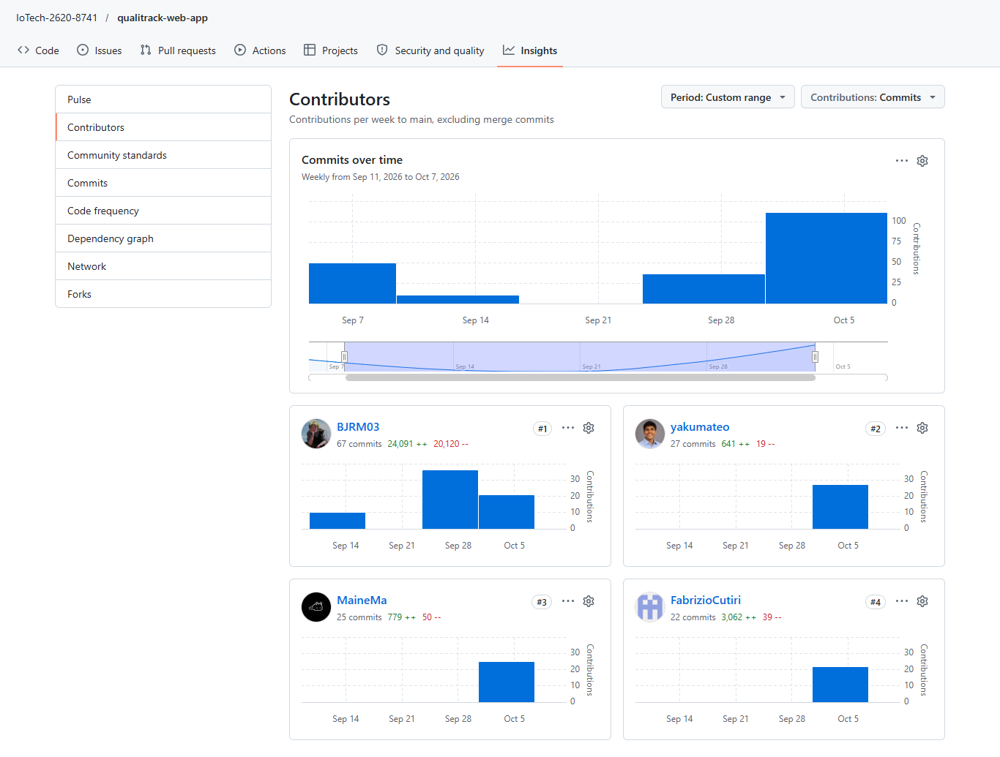
  <p><em>Figura: Analíticos de contribución del repositorio de la Web Application en GitHub Insights. Esta evidencia muestra la participación de los integrantes en la implementación de los módulos del sprint, con los commits integrados en la rama main.</em></p>
</div>

<div align="center">
  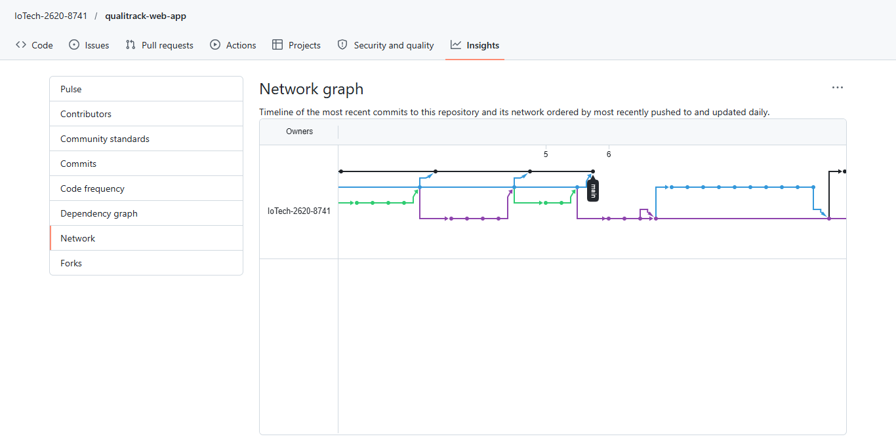
  <p><em>Figura: Gráfico de red del repositorio de la Web Application. Esta vista evidencia las ramas feature creadas desde develop y su integración mediante merges, siguiendo GitFlow.</em></p>
</div>

**Interpretación.** Los analíticos de contribución de GitHub contabilizan los commits integrados en la rama main de cada
repositorio, mientras que el gráfico de red muestra las ramas de funcionalidad en las que los integrantes desarrollaron
sus aspectos antes de integrarlos en `develop`. El uso de ramas `feature/*`, merges hacia `develop` y commits
convencionales permitió integrar el trabajo de cada miembro de forma ordenada y mantener un historial trazable de quién
implementó cada funcionalidad. Como oportunidad de mejora, el equipo se propone distribuir los commits de manera más
uniforme a lo largo del sprint y publicar en main con mayor frecuencia, evitando concentrar la integración del trabajo
en los días previos a la entrega.