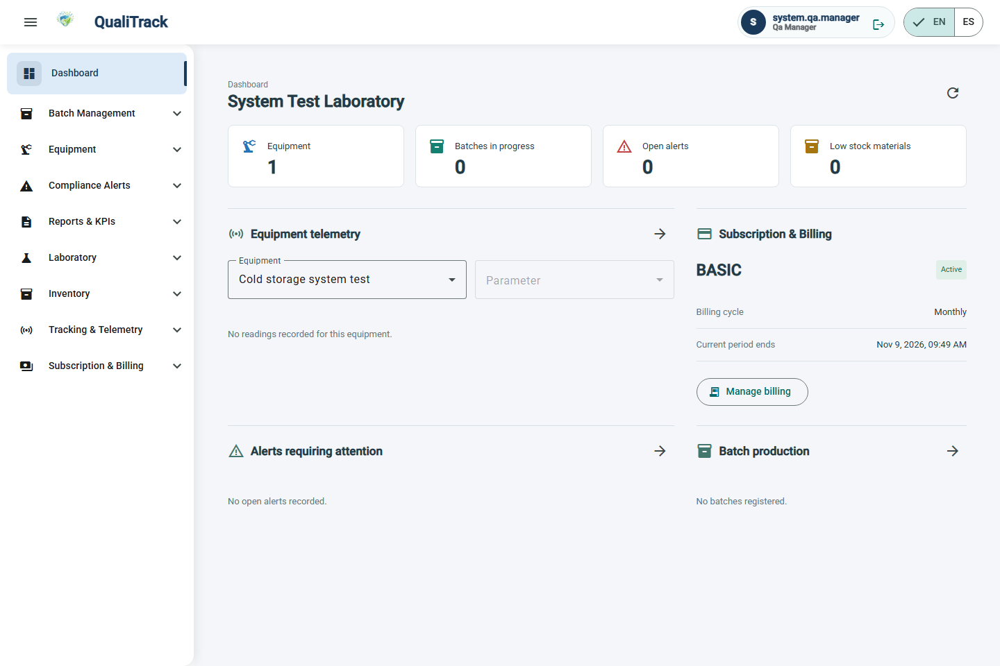
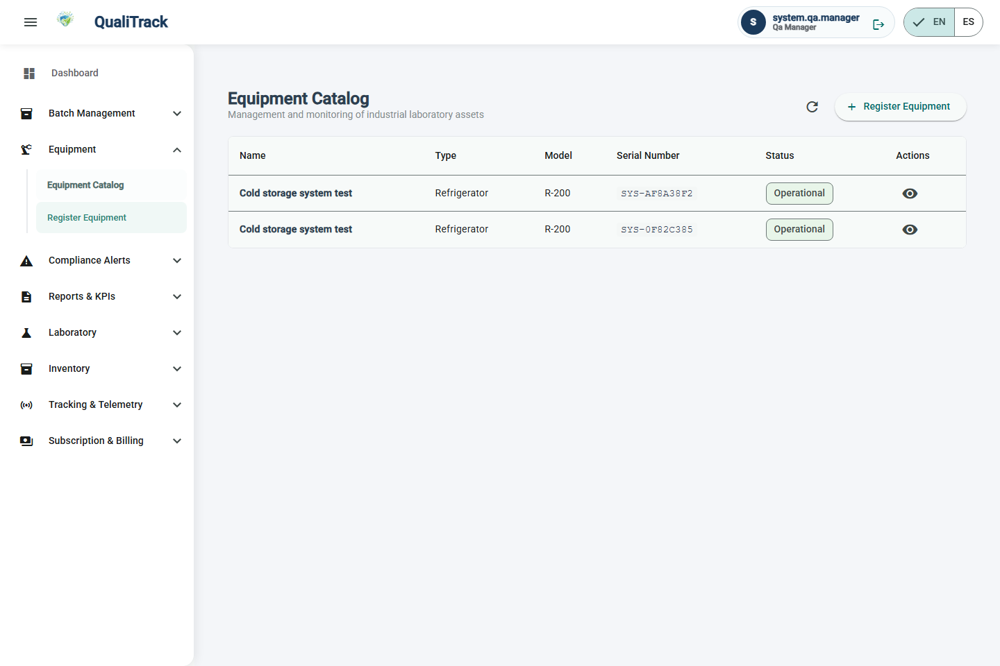
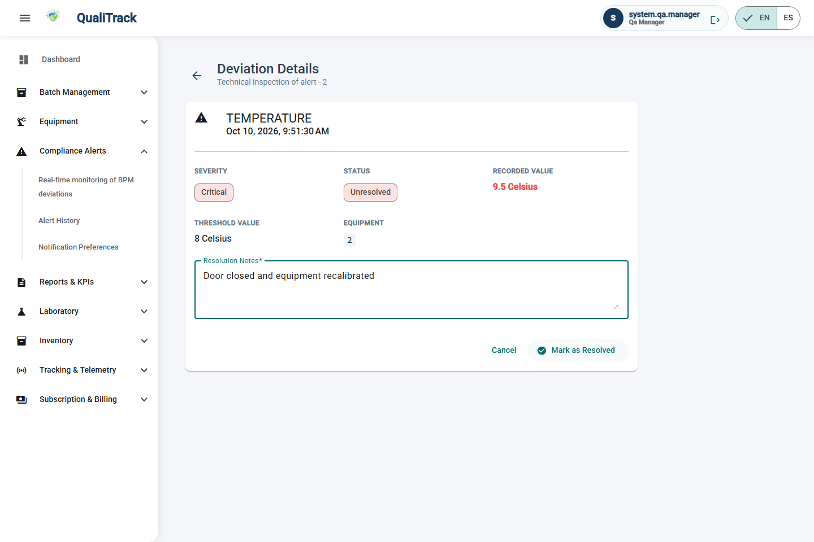
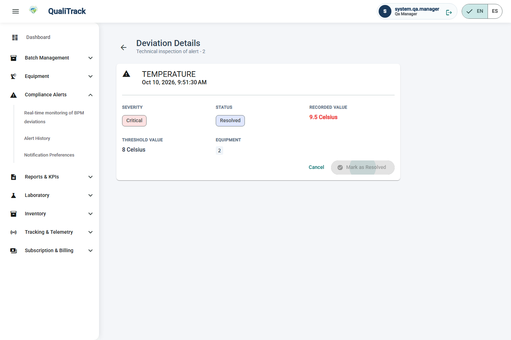

# Capítulo VI: Product Verification & Validation

### 6.1. Testing Suites & Validation

<p>
En esta sección se presentan las suites de pruebas automatizadas elaboradas por el equipo IoTech
para verificar el correcto funcionamiento de QualiTrack. Las pruebas unitarias, de integración y BDD
se encuentran dentro del repositorio del RESTful API, en la carpeta <code>src/test</code>, organizadas en los
paquetes <code>unit</code>, <code>integration</code> y <code>bdd</code> (con los archivos <code>.feature</code> en
<code>src/test/resources/features</code>). Las pruebas de sistema se encuentran en el repositorio de la Frontend
Web Application, en la carpeta <code>tests/system</code>, porque validan la aplicación completa desde el navegador.
</p>

<ul>
  <li>
    <strong>Repositorio Backend (6.1.1, 6.1.2 y 6.1.3):</strong>
    <a href="https://github.com/Experimentos-1ASI0732-2620-9104/Qualitrack-Platform" target="_blank">
      https://github.com/Experimentos-1ASI0732-2620-9104/Qualitrack-Platform
    </a>
    (rama <code>develop</code>, versión 1.0.0, Java 26 y Spring Boot 4.0.5; se ejecuta con <code>mvn test</code>)
  </li>
  <li>
    <strong>Repositorio Frontend Web (6.1.4):</strong>
    <a href="https://github.com/Experimentos-1ASI0732-2620-9104/Qualitrack-WebApplication" target="_blank">
      https://github.com/Experimentos-1ASI0732-2620-9104/Qualitrack-WebApplication
    </a>
    (rama <code>develop</code>, versión 1.0.1, Angular 21; se ejecuta con <code>npm run test:system</code>)
  </li>
</ul>

<p>
Las herramientas de prueba utilizadas son las siguientes:
</p>

| Herramienta | Uso dentro de la suite |
|---|---|
| JUnit 5 (Jupiter) | Framework base para definir y ejecutar los casos de prueba. |
| AssertJ | Aserciones fluidas para validar estados, excepciones y colecciones. |
| Spring Boot Test | Levanta el contexto completo de la aplicación en un puerto aleatorio para las pruebas de integración. |
| H2 Database (modo MySQL) | Base de datos en memoria que reemplaza a MySQL durante las pruebas, aislando cada ejecución. |
| Java HttpClient + JsonPath | Envío de peticiones HTTP reales al API y lectura de las respuestas JSON. |
| Maven Surefire | Ejecución automatizada de las pruebas y generación de reportes. |
| Cucumber 7 + Gherkin | Definición de escenarios BDD en archivos <code>.feature</code> y ejecución sobre la JUnit Platform. |
| Playwright (Chromium) | Automatización de un navegador real para las pruebas de sistema de la aplicación web. |

<p>
Resultado de la ejecución completa de la suite del backend (unitarias, integración y BDD):
</p>

```
[INFO] Tests run: 143, Failures: 0, Errors: 0, Skipped: 0
[INFO] BUILD SUCCESS
```

#### 6.1.1. Core Entities Unit Tests

<p>
Las pruebas unitarias validan, de forma aislada y sin base de datos ni contexto de Spring, las reglas
de negocio de los aggregates, entities, value objects y commands de cada bounded context. Cada prueba
sigue el patrón <em>Arrange - Act - Assert</em>: se construye la entidad a partir de su command, se
ejecuta el comportamiento del dominio y se verifica el estado resultante o la excepción esperada.
Esto asegura que las invariantes del dominio (por ejemplo, que un lote liberado no pueda rechazarse o
que una alerta resuelta no vuelva a cambiar de estado) se cumplan antes de llegar a la capa de
persistencia.
</p>

<p>
<strong>Ubicación:</strong> <code>src/test/java/com/iotech/qualitrack/platform/unit/</code>
</p>

| Bounded Context | Clase de prueba | Clases bajo prueba | Comportamientos validados |
|---|---|---|---|
| Batch Management | `BatchTests` | `Batch`, `PharmaceuticalProduct`, `CreateBatchCommand`, `ReleaseBatchCommand`, `RejectBatchCommand` | Un lote nuevo inicia en `PENDING` con los datos de su command; el command de creación rechaza datos inválidos y normaliza los campos opcionales; solo un lote pendiente puede iniciarse; un lote liberado no puede liberarse otra vez ni rechazarse; un lote rechazado no puede liberarse ni rechazarse de nuevo; los commands de liberación y rechazo exigen justificación. |
| Compliance & Alerts | `DeviationAlertTests` | `DeviationAlert`, `CreateDeviationAlertCommand`, `AcknowledgeAlertCommand`, `ResolveAlertCommand`, `AlertOrigin` | La alerta nace `UNRESOLVED` y conserva la desviación medida; el command de creación rechaza datos incompletos; el reconocimiento registra al usuario y no puede repetirse; la resolución guarda la acción correctiva y cierra la alerta; una alerta sin reconocer puede resolverse directamente, pero exige notas; una alerta resuelta no admite más cambios. |
| Equipment Management | `EquipmentTests` | `Equipment`, `MaintenanceRecord`, `BpmParameterConfig`, `DeviceId`, `RegisterEquipmentCommand`, `RegisterMaintenanceCommand`, `ConfigureBpmParametersCommand` | El equipo nace `OPERATIONAL` y sin sensor; el command de registro exige laboratorio, nombre y datos de identificación; el identificador del sensor se valida (vacío o mayor a 50 caracteres); el cambio de estado exige un valor; el mantenimiento acepta fecha ISO y tipo sin distinguir mayúsculas, y rechaza fechas o tipos inválidos; los parámetros BPM requieren un mínimo estrictamente menor que el máximo y permiten actualizar sus límites. |
| IAM | `UserTests` | `User`, `Username`, `Role`, `UserOnboarding` | El usuario nace activo y con al menos un rol; el nombre de usuario debe tener entre 3 y 80 caracteres; los roles no se duplican; un usuario solo puede pertenecer a un laboratorio; la desactivación no se repite; el onboarding exige suscripción activa antes del laboratorio. |
| Laboratory Management | `LaboratoryTests` | `Laboratory`, `LaboratoryName`, `StaffMember`, `PharmaceuticalProduct`, `StockQuantity` | El laboratorio nace `ACTIVE` con sus regulaciones; el command de creación exige RUC y al menos una regulación, y el nombre tiene un máximo de 100 caracteres; la suspensión no se aplica dos veces; el personal registrado publica `StaffRegisteredEvent`; el producto nace activo en su ambiente; el stock es inmutable y nunca negativo. |
| Tracking | `EquipmentTelemetryTests` | `EnvironmentalProfile`, `EnvironmentalThreshold`, `Measurement`, `RecordMeasurementCommand` | El perfil ambiental de un monitor de contenedor nace en versión 0, sin umbrales ni reglas de actuación; solo acepta umbrales de las métricas de su propio dispositivo y la lista de umbrales no puede modificarse desde fuera ni repetir métricas; reemplazar los umbrales incrementa la versión y permite evaluar lecturas (`NORMAL`, `WARNING`); el command de medición y la medición exigen una lectura completa. |
| Subscription | `MoneyTests` | `Money` | Solo se aceptan montos no negativos y monedas ISO 4217 válidas. |
| Inventory *(suite previa)* | `InventoryDomainTests`, `StockUnitTests` | `RawMaterial`, `RawMaterialBatch`, `StockUnit` | Recepción, revisión y consumo de lotes de materia prima; validación de unidades sin conversión implícita. |
| Subscription *(suite previa)* | `SubscriptionPlanTests`, `SubscriptionAccessTests` | `SubscriptionPlan`, `Subscription` | Límites de equipos por plan; solo una suscripción activa, pagada y vigente otorga acceso; la asociación con el laboratorio no puede reasignarse. |

<p>
<strong>Resultado:</strong> 37 pruebas unitarias nuevas, todas exitosas.
</p>

```
Tests run: 6, Failures: 0, Errors: 0 -- in ...unit.batch.BatchTests
Tests run: 5, Failures: 0, Errors: 0 -- in ...unit.ca.DeviationAlertTests
Tests run: 7, Failures: 0, Errors: 0 -- in ...unit.equipment.EquipmentTests
Tests run: 7, Failures: 0, Errors: 0 -- in ...unit.iam.UserTests
Tests run: 6, Failures: 0, Errors: 0 -- in ...unit.laboratory.LaboratoryTests
Tests run: 2, Failures: 0, Errors: 0 -- in ...unit.subscription.MoneyTests
Tests run: 4, Failures: 0, Errors: 0 -- in ...unit.tracking.EquipmentTelemetryTests
```

#### 6.1.2. Core Integration Tests

<p>
Las pruebas de integración verifican que los módulos del backend funcionen correctamente al
interactuar entre sí. Cada prueba levanta la aplicación completa con <code>@SpringBootTest</code> en un
puerto aleatorio y consume el RESTful API mediante peticiones HTTP reales, del mismo modo en que lo
hacen la Frontend Web Application y la Mobile Application. De esta forma, en un mismo flujo se
ejercitan juntas las capas <em>interfaces</em> (controllers y resources), <em>application</em> (command y
query services), <em>domain</em> e <em>infrastructure</em> (repositorios JPA sobre H2), además del filtro de
seguridad JWT y las reglas de aislamiento por laboratorio (multi-tenant).
</p>

<p>
Para no repetir código, la clase base <code>IntegrationTestSupport</code> centraliza los fixtures
comunes: registro e inicio de sesión de un usuario, activación de su suscripción, creación de su
laboratorio y envío de peticiones autenticadas con el token Bearer.
</p>

<p>
<strong>Ubicación:</strong> <code>src/test/java/com/iotech/qualitrack/platform/integration/</code>
</p>

| Clase de prueba | Endpoints involucrados | Escenarios validados |
|---|---|---|
| `AuthenticationIntegrationTests` | `POST /authentication/sign-up`, `POST /authentication/sign-in`, `GET /users/me/onboarding` | El registro no expone la contraseña ni emite token; el inicio de sesión devuelve un JWT que permite consumir endpoints protegidos; una contraseña incorrecta, un usuario inexistente o un usuario duplicado son rechazados; sin token o con un token inválido se responde `401`. |
| `EquipmentIntegrationTests` | `POST/GET /equipments`, `GET /equipments/{id}`, `POST/GET /equipments/{id}/maintenance-records`, `POST/GET /equipments/{id}/bpm-configs` | El equipo registrado se persiste y se lista para su laboratorio; los registros de mantenimiento se guardan por equipo; una fecha inválida o un rango BPM incorrecto responden `400` sin persistir datos; otro laboratorio no puede leer ni registrar equipos ajenos (`403`). |
| `BatchLifecycleIntegrationTests` | `POST /laboratories/{id}/products`, `POST /batches`, `GET/PATCH /batches/{id}`, `GET /laboratories/{id}/batches` | El lote se crea `PENDING` a partir de un producto del laboratorio; al liberarlo el estado `RELEASED` queda persistido y ya no puede rechazarse (`400`); cantidades negativas o estados no soportados responden `400`; otro laboratorio no puede leer ni liberar el lote (`403`). |
| `DeviationAlertIntegrationTests` | `POST/GET /equipments/{id}/deviation-alerts`, `GET/PATCH /deviation-alerts/{id}` | La alerta se crea `UNRESOLVED` y se lista para su equipo; el usuario autenticado la reconoce y luego la resuelve con notas; una alerta resuelta no vuelve a cambiar; un usuario no puede actuar en nombre de otro ni sobre alertas de otro laboratorio (`403`). |
| `OnboardingIntegrationTests` *(suite previa)* | Onboarding, laboratorios, inventario, reportes y pagos | Flujo suscripción → laboratorio → operación, aislamiento entre tenants, consumo concurrente de inventario y descarga de reportes PDF. |
| `InventoryPersistenceTests`, `StockRollbackTests` *(suite previa)* | Servicios de inventario con JPA | Persistencia de recepciones y consumos, idempotencia y rollback transaccional. |

<p>
<strong>Resultado:</strong> 16 pruebas de integración nuevas, todas exitosas.
</p>

```
Tests run: 4, Failures: 0, Errors: 0 -- in ...integration.AuthenticationIntegrationTests
Tests run: 4, Failures: 0, Errors: 0 -- in ...integration.BatchLifecycleIntegrationTests
Tests run: 4, Failures: 0, Errors: 0 -- in ...integration.DeviationAlertIntegrationTests
Tests run: 4, Failures: 0, Errors: 0 -- in ...integration.EquipmentIntegrationTests
```

#### 6.1.3. Core Behavior-Driven Development

<p>
Para aplicar Behavior-Driven Development, los criterios de aceptación de las User Stories definidas en la
sección 3.2 se transformaron en escenarios ejecutables escritos en Gherkin. Cada archivo
<code>.feature</code> describe el comportamiento esperado desde la perspectiva del responsable de calidad y
supervisión, siguiendo la estructura <em>Given - When - Then</em>, y se etiqueta con el identificador de la
User Story que valida (<code>@US04</code>, <code>@US06</code>, <code>@US07</code>, <code>@US08</code>).
Siguiendo las convenciones de código definidas para el proyecto, los escenarios se redactaron en inglés.
</p>

<p>
Los escenarios se ejecutan con <strong>Cucumber 7</strong> integrado a Spring Boot mediante
<code>cucumber-spring</code>. La clase <code>CucumberSpringConfiguration</code> levanta la aplicación completa
en un puerto aleatorio y cada <em>step definition</em> consume el RESTful API con un usuario autenticado
mediante JWT, de modo que el comportamiento se valida de extremo a extremo en el backend. La clase
<code>RunCucumberTest</code> incorpora los escenarios a <code>mvn test</code> y genera el reporte
<code>target/cucumber-report.html</code>.
</p>

<p>
<strong>Ubicación:</strong> <code>src/test/resources/features/</code> (archivos <code>.feature</code>) y
<code>src/test/java/com/iotech/qualitrack/platform/bdd/</code> (step definitions).
</p>

| Feature file | User Story | Escenarios | Step definitions |
|---|---|---|---|
| `deviation_alerts.feature` | US07 - Consultar y resolver alertas de desviación | Revisar el detalle de una alerta; reconocer una alerta pendiente; resolver una alerta con notas; las notas de resolución son obligatorias; una alerta resuelta no puede resolverse otra vez; otro laboratorio no puede ver la alerta. | `CommonSteps`, `DeviationAlertSteps` |
| `equipment_telemetry.feature` | US04 - Consultar la telemetría de un equipo<br>US06 - Consultar el historial de telemetría | Consultar las últimas mediciones de un equipo; filtrar el historial de telemetría por fechas e identificar los puntos desviados; historial sin resultados para el periodo. | `CommonSteps`, `TelemetrySteps` |
| `batch_report.feature` | US08 - Generar un reporte de trazabilidad de un lote | Generar el reporte PDF de un lote; incluir las desviaciones vinculadas al lote; otro laboratorio no puede generar el reporte. | `CommonSteps`, `BatchReportSteps`, `DeviationAlertSteps` |

<p>
Ejemplo de escenario (<code>deviation_alerts.feature</code>):
</p>

```gherkin
@US07
Feature: Review and resolve deviation alerts
  As a quality and supervision manager
  I want to review the detail of a deviation alert and record its resolution notes
  So that the attention given to every deviation is documented in QualiTrack

  Background:
    Given I am a quality manager with an active laboratory
    And my laboratory has an equipment named "Cold storage A"
    And the equipment reported a "CRITICAL" deviation of "TEMPERATURE" with value 9.5 over the threshold 8.0 "Celsius"

  Scenario: Resolve a pending alert with notes
    When I resolve the alert with the notes "Door closed and equipment recalibrated"
    Then the alert status is "RESOLVED"
    And the resolution notes are "Door closed and equipment recalibrated"

  Scenario: A resolved alert cannot be resolved again
    Given I resolved the alert with the notes "First corrective action"
    When I resolve the alert with the notes "Second corrective action"
    Then the request is rejected
    And the resolution notes are "First corrective action"
```

<p>
<strong>Resultado:</strong> 3 features y 12 escenarios, todos exitosos.
</p>

```
Tests run: 12, Failures: 0, Errors: 0, Skipped: 0 -- in com.iotech.qualitrack.platform.bdd.RunCucumberTest
```

#### 6.1.4. Core System Tests

<p>
Las pruebas de sistema validan QualiTrack como un todo, tal como lo usa el responsable de calidad: un
navegador real (Chromium, automatizado con <strong>Playwright</strong>) opera la Frontend Web Application en
Angular, que a su vez consume el RESTful API real de Spring Boot. A diferencia de las pruebas de integración,
aquí no se simula ninguna capa: se valida la navegación entre vistas, los formularios, las protecciones de
rutas, la comunicación frontend-backend y la persistencia de los datos.
</p>

<p>
Para ejecutarlas de forma aislada, el backend se inicia con <code>SystemTestServer</code>, un lanzador
ubicado en las fuentes de prueba que usa la base de datos H2 en memoria. El único límite externo que no
puede ejecutarse localmente es el pago con Stripe, por lo que el lanzador registra un responsable de calidad
con una suscripción ya pagada; todos los demás pasos (inicio de sesión, creación del laboratorio, registro
del equipo y resolución de la alerta) se realizan a través de la interfaz y del API. Para simular la lectura
de un sensor IoT, la prueba registra la desviación directamente en el API, del mismo modo que lo haría el
dispositivo.
</p>

<p>
<strong>Ubicación:</strong> <code>tests/system/quality-manager-journey.system.mjs</code> (repositorio
Qualitrack-WebApplication).
</p>

| Escenario de sistema | Flujo validado | Resultado esperado |
|---|---|---|
| Las páginas protegidas redirigen al visitante anónimo | Acceso sin sesión a `/dashboard`, `/equipments/equipment-list` y `/alerts/alert-dashboard`. | El sistema redirige siempre a `/iam/sign-in`. |
| Las credenciales inválidas son rechazadas | Inicio de sesión con una contraseña incorrecta. | El usuario permanece en la pantalla de inicio de sesión y no se guarda ningún token. |
| Recorrido completo del responsable de calidad | Inicio de sesión → creación del laboratorio (onboarding) → dashboard → registro de un equipo → la desviación del sensor llega al API → detalle de la alerta → resolución con notas. | El equipo aparece en el catálogo; el botón de resolver exige notas de al menos 10 caracteres; la alerta queda `RESOLVED` en el backend con las notas y el usuario que la resolvió. |

<p>
Evidencias capturadas automáticamente durante la ejecución:
</p>

<p align="center">
  
  <br><em>Dashboard del laboratorio creado durante la prueba de sistema.</em>
</p>

<p align="center">
  
  <br><em>Equipo registrado mediante el formulario y listado en el catálogo.</em>
</p>

<p align="center">
  
  <br><em>Detalle de la alerta de desviación con las notas de resolución ingresadas.</em>
</p>

<p align="center">
  
  <br><em>La alerta queda en estado Resolved después de confirmar la resolución.</em>
</p>

<p>
<strong>Resultado:</strong> 3 escenarios de sistema, todos exitosos.
</p>

```
PASS protected pages redirect anonymous visitors to sign in
PASS invalid credentials are rejected without a session
PASS quality manager completes onboarding, registers equipment and resolves a deviation
```

<p>
<strong>Alcance:</strong> las pruebas de sistema se ejecutaron sobre la aplicación web. La aplicación móvil en
Flutter consume el mismo RESTful API, cuyos flujos de autenticación, alertas, telemetría y reportes quedan
cubiertos por las suites de integración (6.1.2) y BDD (6.1.3).
</p>

<p>
<strong>Commits relacionados con testing:</strong>
</p>

| Repository | Branch | Commit Id | Commit Message |
|---|---|---|---|
| Experimentos-1ASI0732-2620-9104/Qualitrack-Platform | feature/core-tests | 05658f0 | test: add core entities unit tests per bounded context |
| Experimentos-1ASI0732-2620-9104/Qualitrack-Platform | feature/core-tests | 6374178 | test: add core REST API integration tests |
| Experimentos-1ASI0732-2620-9104/Qualitrack-Platform | feature/core-tests | b263122 | test: add cucumber bdd scenarios for alerts, telemetry and batch reports |
| Experimentos-1ASI0732-2620-9104/Qualitrack-Platform | feature/core-tests | 20e896e | test: add isolated backend server for web system tests |
| Experimentos-1ASI0732-2620-9104/Qualitrack-WebApplication | feature/system-tests | 1be4e24 | test: add web system tests for the quality manager journey |
