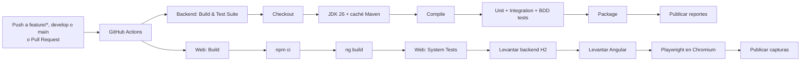

# Capítulo VII: DevOps Practices

### 7.1. Continuous Integration

<p>
En esta sección se describe cómo el equipo IoTech aplica la práctica de Integración Continua en QualiTrack.
Cada cambio que se sube a GitHub, ya sea a una rama <code>feature/*</code>, a <code>develop</code> o a
<code>main</code>, así como cada Pull Request hacia <code>develop</code> o <code>main</code>, dispara de forma
automática un pipeline en <strong>GitHub Actions</strong> que compila el producto y ejecuta sus suites de
pruebas. De esta manera, antes de aprobar el merge de un Pull Request, el equipo puede verificar en el
mismo Pull Request que los cambios compilan y que no rompen ninguna prueba existente.
</p>

<p>
Se implementó un pipeline de integración continua para cada uno de los productos principales:
</p>

| Producto | Repositorio | Workflow | Qué valida |
|---|---|---|---|
| Backend Web Services | [Qualitrack-Platform](https://github.com/Experimentos-1ASI0732-2620-9104/Qualitrack-Platform) | `.github/workflows/ci.yml` | Compilación, pruebas unitarias, de integración y BDD, y empaquetado del API. |
| Frontend Web Application | [Qualitrack-WebApplication](https://github.com/Experimentos-1ASI0732-2620-9104/Qualitrack-WebApplication) | `.github/workflows/ci.yml` | Build de producción de Angular y pruebas de sistema de la aplicación web contra el backend real. |

#### 7.1.1. Tools and Practices

<p>
Las herramientas utilizadas para implementar la integración continua son las siguientes:
</p>

| Herramienta | Uso en la integración continua |
|---|---|
| GitHub | Repositorios del proyecto y Pull Requests, organizados con el flujo GitFlow descrito en la sección 5.1.2. |
| GitHub Actions | Servidor de integración continua; ejecuta los workflows en máquinas virtuales Ubuntu en cada push y Pull Request. |
| Eclipse Temurin JDK 26 | Entorno de ejecución de Java usado para compilar y probar el backend, igual al del proyecto. |
| Apache Maven | Gestión de dependencias, compilación, ejecución de pruebas (Surefire) y empaquetado del backend. |
| JUnit 5, AssertJ, Spring Boot Test y H2 | Suites de pruebas unitarias y de integración del backend (secciones 6.1.1 y 6.1.2). |
| Cucumber 7 | Ejecución de los escenarios BDD escritos en Gherkin (sección 6.1.3). |
| Node.js 24, npm y Angular CLI | Instalación reproducible de dependencias (`npm ci`) y build de producción de la aplicación web. |
| Playwright (Chromium) | Ejecución de las pruebas de sistema de la aplicación web en un navegador real (sección 6.1.4). |
| GitHub Actions Artifacts | Publicación de los reportes de pruebas, del reporte de Cucumber y de las capturas de las pruebas de sistema. |

<p>
Las prácticas de integración continua que adopta el equipo son:
</p>

<ul>
  <li>
    <strong>Integración frecuente en un repositorio común:</strong> cada integrante trabaja en una rama
    <code>feature/*</code> creada desde <code>develop</code> y la integra mediante un Pull Request, siguiendo
    GitFlow y Conventional Commits.
  </li>
  <li>
    <strong>Build automatizado:</strong> la compilación no depende de la máquina de un integrante; el pipeline
    parte siempre de un entorno limpio, instala las versiones definidas (JDK 26 y Node.js 24) y compila con
    Maven y Angular CLI.
  </li>
  <li>
    <strong>Build auto-verificable (self-testing build):</strong> el mismo pipeline ejecuta las pruebas
    unitarias, de integración, BDD y de sistema; si alguna prueba falla, el pipeline termina en error.
  </li>
  <li>
    <strong>Retroalimentación rápida y visible:</strong> el resultado aparece en el Pull Request y en la
    pestaña <em>Actions</em> del repositorio. El pipeline del backend termina en alrededor de un minuto.
  </li>
  <li>
    <strong>Pruebas en un entorno aislado:</strong> las pruebas usan una base de datos H2 en memoria, por lo
    que no requieren MySQL ni modifican datos reales.
  </li>
  <li>
    <strong>Corregir primero un build roto:</strong> un Pull Request con el pipeline en rojo no se integra
    hasta que el pipeline vuelva a estar en verde.
  </li>
  <li>
    <strong>Una sola ejecución por rama:</strong> si se sube un nuevo commit mientras el pipeline anterior
    sigue en curso, la ejecución anterior se cancela (<code>concurrency</code>) y se valida solo el último
    estado de la rama.
  </li>
</ul>

#### 7.1.2. Build & Test Suite Pipeline Components

<p>
El siguiente diagrama resume el flujo de integración continua de QualiTrack:
</p>



<p>
<strong>Pipeline del Backend Web Services</strong> (<code>Qualitrack-Platform/.github/workflows/ci.yml</code>,
job <em>Build &amp; Test Suite</em>):
</p>

| # | Componente (step) | Descripción |
|---|---|---|
| 1 | Trigger | Se ejecuta con cada push a `main`, `develop`, `feature/**`, `release/**` y `hotfix/**`, y con cada Pull Request hacia `main` o `develop`. |
| 2 | Checkout source code | Descarga el código del commit que se va a validar (`actions/checkout`). |
| 3 | Set up JDK 26 | Instala Eclipse Temurin JDK 26 y reutiliza la caché de dependencias de Maven (`actions/setup-java`). |
| 4 | Compile | Compila el código fuente con `mvn compile`. |
| 5 | Unit, integration and BDD tests | Ejecuta `mvn test`: pruebas unitarias, de integración y los escenarios Cucumber, sobre H2 en memoria. |
| 6 | Package application | Genera el archivo `.jar` ejecutable con `mvn package`, el mismo artefacto que se despliega. |
| 7 | Publish test reports | Publica los reportes de Surefire y el reporte HTML de Cucumber como artefacto `test-reports`, incluso si alguna prueba falla. |

<p>
<strong>Pipeline de la Frontend Web Application</strong>
(<code>Qualitrack-WebApplication/.github/workflows/ci.yml</code>):
</p>

| # | Job / Componente | Descripción |
|---|---|---|
| 1 | Trigger | Los mismos eventos que el backend: push a las ramas de GitFlow y Pull Requests hacia `main` o `develop`. |
| 2 | Build: Install dependencies | Instala exactamente las versiones del `package-lock.json` con `npm ci` sobre Node.js 24. |
| 3 | Build: Production build | Compila la aplicación con `npm run build` (Angular CLI); si hay errores de compilación, el pipeline se detiene. |
| 4 | System Tests: Checkout backend | Descarga el repositorio Qualitrack-Platform para usar el API real en las pruebas. |
| 5 | System Tests: Start backend | Inicia `SystemTestServer` (Spring Boot sobre H2) en el puerto 8080. |
| 6 | System Tests: Start web application | Inicia la aplicación Angular en el puerto 4200 y espera a que ambos servicios respondan. |
| 7 | System Tests: Run system tests | Ejecuta `npm run test:system` con Playwright en Chromium (sección 6.1.4). |
| 8 | Publish screenshots and logs | Publica las capturas de las pruebas y los logs del backend y de la web como artefacto `system-test-results`. |

<p>
<strong>Evidencia de ejecución:</strong>
</p>

| Pipeline | Ejecución | Resultado |
|---|---|---|
| Backend - Build & Test Suite | [Run 38061358779](https://github.com/Experimentos-1ASI0732-2620-9104/Qualitrack-Platform/actions/runs/38061358779) | Exitoso: compilación, 143 pruebas (0 fallos) y empaquetado en aproximadamente 1 minuto. |
| Web - Build y System Tests | [Run 38061360766](https://github.com/Experimentos-1ASI0732-2620-9104/Qualitrack-WebApplication/actions/runs/38061360766) | Exitoso: build de producción (30 s) y 3 pruebas de sistema con Playwright contra el backend real (90 s). |

```
[INFO] Tests run: 143, Failures: 0, Errors: 0, Skipped: 0
[INFO] BUILD SUCCESS
```

<p>
<strong>Commits relacionados con la integración continua:</strong>
</p>

| Repository | Branch | Commit Id | Commit Message |
|---|---|---|---|
| Experimentos-1ASI0732-2620-9104/Qualitrack-Platform | feature/core-tests | 07e7125 | ci: add build and test suite pipeline |
| Experimentos-1ASI0732-2620-9104/Qualitrack-WebApplication | feature/system-tests | 230468a | ci: add build and system test pipeline |
| Experimentos-1ASI0732-2620-9104/Qualitrack-WebApplication | feature/system-tests | cd61e8e | ci: run system tests against backend develop branch |
