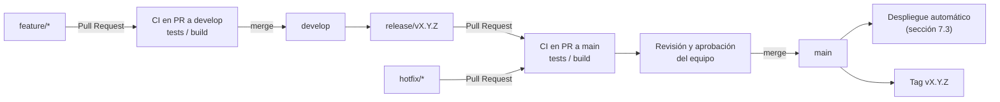

### 7.2. Continuous Delivery

En esta sección se describe cómo el equipo IoTech aplica la práctica de Entrega Continua en QualiTrack. El objetivo
es que el código integrado en <code>develop</code> se mantenga siempre en un estado listo para ser liberado, y que el
paso a producción sea una decisión controlada por el equipo y no un proceso manual propenso a errores. Para ello,
cada versión se prepara en una rama <code>release/*</code> siguiendo GitFlow y se propone hacia <code>main</code>
mediante un Pull Request. En ese Pull Request se vuelve a ejecutar automáticamente la suite de pruebas y el build de
producción. Solo cuando el pipeline está en verde y el equipo aprueba el Pull Request se realiza el merge, que es el
evento que libera la versión.

La Entrega Continua se aplicó a los tres productos desplegados de la solución:

| Producto | Repositorio | Workflow de validación del release | Destino de la entrega |
|---|---|---|---|
| Backend Web Services | [IoTech-2620-8741/qualitrack-platform](https://github.com/IoTech-2620-8741/qualitrack-platform) | `.github/workflows/ci.yml` | Azure Container Apps (imagen Docker en Azure Container Registry) |
| Frontend Web Application | [IoTech-2620-8741/qualitrack-web-app](https://github.com/IoTech-2620-8741/qualitrack-web-app) | `.github/workflows/ci-build.yml` | Firebase Hosting |
| Landing Page | [IoTech-2620-8741/qualitrack-landing-page](https://github.com/IoTech-2620-8741/qualitrack-landing-page) | Revisión del Pull Request | GitHub Pages |

#### 7.2.1. Tools and Practices

Las herramientas utilizadas para implementar la entrega continua son las siguientes:

| Herramienta | Uso en la entrega continua |
|---|---|
| GitHub (GitFlow) | Ramas `release/*` y `hotfix/*` para preparar cada versión, Pull Requests hacia `main` como punto de aprobación y tags con Semantic Versioning (`v1.0.0`, `v1.0.1`, etc.). |
| GitHub Actions | Ejecuta las pruebas del backend (`mvn -B test`) y el build de producción de la web (`npm run build`) en cada Pull Request hacia `develop` o `main`. |
| Docker | Empaqueta el backend en una imagen reproducible mediante un `Dockerfile` multi-stage (build con `eclipse-temurin:26-jdk` y Maven, ejecución con `eclipse-temurin:26-jre`). |
| Azure Container Registry | Almacena las imágenes del backend (`iotechqualitrack.azurecr.io/iotech-qualitrack-api`), etiquetadas con el SHA del commit. |
| Azure Container Apps | Entorno de ejecución del backend (`iotech-qualitrack-api`), con revisiones por cada imagen desplegada. |
| Azure Database for MySQL (Servidor flexible) | Base de datos de producción (`iotech-qualitrack-mysql`, región Chile Central, MySQL 8.4). |
| Microsoft Entra ID (identidad administrada y credenciales federadas) | Permite que GitHub Actions se autentique en Azure mediante OIDC sin guardar contraseñas en el repositorio. |
| GitHub Secrets | Guarda los valores sensibles de los pipelines (`AZURE_CLIENT_ID`, `AZURE_TENANT_ID`, `AZURE_SUBSCRIPTION_ID`, `FIREBASE_SERVICE_ACCOUNT_QUALITRACK_IOTECH`). |
| Secretos y variables de entorno de Container Apps | Configuración de producción del backend fuera del código (`DATABASE_URL`, `DATABASE_USER`, `DATABASE_PASSWORD`, `JWT_SECRET`, `STRIPE_SECRET_KEY`, `STRIPE_WEBHOOK_SECRET`, entre otros). |
| Firebase Hosting y Firebase CLI | Hosting de la aplicación Angular; `firebase.json` define la carpeta publicada (`dist/qualitrack-web-app/browser`) y la regla de reescritura de SPA hacia `index.html`. |
| GitHub Pages | Publicación de la Landing Page desde la rama `main`, carpeta raíz. |

Las prácticas de entrega continua que adopta el equipo son:

<ul>
  <li>
    <strong>Rama <code>main</code> siempre desplegable:</strong> a <code>main</code> solo llega código mediante
    Pull Requests desde ramas <code>release/*</code> o <code>hotfix/*</code>, por lo que todo lo que está en
    <code>main</code> ya pasó por el pipeline y por la revisión del equipo.
  </li>
  <li>
    <strong>Validación automática de cada candidato a release:</strong> al abrir el Pull Request de
    <code>release/*</code> hacia <code>main</code>, GitHub Actions ejecuta nuevamente las pruebas del backend y el
    build de producción de la web; si alguno falla, el release no se integra.
  </li>
  <li>
    <strong>Aprobación explícita antes de producción:</strong> el merge del Pull Request hacia <code>main</code> es la
    decisión de liberar. Antes de crear el Pull Request del backend, el equipo verifica que los recursos de Azure
    (Container App, registro de contenedores y base de datos) estén operativos.
  </li>
  <li>
    <strong>Artefactos versionados e inmutables:</strong> cada imagen del backend se etiqueta con el SHA del commit
    (<code>${{ github.sha }}</code>), lo que permite saber exactamente qué código está en producción y volver a una
    imagen anterior si es necesario.
  </li>
  <li>
    <strong>Configuración separada del código:</strong> el perfil <code>prod</code> de Spring Boot lee la conexión a
    la base de datos, el secreto JWT y las claves de Stripe desde variables de entorno; la web apunta al API
    desplegado mediante <code>src/environments/environment.ts</code>, que es el que usa el build de producción.
  </li>
  <li>
    <strong>Autenticación sin contraseñas hacia la nube:</strong> el pipeline del backend usa credenciales federadas
    (OIDC) con una identidad administrada con rol de Colaborador sobre el grupo de recursos
    <code>iotech-qualitrack-rg</code>; la Container App descarga imágenes del registro con su identidad administrada
    por el sistema.
  </li>
  <li>
    <strong>Versionado semántico de releases:</strong> cada liberación se etiqueta en <code>main</code> (backend
    <code>v1.0.0</code> y <code>v1.0.1</code>; web <code>v1.0.0</code>, <code>v1.1.0</code> y <code>v1.1.1</code>) y
    las ramas <code>release/*</code> y <code>hotfix/*</code> se eliminan después del merge, cumpliendo GitFlow.
  </li>
  <li>
    <strong>Esquema de base de datos protegido:</strong> en producción se usa
    <code>spring.jpa.hibernate.ddl-auto=none</code> para que un despliegue no modifique el esquema de la base de datos.
  </li>
</ul>

#### 7.2.2. Stages Deployment Pipeline Components

El siguiente diagrama resume las etapas por las que pasa un cambio desde su desarrollo hasta quedar listo para
producción:

Las etapas del pipeline de entrega son las siguientes:

| # | Etapa | Rama / Evento | Componentes | Criterio para avanzar |
|---|---|---|---|---|
| 1 | Commit stage | Pull Request de `feature/*` hacia `develop` | Backend: `ci.yml` (JDK 26, `mvn -B test`). Web: `ci-build.yml` (Node.js 22, `npm ci`, `npm run build`). | Pipeline en verde y revisión del Pull Request. |
| 2 | Integración en develop | Merge a `develop` | Código integrado de todos los integrantes. | La rama `develop` compila y sus pruebas pasan. |
| 3 | Preparación del release | Creación de `release/vX.Y.Z` desde `develop` | Ajuste de versión, CHANGELOG y configuración de producción. | Contenido del release completo. |
| 4 | Release candidate | Pull Request de `release/*` (o `hotfix/*`) hacia `main` | Se ejecutan de nuevo `ci.yml` y `ci-build.yml` sobre el candidato. | Pipeline en verde y recursos de producción verificados. |
| 5 | Aprobación | Revisión del Pull Request hacia `main` | Revisión del equipo en GitHub. | Pull Request aprobado y merge realizado. |
| 6 | Liberación | Push a `main` | Workflows de despliegue (sección 7.3) y tag con Semantic Versioning. | Despliegue exitoso y verificación en producción. |

<strong>Componentes por producto:</strong>

| Producto | Workflow | Trigger | Steps |
|---|---|---|---|
| Backend Web Services | `ci.yml` | `pull_request` hacia `develop` y `main` | `actions/checkout@v4` → `actions/setup-java@v4` (Temurin 26, caché Maven) → `mvn -B test` |
| Frontend Web Application | `ci-build.yml` | `pull_request` hacia `main` y `develop` | `actions/checkout@v5` → `actions/setup-node@v5` (Node.js 22, caché npm) → `npm ci` → `npm run build` |
| Landing Page | — | Pull Request hacia `main` | Revisión manual del contenido antes del merge, al tratarse de un sitio estático sin build. |

<strong>Commits relacionados con la entrega continua:</strong>

| Repository | Branch | Commit Id | Commit Message | Committed on (Date) |
|---|---|---|---|---|
| IoTech-2620-8741/qualitrack-platform | feature/foundation-onboarding | 0d8337e | build(docker): package the backend container | 12/09/2026 |
| IoTech-2620-8741/qualitrack-platform | feature/ci-cd-azure | 2bd3b4a | ci(test): run maven tests on pull requests to develop and main | 07/10/2026 |
| IoTech-2620-8741/qualitrack-web-app | feature/environment-production-configuration | 615a3df | build(environment): point production api to azure container apps backend | 08/10/2026 |
