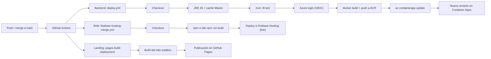

### 7.3. Continuous Deployment

En esta sección se describe cómo el equipo IoTech aplica la práctica de Despliegue Continuo en QualiTrack. Una vez que
un release es aprobado e integrado en <code>main</code>, el despliegue a producción ocurre de forma automática, sin
pasos manuales: cada push a <code>main</code> dispara un workflow que construye y publica el producto en su
plataforma de destino. De esta manera, el tiempo entre la aprobación de un cambio y su disponibilidad para los
usuarios se reduce a minutos, y cada despliegue queda registrado y es repetible.

| Producto | Workflow / Mecanismo | Trigger | Entorno de producción |
|---|---|---|---|
| Backend Web Services | `.github/workflows/deploy.yml` (Deploy to Azure Container Apps) | `push` a `main` | [Swagger UI en Azure Container Apps](https://iotech-qualitrack-api.wonderfulocean-c1f38f8b.chilecentral.azurecontainerapps.io/swagger-ui/index.html) |
| Frontend Web Application | `.github/workflows/firebase-hosting-merge.yml` (Deploy to Firebase Hosting on merge) | `push` a `main` | [https://qualitrack-iotech.web.app](https://qualitrack-iotech.web.app) |
| Landing Page | `pages-build-deployment` (GitHub Pages) | `push` a `main` | [https://iotech-2620-8741.github.io/qualitrack-landing-page/](https://iotech-2620-8741.github.io/qualitrack-landing-page/) |

#### 7.3.1. Tools and Practices

Las herramientas utilizadas para implementar el despliegue continuo son las siguientes:

| Herramienta | Uso en el despliegue continuo |
|---|---|
| GitHub Actions | Ejecuta automáticamente los workflows de despliegue en cada push a `main`. |
| Azure CLI (`azure/login@v2`) | Inicia sesión en Azure con OIDC y ejecuta `az acr login`, `az containerapp registry set` y `az containerapp update`. |
| Docker | Construye la imagen del backend en el runner de GitHub Actions y la publica en Azure Container Registry. |
| Azure Container Registry | Registro `iotechqualitrack` donde se publica la imagen `iotech-qualitrack-api:<SHA del commit>`. |
| Azure Container Apps | Ejecuta la nueva imagen del backend creando una nueva revisión de la aplicación `iotech-qualitrack-api` (puerto de entrada 8080). |
| Firebase Hosting (`FirebaseExtended/action-hosting-deploy@v0`) | Publica el build de Angular en el canal `live` del proyecto `qualitrack-iotech`. |
| GitHub Pages | Publica la Landing Page estática mediante el workflow automático `pages-build-deployment`. |

Las prácticas de despliegue continuo que adopta el equipo son:

<ul>
  <li>
    <strong>Despliegue automático al integrar en <code>main</code>:</strong> ningún integrante despliega desde su
    computadora; el merge del Pull Request hacia <code>main</code> es suficiente para que el cambio llegue a producción.
  </li>
  <li>
    <strong>Pruebas como última barrera:</strong> el workflow del backend vuelve a ejecutar <code>mvn -B test</code>
    antes de construir la imagen; si alguna prueba falla, la imagen no se construye y producción no cambia.
  </li>
  <li>
    <strong>Mismo artefacto, trazable al commit:</strong> la imagen desplegada se etiqueta con el SHA del commit de
    <code>main</code>, por lo que cada revisión de Container Apps corresponde a un commit identificable.
  </li>
  <li>
    <strong>Credenciales fuera del código:</strong> los workflows solo usan GitHub Secrets
    (<code>AZURE_CLIENT_ID</code>, <code>AZURE_TENANT_ID</code>, <code>AZURE_SUBSCRIPTION_ID</code> y
    <code>FIREBASE_SERVICE_ACCOUNT_QUALITRACK_IOTECH</code>), con el permiso mínimo necesario
    (<code>id-token: write</code> y <code>contents: read</code> en el backend).
  </li>
  <li>
    <strong>Verificación posterior al despliegue:</strong> después de cada despliegue el equipo revisa las revisiones
    y réplicas de la Container App, accede a la documentación Swagger, valida las tablas de la base de datos con MySQL
    Workbench y comprueba que la Landing Page lleve a la aplicación web publicada.
  </li>
  <li>
    <strong>Corrección rápida mediante hotfix:</strong> cuando un despliegue falla, se corrige en una rama
    <code>hotfix/*</code> que vuelve a pasar por Pull Request hacia <code>main</code> y se despliega de forma automática.
    Así ocurrió en el backend con <code>hotfix/deploy-docker-build</code> y <code>hotfix/deploy-image-flag</code>, que
    corrigieron la construcción y el paso de la imagen en el workflow de despliegue.
  </li>
  <li>
    <strong>Posibilidad de rollback:</strong> al conservarse las imágenes etiquetadas por commit en Azure Container
    Registry y las revisiones en Azure Container Apps, así como el historial de releases en Firebase Hosting, es
    posible volver a una versión anterior sin reconstruir el producto.
  </li>
</ul>

#### 7.3.2. Production Deployment Pipeline Components

El siguiente diagrama resume el pipeline de despliegue a producción de QualiTrack:

<strong>Pipeline del Backend Web Services</strong> (<code>qualitrack-platform/.github/workflows/deploy.yml</code>,
job <em>deploy</em>):

| # | Componente (step) | Descripción |
|---|---|---|
| 1 | Trigger | Se ejecuta con cada push a `main`, es decir, al hacer merge de un Pull Request de `release/*` o `hotfix/*`. |
| 2 | Variables del pipeline | `ACR_NAME=iotechqualitrack`, `RG=iotech-qualitrack-rg`, `APP=iotech-qualitrack-api`, `IMG=iotech-qualitrack-api`. |
| 3 | Checkout source code | Descarga el código de `main` (`actions/checkout@v4`). |
| 4 | Set up JDK 26 | Instala Eclipse Temurin JDK 26 con caché de Maven (`actions/setup-java@v4`). |
| 5 | Run tests | Ejecuta `mvn -B test`; si falla, el despliegue se detiene. |
| 6 | Azure login | Inicia sesión en Azure con OIDC mediante `azure/login@v2` y la identidad administrada con credencial federada. |
| 7 | Build & push image | `az acr login`, luego `docker build` con el `Dockerfile` multi-stage y `docker push` de la imagen `iotechqualitrack.azurecr.io/iotech-qualitrack-api:<SHA>`. La imagen se construye en el runner porque ACR Tasks no está disponible en la región Chile Central. |
| 8 | Configure registry | `az containerapp registry set --identity system` para que la Container App descargue la imagen con su identidad administrada. |
| 9 | Update Container App | `az containerapp update --image ...:<SHA>` crea una nueva revisión del backend con el perfil `prod` (`SPRING_PROFILES_ACTIVE=prod`) en el puerto 8080. |

<strong>Pipeline de la Frontend Web Application</strong>
(<code>qualitrack-web-app/.github/workflows/firebase-hosting-merge.yml</code>, job <em>build_and_deploy</em>):

| # | Componente (step) | Descripción |
|---|---|---|
| 1 | Trigger | Se ejecuta con cada push a `main`. |
| 2 | Checkout source code | Descarga el código de `main` (`actions/checkout@v4`). |
| 3 | Install & build | Ejecuta `npm ci && npm run build`; Angular compila con la configuración `production`, que usa la URL del API desplegado en Azure. |
| 4 | Deploy to Firebase Hosting | `FirebaseExtended/action-hosting-deploy@v0` publica `dist/qualitrack-web-app/browser` en el canal `live` del proyecto `qualitrack-iotech`, usando el secreto `FIREBASE_SERVICE_ACCOUNT_QUALITRACK_IOTECH`. |

<strong>Pipeline de la Landing Page</strong> (GitHub Pages):

| # | Componente | Descripción |
|---|---|---|
| 1 | Trigger | Cada push a `main` dispara el workflow automático `pages-build-deployment`. |
| 2 | Source | Configuración *Deploy from a branch* con la rama `main` y la carpeta raíz. |
| 3 | Publicación | El sitio estático se publica en https://iotech-2620-8741.github.io/qualitrack-landing-page/ |

<strong>Releases desplegados en producción:</strong>

| Producto | Versión | Fecha |
|---|---|---|
| Backend Web Services | v1.0.0 | 07/10/2026 |
| Backend Web Services | v1.0.1 | 08/10/2026 |
| Frontend Web Application | v1.0.0 | 08/10/2026 |
| Frontend Web Application | v1.1.0 | 08/10/2026 |
| Frontend Web Application | v1.1.1 | 10/10/2026 |

<strong>Commits relacionados con el despliegue continuo:</strong>

| Repository | Branch | Commit Id | Commit Message | Committed on (Date) |
|---|---|---|---|---|
| IoTech-2620-8741/qualitrack-platform | feature/ci-cd-azure | 8974491 | ci(deploy): deploy API to Azure Container Apps on push to main | 07/10/2026 |
| IoTech-2620-8741/qualitrack-platform | hotfix/deploy-docker-build | cac6121 | ci: build image on the runner because ACR Tasks is not available in chilecentral | 07/10/2026 |
| IoTech-2620-8741/qualitrack-platform | hotfix/deploy-image-flag | 31f6862 | ci: pass the built image to containerapp update | 07/10/2026 |
| IoTech-2620-8741/qualitrack-web-app | feature/firebase-hosting-ci | 7bd7ac5 | ci: deploy to Firebase Hosting on push to main | 08/10/2026 |
